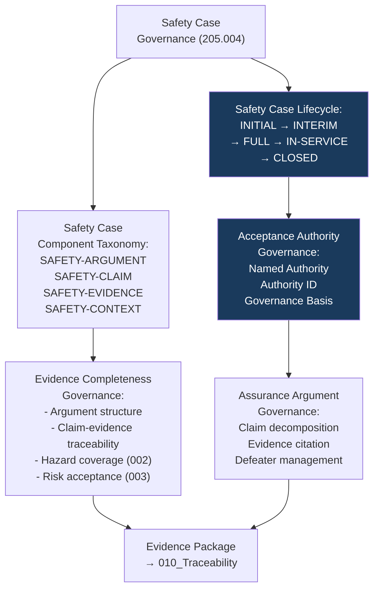

# DTTA 200-209 · Section 00 · Subsection 205 · Subsubject 004 — Safety Case Governance and Evidence Requirements

## 1. Purpose

This subsubject establishes the governance requirements for safety case structure and evidence package completeness within armament safety subsection `205`. It defines the governance taxonomy of safety case components, the evidence requirements for each component, and the governance lifecycle of safety case status — not the content of any specific safety case.

## 2. Scope

- Covers the *Safety Case Governance and Evidence Requirements* subsubject (`004`) of subsection `205`.
- Concepts in scope:
  - **Safety case governance taxonomy** — The governance classification of safety case components: `SAFETY-ARGUMENT`, `SAFETY-CLAIM`, `SAFETY-EVIDENCE`, `SAFETY-CONTEXT` — as abstract governance constructs for evidence package structuring.
  - **Evidence completeness governance** — The minimum content requirements for a governance-complete armament safety evidence package: safety argument structure, claim-evidence traceability, hazard coverage attestation (from subsubject `002`), and risk acceptance record (from subsubject `003`).
  - **Safety case lifecycle governance** — The governance lifecycle of a safety case: `INITIAL`, `INTERIM`, `FULL`, `IN-SERVICE`, `CLOSED` — with governance requirements for each lifecycle stage transition and associated evidence obligations.
  - **Safety case acceptance authority governance** — The governance requirement that each safety case lifecycle stage must be accepted by a named safety case acceptance authority, with authority identification and governance basis recorded in the evidence package.
  - **Assurance argument governance** — The governance requirements for structured assurance arguments in safety cases: claim decomposition, evidence citation (by standard and identifier only), and defeater management at the governance layer.
- Out of scope: safety case content for specific armament systems, safety argument details, safety evidence analysis results, system-specific hazard coverage assessments and any safety case acceptance records for operational systems.

## 3. Diagram — Safety Case Governance Lifecycle

## 4. Footprint

| Metric | Value |
|---|---|
| Architecture | `DTTA` — Defence Technology Type Architecture |
| Master range | `200–299` |
| Code range | `200-209` |
| Section | `00` — Sistemas de Combate y Armamento |
| Subsection | `205` — Seguridad de Armamento y Control de Riesgos |
| Subsubject | `004` — Safety Case Governance and Evidence Requirements |
| Primary Q-Division | Q-DATAGOV |
| Support Q-Divisions | Q-SPACE, Q-HORIZON, Q-HPC, Q-STRUCTURES, Q-INDUSTRY |
| ORB support | ORB-LEG, ORB-PMO, ORB-FIN, **ORB-HR** |
| Governance class | `restricted` |
| Document | `004_Safety-Case-Governance-and-Evidence-Requirements.md` (this file) |
| Subsection index | [`README.md`](./README.md) |
| Parent section | [`../README.md`](../README.md) |
| Parent baseline | [`organization/Q+ATLANTIDE.md`](../../../../organization/Q+ATLANTIDE.md) |

## 5. References & Citations

[^defstan]: **DEF STAN 00-056 Issue 5** — Safety Management Requirements for Defence Systems. Safety case governance requirements (Clause 7); safety argument, claim and evidence taxonomy; lifecycle stages; acceptance authority requirements.
[^milstd882e]: **MIL-STD-882E** — DoD Standard Practice: System Safety. Safety assessment (Task 401) evidence requirements; hazard coverage governance.
[^stanag4119]: **NATO STANAG 4119 Ed. 4** — Common NATO Fuze Design Safety and Suitability for Service. Safety case governance context for armament safety certification.
[^iec61508]: **IEC 61508-1:2010** — Functional Safety: General Requirements. Safety case and functional safety assessment governance.
[^natoaqap]: **NATO AQAP-2110** — NATO Quality Assurance Requirements. Quality governance requirements for safety case evidence packages.
[^n006]: **Note N-006 (Restricted bands)** — Defence-related (`200-299` DTTA) bands require additional governance, evidence packages and access controls. See [`organization/Q+ATLANTIDE.md` §5.3](../../../../organization/Q+ATLANTIDE.md#53-restricted-band-templates-n-006).
