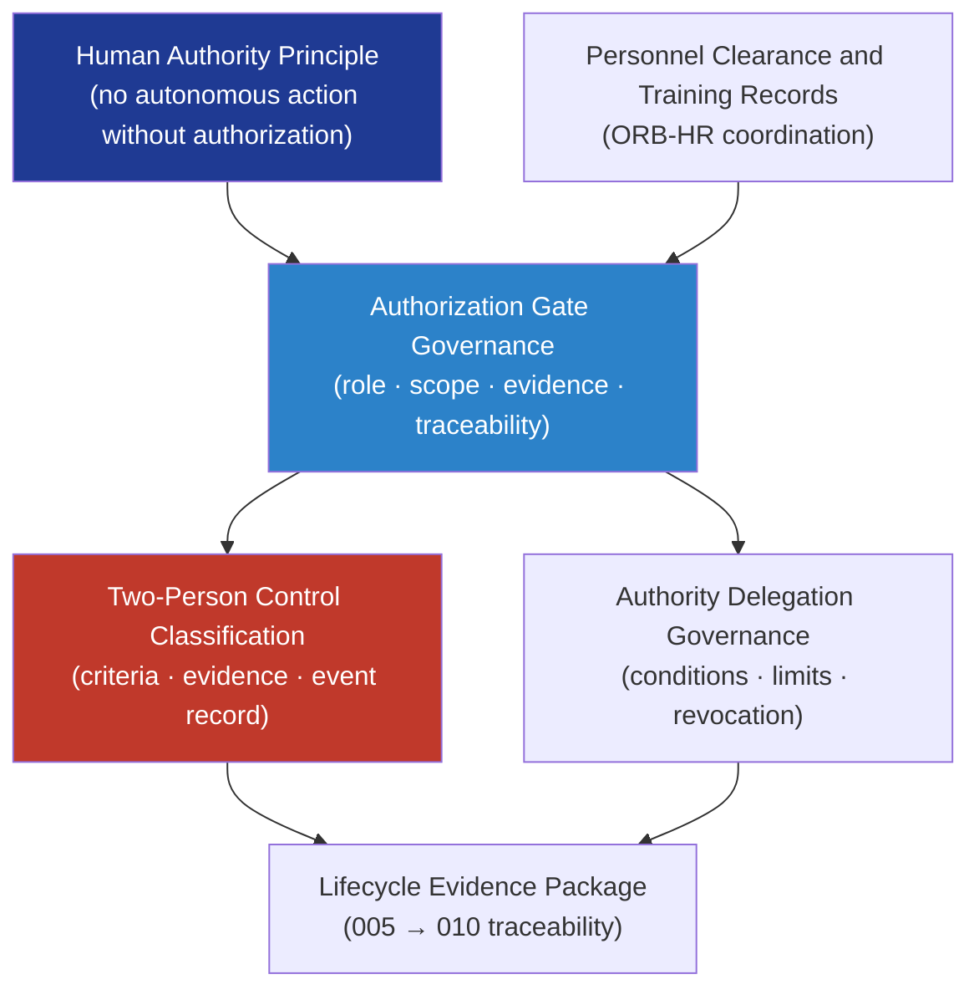

# DTTA 200-209 · Section 00 · Subsection 205 · Subsubject 005 — Human Authority, Authorization and Two-Person Control

## 1. Purpose

Defines the **governance model for human authority, authorization controls and two-person control obligations** in armament safety within the DTTA band. This subsubject establishes how human authority is asserted, documented, and traced across armament safety-critical activities — and how two-person control requirements are classified, governed, and evidenced as a governance obligation, not an operational procedure.

**Non-operational boundary.** This subsubject defines authority governance structures, authorization record obligations, and two-person control classification only. It does not specify activation procedures, command sequences, arming protocols, operational two-person procedures, or any mechanism enabling armament employment.

## 2. Scope

- Covers the *Human Authority, Authorization and Two-Person Control* subsubject (`005`) of subsection `205`.
- Inherits Q-Division authority and ORB support from the parent row in [`../../README.md` §3](../../README.md#3-architecture-table)[^archtable].
- Concepts in scope:
  - **Human authority principle** — All armament safety-critical actions require explicit human authority: no automated or autonomous action is within governance scope without prior human authorization; authority records must be traceable.
  - **Authorization gate governance** — Governance model for armament authorization gates: identity of authorizing role, scope of authorization, evidence of authorization record, and traceability to the lifecycle evidence package.
  - **Two-person control classification** — Taxonomy of armament safety actions requiring two-person control: classification criteria, evidence obligations for two-person compliance, and governance records for two-person authorization events.
  - **Authority delegation governance** — Governance model for delegating authorization authority: conditions, limits, evidence, and revocation governance; not operational command delegation.
  - **Personnel clearance and training records** — Governance obligations for personnel clearance status records, training currency records, and eligibility evidence supporting authorization governance; coordinated with ORB-HR.
- Out of scope: incident reporting (`006`), inspection and audit records (`007`), and emergency response governance (`008`).

## 3. Diagram — Human Authority and Two-Person Control Governance

## 4. Footprint

| Metric | Value |
|---|---|
| Architecture | `DTTA` — Defence Technology Type Architecture |
| Master range | `200–299` |
| Code range | `200-209` |
| Section | `00` — Sistemas de Combate y Armamento |
| Subsection | `205` — Seguridad de Armamento y Control de Riesgos |
| Subsubject | `005` — Human Authority, Authorization and Two-Person Control |
| Primary Q-Division | Q-DATAGOV[^qdiv] |
| Support Q-Divisions | Q-SPACE, Q-HORIZON, Q-HPC, Q-STRUCTURES, Q-INDUSTRY |
| ORB support | ORB-LEG, ORB-PMO, ORB-FIN, ORB-HR |
| Governance class | `restricted`[^gov] |
| Folder path | `Q+ATLANTIDE/200-299_DTTA/200-209_Sistemas-de-Combate-y-Armamento/205_Seguridad-de-Armamento-y-Control-de-Riesgos/` |
| Document | `005_Human-Authority-Authorization-and-Two-Person-Control.md` (this file) |
| Parent subsection | [`README.md`](./README.md) · [`000_Overview.md`](./000_Overview.md) |
| Parent architecture | [`../../README.md`](../../README.md) |
| Parent baseline | [`organization/Q+ATLANTIDE.md`](../../../../organization/Q+ATLANTIDE.md) |

## 5. References & Citations

[^baseline]: **Q+ATLANTIDE controlled baseline (v1.0.0)** — [`organization/Q+ATLANTIDE.md`](../../../../organization/Q+ATLANTIDE.md).

[^archtable]: **§3 — Architecture Table (parent)** — [`../../README.md` §3](../../README.md#3-architecture-table).

[^qdiv]: **Q-Division authority** — Q-Divisions provide technical authority over an architecture row (Q+ATLANTIDE Note N-002). See [`organization/Q+ATLANTIDE.md` §4](../../../../organization/Q+ATLANTIDE.md#4-notes).

[^gov]: **Governance class** — `restricted` per N-006 for DTTA band documents.

[^milstd882e]: **MIL-STD-882E — System Safety** — Governs human authority requirements and authorization evidence for safety-critical armament actions.

[^defstan056]: **DEF STAN 00-056 Issue 5 — Safety Management Requirements for Defence Systems** — Governs authorization gate evidence and two-person control governance obligations.

[^ihl]: **International Humanitarian Law — Geneva Conventions and Additional Protocols** — Legal framework requiring explicit human accountability for armament actions; anchors the human authority principle in armament safety governance.

### Applicable standards

- MIL-STD-882E — System Safety[^milstd882e]
- DEF STAN 00-056 Issue 5 — Safety Management Requirements[^defstan056]
- International Humanitarian Law — Geneva Conventions and Additional Protocols[^ihl]
