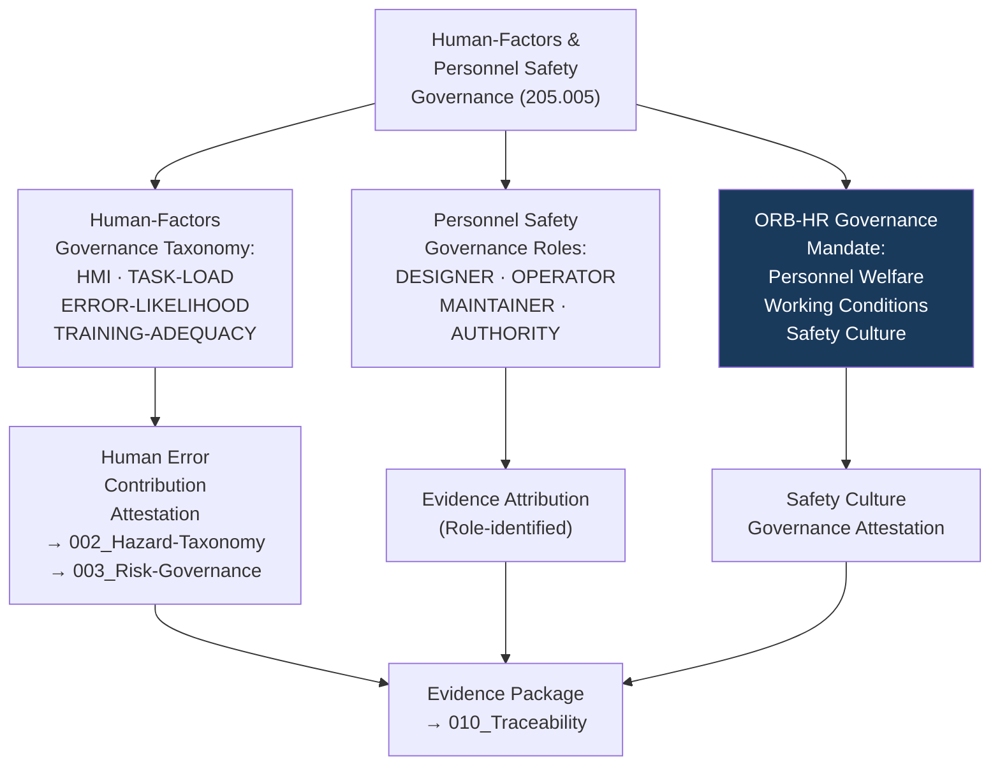

# DTTA 200-209 · Section 00 · Subsection 205 · Subsubject 005 — Human-Factors and Personnel Safety Governance

## 1. Purpose

This subsubject establishes the governance taxonomy of human-factors and personnel safety requirements within armament safety subsection `205`. It is the primary governance anchor for the `ORB-HR` function support across subsection `205`, defining the governance principles for human-factors integration in armament safety governance — not operational human-factors engineering or personnel safety procedures.

## 2. Scope

- Covers the *Human-Factors and Personnel Safety Governance* subsubject (`005`) of subsection `205`.
- Concepts in scope:
  - **Human-factors governance taxonomy** — The governance classification of human-factors domains relevant to armament safety: `HUMAN-MACHINE-INTERACTION`, `TASK-LOAD-GOVERNANCE`, `ERROR-LIKELIHOOD-GOVERNANCE`, `TRAINING-ADEQUACY-GOVERNANCE` — as abstract governance constructs for evidence packaging.
  - **Personnel safety governance classification** — The governance classification of personnel safety obligation categories in armament safety governance: `DESIGNER-OBLIGATION`, `OPERATOR-OBLIGATION`, `MAINTAINER-OBLIGATION`, `AUTHORITY-OBLIGATION` — as governance-layer role identifiers for evidence attribution.
  - **ORB-HR governance mandate** — The formal governance statement that ORB-HR function support is required for subsection `205` because armament safety governance has direct implications for personnel welfare, working conditions and safety culture, which fall within HR governance remit.
  - **Human error contribution governance** — The governance requirement that evidence packages in subsection `205` must include a human error contribution attestation: a governance-level statement that human error pathways have been considered in hazard identification (subsubject `002`) and risk governance (subsubject `003`).
  - **Safety culture governance** — The abstract governance concept of safety culture as a governance dimension: the requirement that evidence packages include a safety culture governance attestation referencing applicable standards.
- Out of scope: human-factors engineering analyses, task analysis results, workload measurement data, training records, personnel qualification records, HR data about individuals, and any operational personnel safety management activities.

## 3. Diagram — Human-Factors Governance Structure

## 4. Footprint

| Metric | Value |
|---|---|
| Architecture | `DTTA` — Defence Technology Type Architecture |
| Master range | `200–299` |
| Code range | `200-209` |
| Section | `00` — Sistemas de Combate y Armamento |
| Subsection | `205` — Seguridad de Armamento y Control de Riesgos |
| Subsubject | `005` — Human-Factors and Personnel Safety Governance |
| Primary Q-Division | Q-DATAGOV |
| Support Q-Divisions | Q-SPACE, Q-HORIZON, Q-HPC, Q-STRUCTURES, Q-INDUSTRY |
| ORB support | ORB-LEG, ORB-PMO, ORB-FIN, **ORB-HR** |
| Governance class | `restricted` |
| Document | `005_Human-Factors-and-Personnel-Safety-Governance.md` (this file) |
| Subsection index | [`README.md`](./README.md) |
| Parent section | [`../README.md`](../README.md) |
| Parent baseline | [`organization/Q+ATLANTIDE.md`](../../../../organization/Q+ATLANTIDE.md) |

## 5. References & Citations

[^milstd882e]: **MIL-STD-882E** — DoD Standard Practice: System Safety. Human factors hazard analysis (Task 208) governance context; human error contribution requirements.
[^defstan]: **DEF STAN 00-056 Issue 5** — Safety Management Requirements for Defence Systems. Human factors safety requirements (Clause 6.2); safety culture governance.
[^stanag4119]: **NATO STANAG 4119 Ed. 4** — NATO Fuze Design Safety. Personnel safety governance context for armament system human-factors requirements.
[^iso31000]: **ISO 31000:2018** — Risk Management: Guidelines. Human error as risk contributor in risk governance framework context.
[^natoaqap]: **NATO AQAP-2110** — NATO Quality Assurance Requirements. Training adequacy governance requirements relevant to personnel safety obligations.
[^n006]: **Note N-006 (Restricted bands)** — Defence-related (`200-299` DTTA) bands require additional governance, evidence packages and access controls. See [`organization/Q+ATLANTIDE.md` §5.3](../../../../organization/Q+ATLANTIDE.md#53-restricted-band-templates-n-006).
