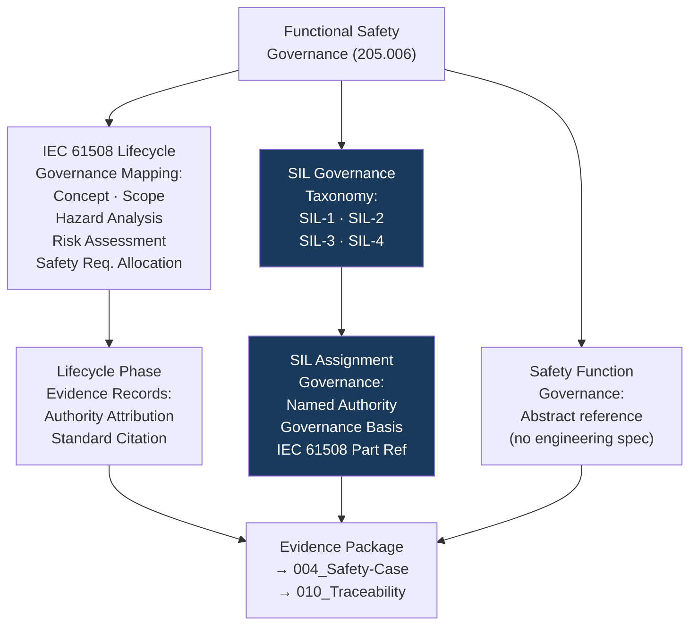

# DTTA 200-209 · Section 00 · Subsection 205 · Subsubject 006 — Functional Safety and Safety Integrity Governance

## 1. Purpose

This subsubject establishes the governance mapping of IEC 61508 functional safety principles and Safety Integrity Level (SIL) classification to armament safety governance within subsection `205`. It provides abstract governance constructs for evidence packaging and regulatory traceability — not SIL calculations or functional safety engineering specifications.

## 2. Scope

- Covers the *Functional Safety and Safety Integrity Governance* subsubject (`006`) of subsection `205`.
- Concepts in scope:
  - **Functional safety governance mapping** — The abstract governance mapping of IEC 61508 functional safety lifecycle phases (concept, scope definition, hazard analysis, risk assessment, safety requirements allocation) to armament safety evidence requirements at the governance layer.
  - **SIL governance taxonomy** — The governance classification of Safety Integrity Levels (`SIL-1`, `SIL-2`, `SIL-3`, `SIL-4`) as abstract governance identifiers for evidence package classification and traceability — not SIL determination calculations.
  - **Safety function governance** — The governance concept of a safety function as a governance-layer construct: an abstract reference to a function that achieves or maintains safe state, used for evidence traceability without engineering specification.
  - **SIL assignment governance** — The governance requirement that any SIL assignment must be documented in the evidence package with a named SIL assignment authority, governance basis citation and standard reference (IEC 61508 part number).
  - **Functional safety lifecycle governance** — The governance lifecycle mapping: each IEC 61508 lifecycle phase that generates governance-relevant outputs must have a corresponding evidence record with authority attribution and standard citation.
- Out of scope: SIL calculation methods, probability of failure on demand values, hardware fault tolerance calculations, software safety integrity level determination, architectural constraints for specific SIL levels, and any functional safety engineering analysis content.

## 3. Diagram — Functional Safety Governance Mapping

## 4. Footprint

| Metric | Value |
|---|---|
| Architecture | `DTTA` — Defence Technology Type Architecture |
| Master range | `200–299` |
| Code range | `200-209` |
| Section | `00` — Sistemas de Combate y Armamento |
| Subsection | `205` — Seguridad de Armamento y Control de Riesgos |
| Subsubject | `006` — Functional Safety and Safety Integrity Governance |
| Primary Q-Division | Q-DATAGOV |
| Support Q-Divisions | Q-SPACE, Q-HORIZON, Q-HPC, Q-STRUCTURES, Q-INDUSTRY |
| ORB support | ORB-LEG, ORB-PMO, ORB-FIN, **ORB-HR** |
| Governance class | `restricted` |
| Document | `006_Functional-Safety-and-Safety-Integrity-Governance.md` (this file) |
| Subsection index | [`README.md`](./README.md) |
| Parent section | [`../README.md`](../README.md) |
| Parent baseline | [`organization/Q+ATLANTIDE.md`](../../../../organization/Q+ATLANTIDE.md) |

## 5. References & Citations

[^iec61508p1]: **IEC 61508-1:2010** — Functional Safety: General Requirements. Functional safety lifecycle, safety function definition, SIL concept and overall safety requirements.
[^iec61508p2]: **IEC 61508-2:2010** — Functional Safety: Hardware Requirements. Hardware SIL classification governance context.
[^iec61508p3]: **IEC 61508-3:2010** — Functional Safety: Software Requirements. Software SIL classification governance context.
[^iec61508p4]: **IEC 61508-4:2010** — Functional Safety: Definitions and Abbreviations. SIL taxonomy and safety function definitions.
[^milstd882e]: **MIL-STD-882E** — DoD Standard Practice: System Safety. Safety function and safety integrity cross-reference context.
[^defstan]: **DEF STAN 00-056 Issue 5** — Safety Management Requirements for Defence Systems. Functional safety governance requirements for defence systems.
[^n006]: **Note N-006 (Restricted bands)** — Defence-related (`200-299` DTTA) bands require additional governance, evidence packages and access controls. See [`organization/Q+ATLANTIDE.md` §5.3](../../../../organization/Q+ATLANTIDE.md#53-restricted-band-templates-n-006).
