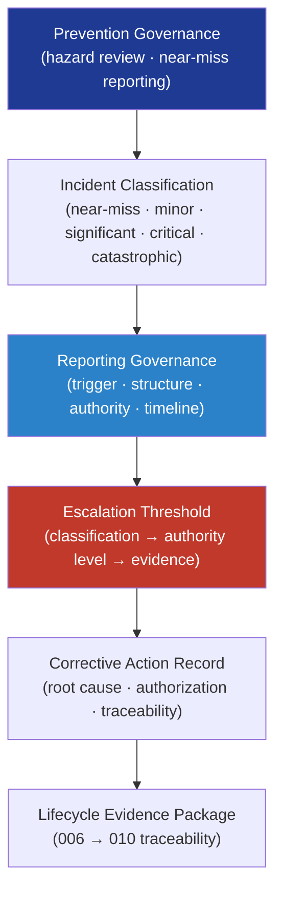

# DTTA 200-209 · Section 00 · Subsection 205 · Subsubject 006 — Incident Prevention, Reporting and Escalation

## 1. Purpose

Defines the **governance model for armament incident prevention, reporting and escalation** within the DTTA band. This subsubject establishes how incident prevention obligations, incident classification taxonomy, reporting governance requirements, and escalation thresholds are structured in the armament safety governance architecture — ensuring that armament-related events are classified, reported, and escalated through defined governance channels with appropriate evidence.

**Non-operational boundary.** This subsubject defines incident classification governance, reporting record structures, and escalation threshold criteria only. It does not define emergency response procedures, incident containment methods, forensic investigation techniques, or any operational action taken in response to an armament incident.

## 2. Scope

- Covers the *Incident Prevention, Reporting and Escalation* subsubject (`006`) of subsection `205`.
- Inherits Q-Division authority and ORB support from the parent row in [`../../README.md` §3](../../README.md#3-architecture-table)[^archtable].
- Concepts in scope:
  - **Prevention governance** — Governance obligations for proactive incident prevention: hazard review intervals, near-miss reporting obligations, and preventive evidence obligations linked to the hazard log (subsubject `002`).
  - **Incident classification taxonomy** — Taxonomy of armament incident types (near-miss, minor, significant, critical, catastrophic) with governance-level descriptors and associated evidence obligations; not severity calculations.
  - **Reporting governance** — Governance model for incident reporting: mandatory report triggers, report structure requirements, reporting authority (ORB-LEG, ORB-HR), reporting timeline obligations, and report traceability.
  - **Escalation threshold governance** — Governance model for escalation: which incident classifications trigger escalation to which governance authority levels, and the evidence obligations at each escalation level.
  - **Corrective action governance** — Governance requirements for corrective action records following classified incidents: root cause classification, corrective action authorization, and lifecycle traceability; not engineering corrective action methods.
- Out of scope: inspection/audit records (`007`), emergency response boundaries (`008`), and legal/ethical constraints (`009`).

## 3. Diagram — Incident Governance Flow

## 4. Footprint

| Metric | Value |
|---|---|
| Architecture | `DTTA` — Defence Technology Type Architecture |
| Master range | `200–299` |
| Code range | `200-209` |
| Section | `00` — Sistemas de Combate y Armamento |
| Subsection | `205` — Seguridad de Armamento y Control de Riesgos |
| Subsubject | `006` — Incident Prevention, Reporting and Escalation |
| Primary Q-Division | Q-DATAGOV[^qdiv] |
| Support Q-Divisions | Q-SPACE, Q-HORIZON, Q-HPC, Q-STRUCTURES, Q-INDUSTRY |
| ORB support | ORB-LEG, ORB-PMO, ORB-FIN, ORB-HR |
| Governance class | `restricted`[^gov] |
| Folder path | `Q+ATLANTIDE/200-299_DTTA/200-209_Sistemas-de-Combate-y-Armamento/205_Seguridad-de-Armamento-y-Control-de-Riesgos/` |
| Document | `006_Incident-Prevention-Reporting-and-Escalation.md` (this file) |
| Parent subsection | [`README.md`](./README.md) · [`000_Overview.md`](./000_Overview.md) |
| Parent architecture | [`../../README.md`](../../README.md) |
| Parent baseline | [`organization/Q+ATLANTIDE.md`](../../../../organization/Q+ATLANTIDE.md) |

## 5. References & Citations

[^baseline]: **Q+ATLANTIDE controlled baseline (v1.0.0)** — [`organization/Q+ATLANTIDE.md`](../../../../organization/Q+ATLANTIDE.md).

[^archtable]: **§3 — Architecture Table (parent)** — [`../../README.md` §3](../../README.md#3-architecture-table).

[^qdiv]: **Q-Division authority** — Q-Divisions provide technical authority over an architecture row (Q+ATLANTIDE Note N-002). See [`organization/Q+ATLANTIDE.md` §4](../../../../organization/Q+ATLANTIDE.md#4-notes).

[^gov]: **Governance class** — `restricted` per N-006 for DTTA band documents.

[^milstd882e]: **MIL-STD-882E — System Safety** — Governs incident classification taxonomy, reporting obligations, and corrective action governance for defence system safety incidents.

[^defstan056]: **DEF STAN 00-056 Issue 5 — Safety Management Requirements for Defence Systems** — Governs incident reporting, escalation thresholds, and corrective action evidence in UK MoD safety programmes.

[^iso31000]: **ISO 31000 — Risk Management — Guidelines** — Provides incident classification vocabulary and risk escalation governance framework.

### Applicable standards

- MIL-STD-882E — System Safety[^milstd882e]
- DEF STAN 00-056 Issue 5 — Safety Management Requirements[^defstan056]
- ISO 31000 — Risk Management Guidelines[^iso31000]
