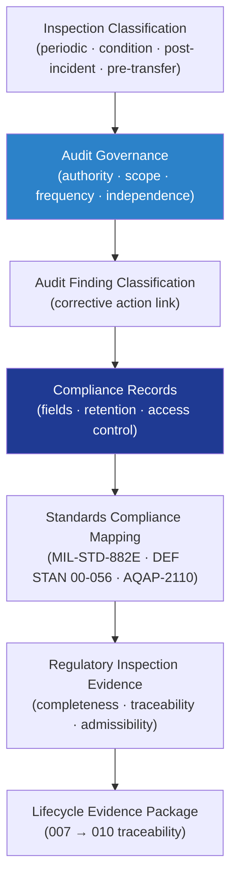

# DTTA 200-209 · Section 00 · Subsection 205 · Subsubject 007 — Inspection, Audit and Compliance Records

## 1. Purpose

Defines the **governance model for armament safety inspection, audit obligations and compliance record management** within the DTTA band. This subsubject establishes the inspection classification taxonomy, audit governance requirements, compliance record structures, and the evidence obligations that demonstrate sustained compliance with armament safety governance across the lifecycle.

**Non-operational boundary.** This subsubject defines inspection classification, audit governance, and compliance record structure only. It does not specify physical inspection techniques, non-destructive testing methods, armament condition assessment procedures, or any inspection activity enabling operational status determination.

## 2. Scope

- Covers the *Inspection, Audit and Compliance Records* subsubject (`007`) of subsection `205`.
- Inherits Q-Division authority and ORB support from the parent row in [`../../README.md` §3](../../README.md#3-architecture-table)[^archtable].
- Concepts in scope:
  - **Inspection classification** — Taxonomy of armament safety inspection types (periodic, condition-triggered, post-incident, pre-transfer) with associated governance obligations and evidence requirements.
  - **Audit governance** — Governance model for armament safety audits: audit authority, scope, frequency, independence requirements, finding classification, and corrective-action link governance.
  - **Compliance record structure** — Governance model for compliance records: mandatory record fields, retention periods, access-control classification, and traceability to the lifecycle evidence package.
  - **Standards compliance mapping** — Cross-reference of armament safety governance obligations to applicable standards (MIL-STD-882E[^milstd882e], DEF STAN 00-056[^defstan056], NATO AQAP-2110[^aqap2110]) in a compliance matrix for governance evidence purposes.
  - **Regulatory inspection evidence** — Governance obligations for evidence prepared for regulatory and ORB-LEG inspection: record completeness, traceability, and legal admissibility requirements.
- Out of scope: emergency response governance (`008`), legal/ethical constraints (`009`), and full lifecycle traceability (`010`).

## 3. Diagram — Inspection, Audit and Compliance Governance

## 4. Footprint

| Metric | Value |
|---|---|
| Architecture | `DTTA` — Defence Technology Type Architecture |
| Master range | `200–299` |
| Code range | `200-209` |
| Section | `00` — Sistemas de Combate y Armamento |
| Subsection | `205` — Seguridad de Armamento y Control de Riesgos |
| Subsubject | `007` — Inspection, Audit and Compliance Records |
| Primary Q-Division | Q-DATAGOV[^qdiv] |
| Support Q-Divisions | Q-SPACE, Q-HORIZON, Q-HPC, Q-STRUCTURES, Q-INDUSTRY |
| ORB support | ORB-LEG, ORB-PMO, ORB-FIN, ORB-HR |
| Governance class | `restricted`[^gov] |
| Folder path | `Q+ATLANTIDE/200-299_DTTA/200-209_Sistemas-de-Combate-y-Armamento/205_Seguridad-de-Armamento-y-Control-de-Riesgos/` |
| Document | `007_Inspection-Audit-and-Compliance-Records.md` (this file) |
| Parent subsection | [`README.md`](./README.md) · [`000_Overview.md`](./000_Overview.md) |
| Parent architecture | [`../../README.md`](../../README.md) |
| Parent baseline | [`organization/Q+ATLANTIDE.md`](../../../../organization/Q+ATLANTIDE.md) |

## 5. References & Citations

[^baseline]: **Q+ATLANTIDE controlled baseline (v1.0.0)** — [`organization/Q+ATLANTIDE.md`](../../../../organization/Q+ATLANTIDE.md).

[^archtable]: **§3 — Architecture Table (parent)** — [`../../README.md` §3](../../README.md#3-architecture-table).

[^qdiv]: **Q-Division authority** — Q-Divisions provide technical authority over an architecture row (Q+ATLANTIDE Note N-002). See [`organization/Q+ATLANTIDE.md` §4](../../../../organization/Q+ATLANTIDE.md#4-notes).

[^gov]: **Governance class** — `restricted` per N-006 for DTTA band documents.

[^milstd882e]: **MIL-STD-882E — System Safety** — Governs inspection classification, audit obligations, and compliance evidence for armament safety programmes.

[^defstan056]: **DEF STAN 00-056 Issue 5 — Safety Management Requirements for Defence Systems** — Governs audit governance, compliance record structure, and regulatory inspection evidence.

[^aqap2110]: **NATO AQAP-2110 — Quality Assurance Requirements** — Governs compliance matrix structure and audit governance for NATO armament programmes.

[^as9100d]: **AS9100D — Quality Management Systems for Defence** — Governs audit frequency, finding classification, and corrective-action governance.

### Applicable standards

- MIL-STD-882E — System Safety[^milstd882e]
- DEF STAN 00-056 Issue 5 — Safety Management Requirements[^defstan056]
- NATO AQAP-2110 — Quality Assurance Requirements[^aqap2110]
- AS9100D — Quality Management Systems for Defence[^as9100d]
