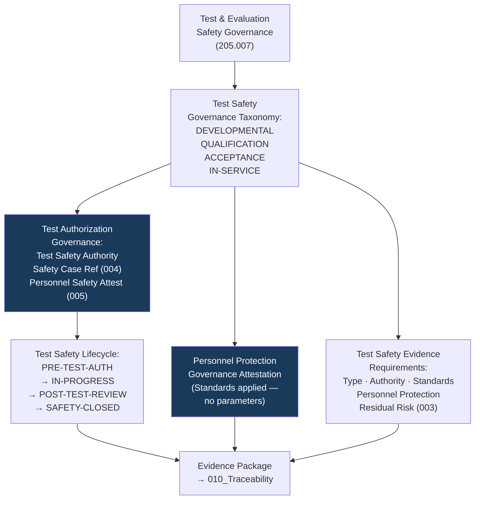

# DTTA 200-209 · Section 00 · Subsection 205 · Subsubject 007 — Test and Evaluation Safety Governance

## 1. Purpose

This subsubject establishes the governance taxonomy of safety requirements applicable to armament test and evaluation activities within subsection `205`. It defines governance-layer safety requirements for test authorization, personnel protection governance, test safety evidence and test safety lifecycle — not operational test procedures or live-fire test protocols.

## 2. Scope

- Covers the *Test and Evaluation Safety Governance* subsubject (`007`) of subsection `205`.
- Concepts in scope:
  - **Test safety governance taxonomy** — The governance classification of test safety governance types: `DEVELOPMENTAL-TEST-SAFETY`, `QUALIFICATION-TEST-SAFETY`, `ACCEPTANCE-TEST-SAFETY`, `IN-SERVICE-TEST-SAFETY` — as governance constructs for evidence packaging and traceability.
  - **Test authorization governance** — The governance requirements for test authorization: named test safety authority, applicable safety case reference (subsubject `004`), and personnel safety governance attestation (subsubject `005`).
  - **Personnel protection governance** — The abstract governance requirement that evidence packages for test activities include a personnel protection governance attestation: a governance-level statement that applicable personnel protection standards have been applied, without specifying standoff distances, protection measures or test range parameters.
  - **Test safety evidence requirements** — The minimum content for a test safety evidence package: test type classification, safety authority identification, applicable standards citations, personnel protection attestation, and residual risk record (from subsubject `003`).
  - **Test safety lifecycle governance** — The governance lifecycle of test safety authorization: `PRE-TEST-AUTHORIZATION`, `TEST-IN-PROGRESS`, `POST-TEST-REVIEW`, `TEST-SAFETY-CLOSED` — with evidence requirements for each stage.
- Out of scope: test procedures, test ranges, live-fire protocols, safety exclusion zones, pyrotechnic handling procedures, explosive ordnance test parameters, personnel protection engineering specifications and any operational test range safety management activities.

## 3. Diagram — Test Safety Governance Lifecycle

## 4. Footprint

| Metric | Value |
|---|---|
| Architecture | `DTTA` — Defence Technology Type Architecture |
| Master range | `200–299` |
| Code range | `200-209` |
| Section | `00` — Sistemas de Combate y Armamento |
| Subsection | `205` — Seguridad de Armamento y Control de Riesgos |
| Subsubject | `007` — Test and Evaluation Safety Governance |
| Primary Q-Division | Q-DATAGOV |
| Support Q-Divisions | Q-SPACE, Q-HORIZON, Q-HPC, Q-STRUCTURES, Q-INDUSTRY |
| ORB support | ORB-LEG, ORB-PMO, ORB-FIN, **ORB-HR** |
| Governance class | `restricted` |
| Document | `007_Test-and-Evaluation-Safety-Governance.md` (this file) |
| Subsection index | [`README.md`](./README.md) |
| Parent section | [`../README.md`](../README.md) |
| Parent baseline | [`organization/Q+ATLANTIDE.md`](../../../../organization/Q+ATLANTIDE.md) |

## 5. References & Citations

[^milstd882e]: **MIL-STD-882E** — DoD Standard Practice: System Safety. Test safety requirements (Task 401); test hazard analysis governance context.
[^defstan]: **DEF STAN 00-056 Issue 5** — Safety Management Requirements for Defence Systems. Test and verification safety requirements (Clause 8); test safety authorization governance.
[^stanag4119]: **NATO STANAG 4119 Ed. 4** — NATO Fuze Design Safety. Test and evaluation governance context for fuze-type armament safety.
[^iec61508]: **IEC 61508-1:2010** — Functional Safety: Verification and Validation (Clause 7.8). Test governance requirements in functional safety lifecycle.
[^natoaqap]: **NATO AQAP-2110** — NATO Quality Assurance Requirements. Test and acceptance governance quality requirements.
[^n006]: **Note N-006 (Restricted bands)** — Defence-related (`200-299` DTTA) bands require additional governance, evidence packages and access controls. See [`organization/Q+ATLANTIDE.md` §5.3](../../../../organization/Q+ATLANTIDE.md#53-restricted-band-templates-n-006).
