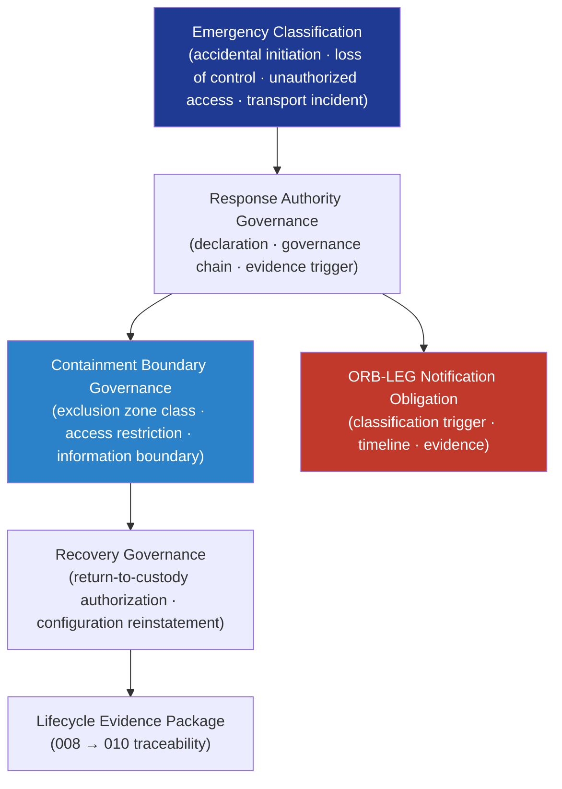

# DTTA 200-209 · Section 00 · Subsection 205 · Subsubject 008 — Emergency Response, Containment and Recovery Boundaries

## 1. Purpose

Defines the **governance boundaries for armament emergency response, containment and recovery** within the DTTA band. This subsubject establishes how emergency response categories are classified for governance purposes, what governance obligations apply at each response boundary, and what evidence obligations must be satisfied before, during, and after an armament emergency response event — without specifying operational emergency procedures.

**Non-operational boundary.** This subsubject defines emergency classification taxonomy, governance boundary obligations, and evidence requirements only. It does not specify emergency response procedures, containment techniques, explosive ordnance disposal (EOD) methods, incident site management protocols, or any operational action taken during or after an armament emergency.

## 2. Scope

- Covers the *Emergency Response, Containment and Recovery Boundaries* subsubject (`008`) of subsection `205`.
- Inherits Q-Division authority and ORB support from the parent row in [`../../README.md` §3](../../README.md#3-architecture-table)[^archtable].
- Concepts in scope:
  - **Emergency classification taxonomy** — Governance classification of armament emergency types (accidental initiation, loss of control, unauthorized access, transportation incident) for governance boundary identification; not operational severity ratings.
  - **Response authority governance** — Governance model for emergency response authority: who is authorized to declare an emergency, what governance chain is activated, and what evidence obligations are triggered at declaration.
  - **Containment boundary governance** — Governance classification of containment boundary types (exclusion zone classification, access restriction governance, media/information boundary obligations); not physical containment engineering.
  - **Recovery governance** — Governance model for post-emergency recovery: return-to-safe-custody authorization, configuration reinstatement obligations, evidence package requirements for recovery actions, and traceability to the lifecycle evidence.
  - **ORB-LEG notification obligations** — Mandatory governance notification obligations to ORB-LEG at specified emergency classification levels, with evidence and timeline requirements.
- Out of scope: legal/ethical constraints (`009`) and lifecycle traceability (`010`).

## 3. Diagram — Emergency Response Governance Boundaries

## 4. Footprint

| Metric | Value |
|---|---|
| Architecture | `DTTA` — Defence Technology Type Architecture |
| Master range | `200–299` |
| Code range | `200-209` |
| Section | `00` — Sistemas de Combate y Armamento |
| Subsection | `205` — Seguridad de Armamento y Control de Riesgos |
| Subsubject | `008` — Emergency Response, Containment and Recovery Boundaries |
| Primary Q-Division | Q-DATAGOV[^qdiv] |
| Support Q-Divisions | Q-SPACE, Q-HORIZON, Q-HPC, Q-STRUCTURES, Q-INDUSTRY |
| ORB support | ORB-LEG, ORB-PMO, ORB-FIN, ORB-HR |
| Governance class | `restricted`[^gov] |
| Folder path | `Q+ATLANTIDE/200-299_DTTA/200-209_Sistemas-de-Combate-y-Armamento/205_Seguridad-de-Armamento-y-Control-de-Riesgos/` |
| Document | `008_Emergency-Response-Containment-and-Recovery-Boundaries.md` (this file) |
| Parent subsection | [`README.md`](./README.md) · [`000_Overview.md`](./000_Overview.md) |
| Parent architecture | [`../../README.md`](../../README.md) |
| Parent baseline | [`organization/Q+ATLANTIDE.md`](../../../../organization/Q+ATLANTIDE.md) |

## 5. References & Citations

[^baseline]: **Q+ATLANTIDE controlled baseline (v1.0.0)** — [`organization/Q+ATLANTIDE.md`](../../../../organization/Q+ATLANTIDE.md).

[^archtable]: **§3 — Architecture Table (parent)** — [`../../README.md` §3](../../README.md#3-architecture-table).

[^qdiv]: **Q-Division authority** — Q-Divisions provide technical authority over an architecture row (Q+ATLANTIDE Note N-002). See [`organization/Q+ATLANTIDE.md` §4](../../../../organization/Q+ATLANTIDE.md#4-notes).

[^gov]: **Governance class** — `restricted` per N-006 for DTTA band documents.

[^milstd882e]: **MIL-STD-882E — System Safety** — Governs emergency classification, response authority obligations, and recovery evidence requirements for armament safety incidents.

[^defstan056]: **DEF STAN 00-056 Issue 5 — Safety Management Requirements for Defence Systems** — Governs emergency response governance obligations, containment boundary classification, and ORB-LEG notification requirements.

[^stanag2888]: **NATO STANAG 2888 — Marking of Hazardous Areas** — Provides governance classification references for exclusion zones and hazardous area boundary designations.

### Applicable standards

- MIL-STD-882E — System Safety[^milstd882e]
- DEF STAN 00-056 Issue 5 — Safety Management Requirements[^defstan056]
- NATO STANAG 2888 — Marking of Hazardous Areas[^stanag2888]
