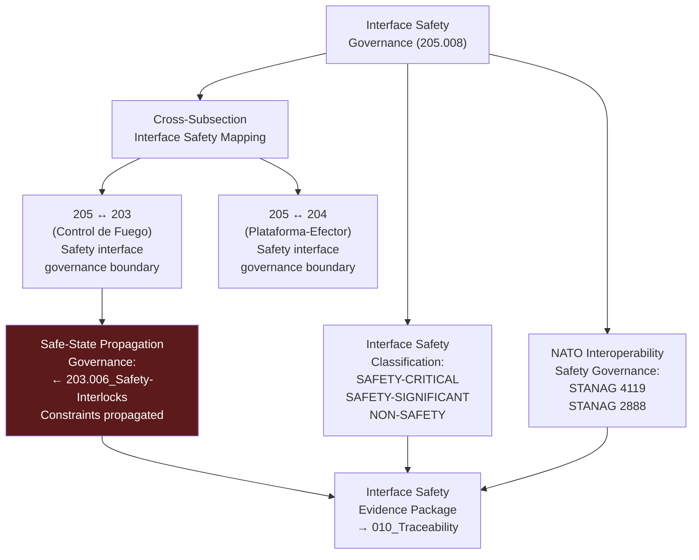

# DTTA 200-209 · Section 00 · Subsection 205 · Subsubject 008 — Interoperability and Interface Safety Governance

## 1. Purpose

This subsubject establishes the governance mapping of interface safety requirements between armament safety subsection `205` and adjacent subsections `203` (Sistemas de Control de Fuego No Operacional) and `204` (Integración Plataforma-Efector). It defines cross-subsection interface safety governance requirements and interoperability safety evidence standards — not engineering interface specifications.

## 2. Scope

- Covers the *Interoperability and Interface Safety Governance* subsubject (`008`) of subsection `205`.
- Concepts in scope:
  - **Cross-subsection interface safety mapping** — The governance mapping of safety interface requirements between subsection `205` and subsections `203` and `204`, establishing where each subsection's safety governance obligations begin and end.
  - **Interface safety classification** — The governance classification of safety-relevant interfaces: `SAFETY-CRITICAL`, `SAFETY-SIGNIFICANT`, `NON-SAFETY` — as abstract governance identifiers for evidence packaging and traceability.
  - **NATO interoperability safety governance** — The abstract governance reference to NATO STANAG 4119 and STANAG 2888 as interoperability safety standards anchors for cross-system armament safety governance requirements.
  - **Interface safety evidence requirements** — The minimum content for an interface safety evidence package: interface classification, applicable standard citation, safety authority identification, and cross-subsection reference.
  - **Safe-state propagation governance** — The governance requirement that safe-state conditions defined in subsection `203` subsubject `006` (Safety Interlocks) must propagate as governance constraints into subsection `205` interface safety evidence records.
- Out of scope: engineering interface specifications, interface control documents, safety-critical interface hardware designs, inter-system communication protocols, electrical isolation specifications and any operational interface safety management activities.

## 3. Diagram — Interface Safety Governance Map

## 4. Footprint

| Metric | Value |
|---|---|
| Architecture | `DTTA` — Defence Technology Type Architecture |
| Master range | `200–299` |
| Code range | `200-209` |
| Section | `00` — Sistemas de Combate y Armamento |
| Subsection | `205` — Seguridad de Armamento y Control de Riesgos |
| Subsubject | `008` — Interoperability and Interface Safety Governance |
| Primary Q-Division | Q-DATAGOV |
| Support Q-Divisions | Q-SPACE, Q-HORIZON, Q-HPC, Q-STRUCTURES, Q-INDUSTRY |
| ORB support | ORB-LEG, ORB-PMO, ORB-FIN, **ORB-HR** |
| Governance class | `restricted` |
| Document | `008_Interoperability-and-Interface-Safety-Governance.md` (this file) |
| Subsection index | [`README.md`](./README.md) |
| Parent section | [`../README.md`](../README.md) |
| Parent baseline | [`organization/Q+ATLANTIDE.md`](../../../../organization/Q+ATLANTIDE.md) |

## 5. References & Citations

[^stanag4119]: **NATO STANAG 4119 Ed. 4** — Common NATO Fuze Design Safety and Suitability for Service. Interoperability safety governance for armament system interfaces.
[^stanag2888]: **STANAG 2888** — NATO Standard for Storage and Transport of Military Ammunition and Explosives. Interface safety governance context for storage and transport.
[^milstd882e]: **MIL-STD-882E** — DoD Standard Practice: System Safety. Interface Hazard Analysis (Task 207) — interface safety classification governance.
[^defstan]: **DEF STAN 00-056 Issue 5** — Safety Management Requirements for Defence Systems. Interface safety requirements for system-of-systems safety governance.
[^iec61508]: **IEC 61508-1:2010** — Functional Safety: Safety Function and Interface Safety Requirements. Safety-critical interface classification governance.
[^n006]: **Note N-006 (Restricted bands)** — Defence-related (`200-299` DTTA) bands require additional governance, evidence packages and access controls. See [`organization/Q+ATLANTIDE.md` §5.3](../../../../organization/Q+ATLANTIDE.md#53-restricted-band-templates-n-006).
