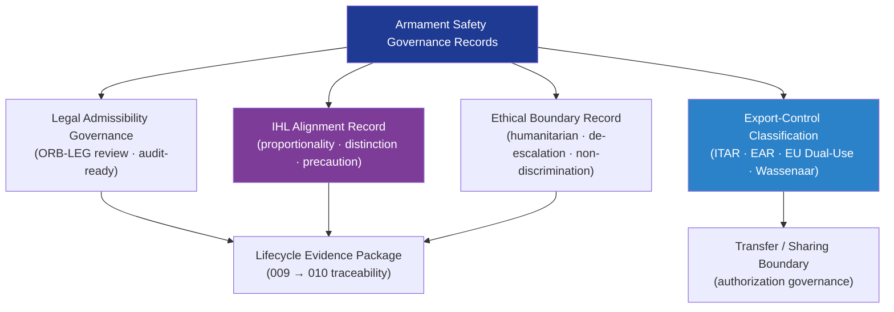

# DTTA 200-209 · Section 00 · Subsection 205 · Subsubject 009 — Legal, Ethical and Export Control Constraints

## 1. Purpose

Defines the **legal, ethical and export-control constraint framework** for armament safety and risk control governance within the DTTA band. This subsubject establishes the governance obligations arising from applicable legal instruments, ethical principles, and export-control regimes — ensuring that armament safety governance records are legally admissible, ethically bounded, and classified for export-control purposes.

**Non-operational boundary.** This subsubject defines legal classification, ethical constraint governance, and export-control record obligations only. It does not specify weapon use rules, rules of engagement, operational legal review processes, or any operational action governed by legal or ethical constraints.

## 2. Scope

- Covers the *Legal, Ethical and Export Control Constraints* subsubject (`009`) of subsection `205`.
- Inherits Q-Division authority and ORB support from the parent row in [`../../README.md` §3](../../README.md#3-architecture-table)[^archtable].
- Concepts in scope:
  - **Legal admissibility governance** — Requirements ensuring armament safety governance records satisfy legal admissibility standards for audit, regulatory inspection, and litigation; ORB-LEG review obligations.
  - **International humanitarian law alignment** — Governance record obligations arising from IHL[^ihl] proportionality, distinction, and precaution principles — expressed as governance constraints on armament safety records, not operational compliance.
  - **Export-control classification** — Governance model for classifying armament safety records under applicable export-control frameworks (ITAR[^itar], EAR[^ear], EU Dual-Use Regulation[^eudu], Wassenaar Arrangement[^wass]); abstract classification for governance purposes.
  - **Ethical boundary constraints** — Governance record obligations arising from humanitarian, proportionality, de-escalation, and non-discrimination ethical principles; documented as governance evidence, not operational guidance.
  - **ORB-LEG review triggers** — Mandatory ORB-LEG review events triggered by changes to armament safety governance records with legal or export-control implications.
- Out of scope: lifecycle traceability (`010`).

## 3. Diagram — Legal, Ethical and Export Control Governance

## 4. Footprint

| Metric | Value |
|---|---|
| Architecture | `DTTA` — Defence Technology Type Architecture |
| Master range | `200–299` |
| Code range | `200-209` |
| Section | `00` — Sistemas de Combate y Armamento |
| Subsection | `205` — Seguridad de Armamento y Control de Riesgos |
| Subsubject | `009` — Legal, Ethical and Export Control Constraints |
| Primary Q-Division | Q-DATAGOV[^qdiv] |
| Support Q-Divisions | Q-SPACE, Q-HORIZON, Q-HPC, Q-STRUCTURES, Q-INDUSTRY |
| ORB support | ORB-LEG, ORB-PMO, ORB-FIN, ORB-HR |
| Governance class | `restricted`[^gov] |
| Folder path | `Q+ATLANTIDE/200-299_DTTA/200-209_Sistemas-de-Combate-y-Armamento/205_Seguridad-de-Armamento-y-Control-de-Riesgos/` |
| Document | `009_Legal-Ethical-and-Export-Control-Constraints.md` (this file) |
| Parent subsection | [`README.md`](./README.md) · [`000_Overview.md`](./000_Overview.md) |
| Parent architecture | [`../../README.md`](../../README.md) |
| Parent baseline | [`organization/Q+ATLANTIDE.md`](../../../../organization/Q+ATLANTIDE.md) |

## 5. References & Citations

[^baseline]: **Q+ATLANTIDE controlled baseline (v1.0.0)** — [`organization/Q+ATLANTIDE.md`](../../../../organization/Q+ATLANTIDE.md).
[^archtable]: **§3 — Architecture Table (parent)** — [`../../README.md` §3](../../README.md#3-architecture-table).
[^qdiv]: **Q-Division authority** — See [`organization/Q+ATLANTIDE.md` §4](../../../../organization/Q+ATLANTIDE.md#4-notes).
[^gov]: **Governance class** — `restricted` per N-006 for DTTA band documents.
[^ihl]: **International Humanitarian Law — Geneva Conventions and Additional Protocols** — Legal framework for proportionality, distinction, and precaution obligations in armament safety governance.
[^itar]: **ITAR — International Traffic in Arms Regulations (22 CFR Parts 120–130)** — US export-control framework for defence articles.
[^ear]: **EAR — Export Administration Regulations (15 CFR Parts 730–774)** — US dual-use export-control framework.
[^eudu]: **EU Dual-Use Regulation (EU) 2021/821** — EU export-control framework for dual-use items.
[^wass]: **Wassenaar Arrangement on Export Controls for Conventional Arms and Dual-Use Goods and Technologies** — Multilateral export-control regime governing armament safety record transfer governance.

### Applicable frameworks

- IHL — Geneva Conventions and Additional Protocols[^ihl]
- ITAR — International Traffic in Arms Regulations[^itar]
- EAR — Export Administration Regulations[^ear]
- EU Dual-Use Regulation (EU) 2021/821[^eudu]
- Wassenaar Arrangement[^wass]
