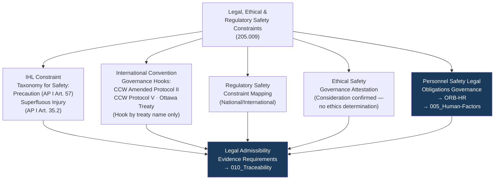

# DTTA 200-209 · Section 00 · Subsection 205 · Subsubject 009 — Legal, Ethical and Regulatory Safety Constraints

## 1. Purpose

This subsubject establishes the governance taxonomy of legal, ethical and regulatory safety constraints specific to armament safety governance within subsection `205`. It maps IHL obligations, international conventions, national legal frameworks and ethical principles to governance evidence requirements — not as legal advice or ethical assessments, but as governance traceability anchors.

## 2. Scope

- Covers the *Legal, Ethical and Regulatory Safety Constraints* subsubject (`009`) of subsection `205`.
- Concepts in scope:
  - **IHL constraint taxonomy for armament safety** — The governance classification of IHL principles as they apply to armament safety governance: precaution in attack obligations (AP I Art. 57) mapped as safety precaution governance constraints; prohibition of superfluous injury (AP I Art. 35.2) mapped as safety design governance constraint.
  - **International convention governance hooks** — The governance mapping of international treaty instruments (CCW Amended Protocol II on landmines, CCW Protocol V on ERW, Ottawa Treaty) as constraint governance hooks for armament types where applicable — identified by treaty name only, no legal interpretation.
  - **Regulatory safety constraint mapping** — The governance mapping of national and international regulatory safety instruments to armament safety evidence requirements at the governance layer.
  - **Ethical safety governance** — The abstract governance requirement that armament safety evidence packages include an ethical safety governance attestation: confirmation that applicable international ethical guidelines on armament safety have been considered — not an ethics determination.
  - **Personnel safety legal obligations governance** — The governance hook for `ORB-HR`: the mapping of national and international occupational health and safety legal obligations to personnel safety governance (subsubject `005`) within the evidence package.
- Out of scope: legal advice, IHL compliance determinations, weapons law reviews for specific systems, ethics committee findings, occupational health and safety compliance assessments and any operational legal clearance or regulatory approval activities.

## 3. Diagram — Legal and Regulatory Safety Constraint Governance Map

## 4. Footprint

| Metric | Value |
|---|---|
| Architecture | `DTTA` — Defence Technology Type Architecture |
| Master range | `200–299` |
| Code range | `200-209` |
| Section | `00` — Sistemas de Combate y Armamento |
| Subsection | `205` — Seguridad de Armamento y Control de Riesgos |
| Subsubject | `009` — Legal, Ethical and Regulatory Safety Constraints |
| Primary Q-Division | Q-DATAGOV |
| Support Q-Divisions | Q-SPACE, Q-HORIZON, Q-HPC, Q-STRUCTURES, Q-INDUSTRY |
| ORB support | ORB-LEG, ORB-PMO, ORB-FIN, **ORB-HR** |
| Governance class | `restricted` |
| Document | `009_Legal-Ethical-and-Regulatory-Safety-Constraints.md` (this file) |
| Subsection index | [`README.md`](./README.md) |
| Parent section | [`../README.md`](../README.md) |
| Parent baseline | [`organization/Q+ATLANTIDE.md`](../../../../organization/Q+ATLANTIDE.md) |

## 5. References & Citations

[^geneva]: **Geneva Conventions (1949) Additional Protocol I, Articles 35.2 and 57** — Prohibition of superfluous injury; precaution in attack obligations; mapped as armament safety design governance constraints.
[^ccw]: **Convention on Certain Conventional Weapons (CCW) — Amended Protocol II and Protocol V** — Landmine and Explosive Remnants of War governance constraints; referenced by treaty name as constraint governance hooks.
[^ottawa]: **Ottawa Treaty (1997) — Convention on the Prohibition of the Use, Stockpiling, Production and Transfer of Anti-Personnel Mines** — Referenced as international convention governance hook where applicable armament types are identified.
[^milstd882e]: **MIL-STD-882E** — DoD Standard Practice: System Safety. Legal and regulatory compliance context for system safety governance.
[^defstan]: **DEF STAN 00-056 Issue 5** — Safety Management Requirements for Defence Systems. Regulatory safety governance requirements for defence systems.
[^iso31000]: **ISO 31000:2018** — Risk Management: Guidelines. Ethical and regulatory context for risk governance in armament safety.
[^n006]: **Note N-006 (Restricted bands)** — Defence-related (`200-299` DTTA) bands require additional governance, evidence packages and access controls. See [`organization/Q+ATLANTIDE.md` §5.3](../../../../organization/Q+ATLANTIDE.md#53-restricted-band-templates-n-006).
