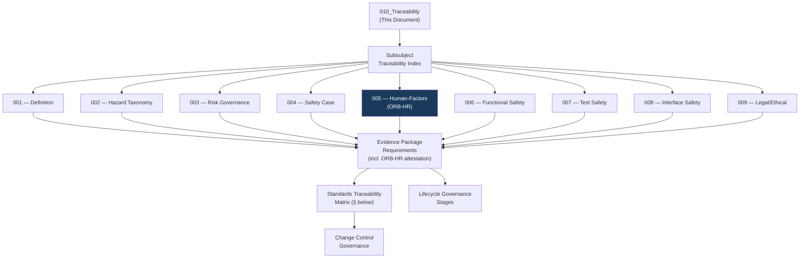

# DTTA 200-209 · Section 00 · Subsection 205 · Subsubject 010 — Traceability, Evidence and Lifecycle Governance

## 1. Purpose

This subsubject is the closing governance document for subsection `205`. It establishes the traceability architecture, evidence-packaging requirements and lifecycle governance framework for all subsubjects `001`–`009`. It provides the standards traceability matrix and lifecycle governance model used for audit, legal admissibility and evidence package certification across the full subsection.

The `ORB-HR` function support extends through this traceability document, as personnel safety and human-factors evidence requirements are tracked alongside technical safety evidence.

## 2. Scope

- Covers the *Traceability, Evidence and Lifecycle Governance* subsubject (`010`) of subsection `205`.
- Concepts in scope:
  - **Traceability architecture** — The governance-layer model linking each subsubject `001`–`009` document to its applicable standards citations, evidence package identifiers, human authority records and ORB function attestations.
  - **Evidence package requirements** — The minimum content requirements for a governance-complete evidence package: document ID, version, authority attribution, standards citation, ORB function attestation (including ORB-HR for personnel safety items), and hazard/risk traceability.
  - **Standards traceability matrix** — The mapping of applicable standards to the specific subsubjects they govern.
  - **Lifecycle governance stages** — The governance lifecycle stages: `PENDING`, `ACTIVE`, `UNDER-REVIEW`, `SUPERSEDED`, `ARCHIVED`.
  - **Change control governance** — The governance requirements for change control: change initiator, impact assessment, re-authorization and evidence package update.
- Out of scope: operational lifecycle management, engineering change management systems, and any system operational lifecycle events.

## 3. Diagram — Traceability and Evidence Architecture

## 4. Standards Traceability Matrix

| Standard | Subsubjects Governed | Key Requirement Mapped |
|---|---|---|
| **MIL-STD-882E** | 001, 002, 003, 004, 005, 007, 008, 009 | System safety lifecycle; hazard categories; risk matrix; test safety; interface hazard analysis |
| **DEF STAN 00-056 Issue 5** | 001, 003, 004, 005, 006, 007, 008, 009 | Safety management; safety case governance; human factors; functional safety; test verification |
| **NATO STANAG 4119 Ed. 4** | 001, 002, 004, 007, 008 | Fuze design safety; hazard classification; safety case governance; interoperability |
| **STANAG 2888** | 002, 008 | Storage/transport hazard classification; interface safety governance |
| **IEC 61508 (Parts 1–4):2010** | 001, 006, 007, 008 | Functional safety lifecycle; SIL classification; safety function governance; test governance |
| **ISO 31000:2018** | 001, 003, 005, 009 | Risk governance framework; risk classification; human error risk contribution |
| **NATO AQAP-2110** | 003, 004, 007 | Quality governance for risk, safety case and test evidence packages |
| **Geneva Conventions / AP I** | 001, 009 | IHL constraints: precaution (Art. 57), superfluous injury prohibition (Art. 35.2) |
| **CCW Protocols II (Amended) & V** | 009 | International convention governance hooks for applicable armament types |
| **Ottawa Treaty (1997)** | 009 | International convention governance hook for applicable armament types |

## 5. Footprint

| Metric | Value |
|---|---|
| Architecture | `DTTA` — Defence Technology Type Architecture |
| Master range | `200–299` |
| Code range | `200-209` |
| Section | `00` — Sistemas de Combate y Armamento |
| Subsection | `205` — Seguridad de Armamento y Control de Riesgos |
| Subsubject | `010` — Traceability, Evidence and Lifecycle Governance |
| Primary Q-Division | Q-DATAGOV |
| Support Q-Divisions | Q-SPACE, Q-HORIZON, Q-HPC, Q-STRUCTURES, Q-INDUSTRY |
| ORB support | ORB-LEG, ORB-PMO, ORB-FIN, **ORB-HR** |
| Governance class | `restricted` |
| Document | `010_Traceability-Evidence-and-Lifecycle-Governance.md` (this file) |
| Subsection index | [`README.md`](./README.md) |
| Parent section | [`../README.md`](../README.md) |
| Parent baseline | [`organization/Q+ATLANTIDE.md`](../../../../organization/Q+ATLANTIDE.md) |

## 6. References & Citations

[^milstd882e]: **MIL-STD-882E** — DoD Standard Practice: System Safety (2012). Primary system safety standard for subsection `205`.
[^defstan]: **DEF STAN 00-056 Issue 5** — Safety Management Requirements for Defence Systems.
[^stanag4119]: **NATO STANAG 4119 Ed. 4** — Common NATO Fuze Design Safety and Suitability for Service.
[^stanag2888]: **STANAG 2888** — NATO Standard for Storage and Transport of Military Ammunition and Explosives.
[^iec61508]: **IEC 61508 (Parts 1–4):2010** — Functional Safety of E/E/PE Safety-related Systems.
[^iso31000]: **ISO 31000:2018** — Risk Management: Guidelines.
[^natoaqap]: **NATO AQAP-2110** — NATO Quality Assurance Requirements.
[^geneva]: **Geneva Conventions (1949) and Additional Protocols I & II** — Foundational IHL instruments.
[^ccw]: **CCW Amended Protocol II and Protocol V** — International convention governance hooks.
[^ottawa]: **Ottawa Treaty (1997)** — Anti-Personnel Mines prohibition convention.
[^n006]: **Note N-006 (Restricted bands)** — See [`organization/Q+ATLANTIDE.md` §5.3](../../../../organization/Q+ATLANTIDE.md#53-restricted-band-templates-n-006).
