# DTTA 200-209 · Section 00 — Sistemas de Combate y Armamento

## 1. Purpose

Section-level index for *Sistemas de Combate y Armamento* (`200-209`) within the DTTA band. Sistemas de combate, efectos, integración de plataformas.

This section is part of the **ATLAS-1000** register, a subpart of the controlled **Q+ATLANTIDE** baseline[^baseline][^n001]. Bands classify technologies, Q-Divisions provide technical authority and ORB-Functions provide enterprise support[^n002].

**Restricted band (N-006[^n006]).** Documents in this section must declare `governance_class: restricted`, `evidence_package_id` and `access_control_profile`.

**Non-operational boundary.** This section provides classification, governance and traceability structures only. It does not contain weapon construction data, targeting methods, offensive procedures, or instructions enabling harm.

## 2. Scope

- Aggregates the subjects within the `200-209` code range listed in §3.
- Inherits Q-Division authority and ORB support from the parent row in [`../README.md` §3](../README.md#3-architecture-table)[^archtable].
- Each subject folder contains its own documents. Subject codes use absolute numbering (`200`–`209`).

## 3. Subject Index

| Code | Title | Folder | Status |
|---:|---|---|---|
| `200` | Arquitectura de Sistemas de Combate | [`./200_Arquitectura-de-Sistemas-de-Combate/`](./200_Arquitectura-de-Sistemas-de-Combate/) | reserved |
| `201` | Clasificacion de Efectores y Capacidades | [`./201_Clasificacion-de-Efectores-y-Capacidades/`](./201_Clasificacion-de-Efectores-y-Capacidades/) | reserved |
| `202` | Armamento Convencional Clasificacion y Control | [`./202_Armamento-Convencional-Clasificacion-y-Control/`](./202_Armamento-Convencional-Clasificacion-y-Control/) | reserved |
| `203` | Sistemas de Control de Fuego No Operacional | [`./203_Sistemas-de-Control-de-Fuego-No-Operacional/`](./203_Sistemas-de-Control-de-Fuego-No-Operacional/) | reserved |
| `204` | Integracion Plataforma Efector | [`./204_Integracion-Plataforma-Efector/`](./204_Integracion-Plataforma-Efector/) | reserved |
| `205` | Seguridad de Armamento y Control de Riesgos | [`./205_Seguridad-de-Armamento-y-Control-de-Riesgos/`](./205_Seguridad-de-Armamento-y-Control-de-Riesgos/) | reserved |
| `206` | Cumplimiento Control de Exportacion y No Proliferacion | [`./206_Cumplimiento-Control-de-Exportacion-y-No-Proliferacion/`](./206_Cumplimiento-Control-de-Exportacion-y-No-Proliferacion/) | reserved |
| `207` | Interoperabilidad NATO UE y Doctrina Defensiva | [`./207_Interoperabilidad-NATO-UE-y-Doctrina-Defensiva/`](./207_Interoperabilidad-NATO-UE-y-Doctrina-Defensiva/) | reserved |
| `208` | Evidencia Trazabilidad y Gobernanza de Ciclo de Vida | [`./208_Evidencia-Trazabilidad-y-Gobernanza-de-Ciclo-de-Vida/`](./208_Evidencia-Trazabilidad-y-Gobernanza-de-Ciclo-de-Vida/) | reserved |
| `209` | Limites Eticos Legales y No Operacionales | [`./209_Limites-Eticos-Legales-y-No-Operacionales/`](./209_Limites-Eticos-Legales-y-No-Operacionales/) | reserved |

## 4. Interfaces Diagram

```mermaid
flowchart TB
    PARENT["ATLAS-1000<br/>(`200–299` master range)"]:::parent
    SEC["Section 00 · 200-209<br/>Sistemas de Combate y Armamento"]:::sec
    PARENT --> SEC

    subgraph SUBS["Subjects"]
        direction LR
        SUB_200["200 — Arquitectura de Sistemas de Combate"]:::sub
        SUB_201["201 — Clasificacion de Efectores y Capacidades"]:::sub
        SUB_202["202 — Armamento Convencional Clasificacion y Control"]:::sub
        SUB_203["203 — Sistemas de Control de Fuego No Operacional"]:::sub
        SUB_204["204 — Integracion Plataforma Efector"]:::sub
        SUB_205["205 — Seguridad de Armamento y Control de Riesgos"]:::sub
        SUB_206["206 — Cumplimiento Control de Exportacion y No Proliferacion"]:::sub
        SUB_207["207 — Interoperabilidad NATO UE y Doctrina Defensiva"]:::sub
        SUB_208["208 — Evidencia Trazabilidad y Gobernanza de Ciclo de Vida"]:::sub
        SUB_209["209 — Limites Eticos Legales y No Operacionales"]:::sub
    end
    SEC --> SUBS

    QPRIM["Q-HORIZON<br/>(primary Q-Division)"]:::qdiv
    QSUPP["Q-AIR, Q-SPACE, Q-DATAGOV<br/>(support Q-Divisions)"]:::qdiv
    ORB["ORB-LEG, ORB-PMO<br/>(ORB support)"]:::orb

    SEC --> QPRIM
    SEC -.-> QSUPP
    SEC -.-> ORB

    SUBS --> SUB_200
    SUBS --> SUB_201
    SUBS --> SUB_202
    SUBS --> SUB_203
    SUBS --> SUB_204
    SUBS --> SUB_205
    SUBS --> SUB_206
    SUBS --> SUB_207
    SUBS --> SUB_208
    SUBS --> SUB_209

    classDef parent fill:#1f3a93,stroke:#0b1d4a,color:#fff
    classDef sec fill:#2c82c9,stroke:#0b1d4a,color:#fff
    classDef sub fill:#eaf3fb,stroke:#2c82c9,color:#0b1d4a
    classDef qdiv fill:#f6e6ff,stroke:#7d3c98,color:#3b1f4d
    classDef orb fill:#fff4dd,stroke:#b9770e,color:#5a3b00
```

*Solid arrows show parent→section→subject ownership and primary Q-Division authority; dotted arrows show support Q-Divisions and ORB enterprise support.*

## 5. Footprint

| Metric | Value |
|---|---|
| Architecture | `DTTA` — Defence Technology Type Architecture |
| Master range | `200–299` |
| Code range | `200-209` |
| Section | `00` — Sistemas de Combate y Armamento |
| Subjects | 10 reserved |
| Primary Q-Division | Q-HORIZON[^qdiv] |
| Support Q-Divisions | Q-AIR, Q-SPACE, Q-DATAGOV |
| ORB support | ORB-LEG, ORB-PMO |
| Governance class | `restricted`[^gov] |
| Folder path | `Q+ATLANTIDE/200-299_DTTA/200-209_Sistemas-de-Combate-y-Armamento/` |
| Document | `README.md` (this file) |
| Parent architecture | [`../README.md`](../README.md) |
| Parent baseline | [`organization/Q+ATLANTIDE.md`](../../../organization/Q+ATLANTIDE.md) |

## Governance

Governed by [`organization/Q+ATLANTIDE.md`](../../../organization/Q+ATLANTIDE.md)[^baseline]. All subjects under this section inherit `architecture_code = DTTA`, `primary_q_division = Q-HORIZON`, `governance_class = restricted`, and must additionally declare `evidence_package_id` and `access_control_profile` per N-006[^n006]. The No-AAA Rule[^n004] applies.

## 6. References & Citations

[^baseline]: **Q+ATLANTIDE controlled baseline (v1.0.0)** — [`organization/Q+ATLANTIDE.md`](../../../organization/Q+ATLANTIDE.md).

[^archtable]: **§3 — Architecture Table (parent)** — [`../README.md` §3](../README.md#3-architecture-table).

[^qdiv]: **Q-Division authority** — [`organization/Q-Divisions/`](../../../organization/Q-Divisions/).

[^gov]: **Governance class** — `restricted` per N-006 for DTTA band documents.

[^templates]: **§5 — Templates System** — [`organization/Q+ATLANTIDE.md` §5](../../../organization/Q+ATLANTIDE.md#5-templates-system).

[^n001]: **Note N-001** — Q+ATLANTIDE is a taxonomy and traceability ecosystem, not an organization chart. See [`organization/Q+ATLANTIDE.md` §4](../../../organization/Q+ATLANTIDE.md#4-notes).

[^n002]: **Note N-002** — Architecture bands classify technologies; Q-Divisions provide technical authority; ORB-Functions provide enterprise support. See [`organization/Q+ATLANTIDE.md` §4](../../../organization/Q+ATLANTIDE.md#4-notes).

[^n004]: **Note N-004 (No-AAA Rule)** — "AAA" is not a valid domain, division, architecture, interface or function in this baseline. See [`organization/Q+ATLANTIDE.md` §4](../../../organization/Q+ATLANTIDE.md#4-notes).

[^n006]: **Note N-006 (Restricted bands)** — Defence-related (`200-299` DTTA), cybersecurity-related (`800-899` CYB) and quantum-related (`900-999` QCSAA) bands require additional governance, evidence packages and access controls. See [`organization/Q+ATLANTIDE.md` §5.3](../../../organization/Q+ATLANTIDE.md#53-restricted-band-templates-n-006).
