# DTTA 210-219 · Section 01 — C4ISR

## 1. Purpose

Section-level index for *C4ISR* (`210-219`) within the DTTA band. Mando, control, comunicaciones, inteligencia, vigilancia, reconocimiento.

This section is part of the **ATLAS-1000** register, a subpart of the controlled **Q+ATLANTIDE** baseline[^baseline][^n001]. Bands classify technologies, Q-Divisions provide technical authority and ORB-Functions provide enterprise support[^n002].

**Restricted band (N-006[^n006]).** Documents in this section must declare `governance_class: restricted`, `evidence_package_id` and `access_control_profile`.

**Non-operational boundary.** This section provides classification, governance and traceability structures only. It does not contain weapon construction data, targeting methods, offensive procedures, or instructions enabling harm.

## 2. Scope

- Aggregates the subjects within the `210-219` code range listed in §3.
- Inherits Q-Division authority and ORB support from the parent row in [`../README.md` §3](../README.md#3-architecture-table)[^archtable].
- Each subject folder contains its own documents. Subject codes use absolute numbering (`210`–`219`).

## 3. Subject Index

| Code | Title | Folder | Status |
|---:|---|---|---|
| `210` | Comando Control Comunicaciones Computacion | [`./210_Comando-Control-Comunicaciones-Computacion/`](./210_Comando-Control-Comunicaciones-Computacion/) | reserved |
| `211` | Inteligencia Vigilancia y Reconocimiento | [`./211_Inteligencia-Vigilancia-y-Reconocimiento/`](./211_Inteligencia-Vigilancia-y-Reconocimiento/) | reserved |
| `212` | Arquitectura de Mando y Control | [`./212_Arquitectura-de-Mando-y-Control/`](./212_Arquitectura-de-Mando-y-Control/) | reserved |
| `213` | Fusion de Datos y Common Operational Picture | [`./213_Fusion-de-Datos-y-Common-Operational-Picture/`](./213_Fusion-de-Datos-y-Common-Operational-Picture/) | reserved |
| `214` | Sistemas de Comunicacion Segura | [`./214_Sistemas-de-Comunicacion-Segura/`](./214_Sistemas-de-Comunicacion-Segura/) | reserved |
| `215` | Sensores ISR y Cadenas de Observacion | [`./215_Sensores-ISR-y-Cadenas-de-Observacion/`](./215_Sensores-ISR-y-Cadenas-de-Observacion/) | reserved |
| `216` | Interoperabilidad C4ISR y Estadandares | [`./216_Interoperabilidad-C4ISR-y-Estadandares/`](./216_Interoperabilidad-C4ISR-y-Estadandares/) | reserved |
| `217` | Resiliencia C4ISR y Continuidad Operacional | [`./217_Resiliencia-C4ISR-y-Continuidad-Operacional/`](./217_Resiliencia-C4ISR-y-Continuidad-Operacional/) | reserved |
| `218` | Evidencia Trazabilidad y Gobernanza C4ISR | [`./218_Evidencia-Trazabilidad-y-Gobernanza-C4ISR/`](./218_Evidencia-Trazabilidad-y-Gobernanza-C4ISR/) | reserved |
| `219` | Limites de Uso Privacidad y Supervision Humana | [`./219_Limites-de-Uso-Privacidad-y-Supervision-Humana/`](./219_Limites-de-Uso-Privacidad-y-Supervision-Humana/) | reserved |

## 4. Interfaces Diagram

```mermaid
flowchart TB
    PARENT["ATLAS-1000<br/>(`200–299` master range)"]:::parent
    SEC["Section 01 · 210-219<br/>C4ISR"]:::sec
    PARENT --> SEC

    subgraph SUBS["Subjects"]
        direction LR
        SUB_210["210 — Comando Control Comunicaciones Computacion"]:::sub
        SUB_211["211 — Inteligencia Vigilancia y Reconocimiento"]:::sub
        SUB_212["212 — Arquitectura de Mando y Control"]:::sub
        SUB_213["213 — Fusion de Datos y Common Operational Picture"]:::sub
        SUB_214["214 — Sistemas de Comunicacion Segura"]:::sub
        SUB_215["215 — Sensores ISR y Cadenas de Observacion"]:::sub
        SUB_216["216 — Interoperabilidad C4ISR y Estadandares"]:::sub
        SUB_217["217 — Resiliencia C4ISR y Continuidad Operacional"]:::sub
        SUB_218["218 — Evidencia Trazabilidad y Gobernanza C4ISR"]:::sub
        SUB_219["219 — Limites de Uso Privacidad y Supervision Humana"]:::sub
    end
    SEC --> SUBS

    QPRIM["Q-DATAGOV<br/>(primary Q-Division)"]:::qdiv
    QSUPP["Q-SPACE, Q-HPC, Q-AIR<br/>(support Q-Divisions)"]:::qdiv
    ORB["ORB-PMO, ORB-LEG<br/>(ORB support)"]:::orb

    SEC --> QPRIM
    SEC -.-> QSUPP
    SEC -.-> ORB

    SUBS --> SUB_210
    SUBS --> SUB_211
    SUBS --> SUB_212
    SUBS --> SUB_213
    SUBS --> SUB_214
    SUBS --> SUB_215
    SUBS --> SUB_216
    SUBS --> SUB_217
    SUBS --> SUB_218
    SUBS --> SUB_219

    classDef parent fill:#1f3a93,stroke:#0b1d4a,color:#fff
    classDef sec fill:#2c82c9,stroke:#0b1d4a,color:#fff
    classDef sub fill:#eaf3fb,stroke:#2c82c9,color:#0b1d4a
    classDef qdiv fill:#f6e6ff,stroke:#7d3c98,color:#3b1f4d
    classDef orb fill:#fff4dd,stroke:#b9770e,color:#5a3b00
```

*Solid arrows show parent→section→subject ownership and primary Q-Division authority; dotted arrows show support Q-Divisions and ORB enterprise support.*

## 5. Footprint

| Metric | Value |
|---|---|
| Architecture | `DTTA` — Defence Technology Type Architecture |
| Master range | `200–299` |
| Code range | `210-219` |
| Section | `01` — C4ISR |
| Subjects | 10 reserved |
| Primary Q-Division | Q-DATAGOV[^qdiv] |
| Support Q-Divisions | Q-SPACE, Q-HPC, Q-AIR |
| ORB support | ORB-PMO, ORB-LEG |
| Governance class | `restricted`[^gov] |
| Folder path | `Q+ATLANTIDE/200-299_DTTA/210-219_C4ISR/` |
| Document | `README.md` (this file) |
| Parent architecture | [`../README.md`](../README.md) |
| Parent baseline | [`organization/Q+ATLANTIDE.md`](../../../organization/Q+ATLANTIDE.md) |

## Governance

Governed by [`organization/Q+ATLANTIDE.md`](../../../organization/Q+ATLANTIDE.md)[^baseline]. All subjects under this section inherit `architecture_code = DTTA`, `primary_q_division = Q-DATAGOV`, `governance_class = restricted`, and must additionally declare `evidence_package_id` and `access_control_profile` per N-006[^n006]. The No-AAA Rule[^n004] applies.

## 6. References & Citations

[^baseline]: **Q+ATLANTIDE controlled baseline (v1.0.0)** — [`organization/Q+ATLANTIDE.md`](../../../organization/Q+ATLANTIDE.md).

[^archtable]: **§3 — Architecture Table (parent)** — [`../README.md` §3](../README.md#3-architecture-table).

[^qdiv]: **Q-Division authority** — [`organization/Q-Divisions/`](../../../organization/Q-Divisions/).

[^gov]: **Governance class** — `restricted` per N-006 for DTTA band documents.

[^templates]: **§5 — Templates System** — [`organization/Q+ATLANTIDE.md` §5](../../../organization/Q+ATLANTIDE.md#5-templates-system).

[^n001]: **Note N-001** — Q+ATLANTIDE is a taxonomy and traceability ecosystem, not an organization chart. See [`organization/Q+ATLANTIDE.md` §4](../../../organization/Q+ATLANTIDE.md#4-notes).

[^n002]: **Note N-002** — Architecture bands classify technologies; Q-Divisions provide technical authority; ORB-Functions provide enterprise support. See [`organization/Q+ATLANTIDE.md` §4](../../../organization/Q+ATLANTIDE.md#4-notes).

[^n004]: **Note N-004 (No-AAA Rule)** — "AAA" is not a valid domain, division, architecture, interface or function in this baseline. See [`organization/Q+ATLANTIDE.md` §4](../../../organization/Q+ATLANTIDE.md#4-notes).

[^n006]: **Note N-006 (Restricted bands)** — Defence-related (`200-299` DTTA), cybersecurity-related (`800-899` CYB) and quantum-related (`900-999` QCSAA) bands require additional governance, evidence packages and access controls. See [`organization/Q+ATLANTIDE.md` §5.3](../../../organization/Q+ATLANTIDE.md#53-restricted-band-templates-n-006).
