# DTTA 220-229 · Section 02 — Protección y Resiliencia

## 1. Purpose

Section-level index for *Protección y Resiliencia* (`220-229`) within the DTTA band. Protección de sistemas, supervivencia, hardening, resiliencia operacional.

This section is part of the **ATLAS-1000** register, a subpart of the controlled **Q+ATLANTIDE** baseline[^baseline][^n001]. Bands classify technologies, Q-Divisions provide technical authority and ORB-Functions provide enterprise support[^n002].

**Restricted band (N-006[^n006]).** Documents in this section must declare `governance_class: restricted`, `evidence_package_id` and `access_control_profile`.

**Non-operational boundary.** This section provides classification, governance and traceability structures only. It does not contain weapon construction data, targeting methods, offensive procedures, or instructions enabling harm.

## 2. Scope

- Aggregates the subjects within the `220-229` code range listed in §3.
- Inherits Q-Division authority and ORB support from the parent row in [`../README.md` §3](../README.md#3-architecture-table)[^archtable].
- Each subject folder contains its own documents. Subject codes use absolute numbering (`220`–`229`).

## 3. Subject Index

| Code | Title | Folder | Status |
|---:|---|---|---|
| `220` | Arquitectura de Proteccion y Resiliencia | [`./220_Arquitectura-de-Proteccion-y-Resiliencia/`](./220_Arquitectura-de-Proteccion-y-Resiliencia/) | reserved |
| `221` | Proteccion de Plataformas y Sistemas | [`./221_Proteccion-de-Plataformas-y-Sistemas/`](./221_Proteccion-de-Plataformas-y-Sistemas/) | reserved |
| `222` | Survivability y Tolerancia al Dano | [`./222_Survivability-y-Tolerancia-al-Dano/`](./222_Survivability-y-Tolerancia-al-Dano/) | reserved |
| `223` | Proteccion NBQ CBRN Conceptual y Defensiva | [`./223_Proteccion-NBQ-CBRN-Conceptual-y-Defensiva/`](./223_Proteccion-NBQ-CBRN-Conceptual-y-Defensiva/) | reserved |
| `224` | Resiliencia de Infraestructura Critica | [`./224_Resiliencia-de-Infraestructura-Critica/`](./224_Resiliencia-de-Infraestructura-Critica/) | reserved |
| `225` | Gestion de Riesgos Amenazas y Vulnerabilidades | [`./225_Gestion-de-Riesgos-Amenazas-y-Vulnerabilidades/`](./225_Gestion-de-Riesgos-Amenazas-y-Vulnerabilidades/) | reserved |
| `226` | Continuidad de Mision y Modos Degradados | [`./226_Continuidad-de-Mision-y-Modos-Degradados/`](./226_Continuidad-de-Mision-y-Modos-Degradados/) | reserved |
| `227` | Seguridad Fisica Industrial y Operacional | [`./227_Seguridad-Fisica-Industrial-y-Operacional/`](./227_Seguridad-Fisica-Industrial-y-Operacional/) | reserved |
| `228` | Evidencia Trazabilidad y Gobernanza de Resiliencia | [`./228_Evidencia-Trazabilidad-y-Gobernanza-de-Resiliencia/`](./228_Evidencia-Trazabilidad-y-Gobernanza-de-Resiliencia/) | reserved |
| `229` | Limites Humanitarios Legales y Proporcionalidad | [`./229_Limites-Humanitarios-Legales-y-Proporcionalidad/`](./229_Limites-Humanitarios-Legales-y-Proporcionalidad/) | reserved |

## 4. Interfaces Diagram

```mermaid
flowchart TB
    PARENT["ATLAS-1000<br/>(`200–299` master range)"]:::parent
    SEC["Section 02 · 220-229<br/>Protección y Resiliencia"]:::sec
    PARENT --> SEC

    subgraph SUBS["Subjects"]
        direction LR
        SUB_220["220 — Arquitectura de Proteccion y Resiliencia"]:::sub
        SUB_221["221 — Proteccion de Plataformas y Sistemas"]:::sub
        SUB_222["222 — Survivability y Tolerancia al Dano"]:::sub
        SUB_223["223 — Proteccion NBQ CBRN Conceptual y Defensiva"]:::sub
        SUB_224["224 — Resiliencia de Infraestructura Critica"]:::sub
        SUB_225["225 — Gestion de Riesgos Amenazas y Vulnerabilidades"]:::sub
        SUB_226["226 — Continuidad de Mision y Modos Degradados"]:::sub
        SUB_227["227 — Seguridad Fisica Industrial y Operacional"]:::sub
        SUB_228["228 — Evidencia Trazabilidad y Gobernanza de Resiliencia"]:::sub
        SUB_229["229 — Limites Humanitarios Legales y Proporcionalidad"]:::sub
    end
    SEC --> SUBS

    QPRIM["Q-HORIZON<br/>(primary Q-Division)"]:::qdiv
    QSUPP["Q-STRUCTURES, Q-DATAGOV, Q-HPC<br/>(support Q-Divisions)"]:::qdiv
    ORB["ORB-LEG, ORB-PMO<br/>(ORB support)"]:::orb

    SEC --> QPRIM
    SEC -.-> QSUPP
    SEC -.-> ORB

    SUBS --> SUB_220
    SUBS --> SUB_221
    SUBS --> SUB_222
    SUBS --> SUB_223
    SUBS --> SUB_224
    SUBS --> SUB_225
    SUBS --> SUB_226
    SUBS --> SUB_227
    SUBS --> SUB_228
    SUBS --> SUB_229

    classDef parent fill:#1f3a93,stroke:#0b1d4a,color:#fff
    classDef sec fill:#2c82c9,stroke:#0b1d4a,color:#fff
    classDef sub fill:#eaf3fb,stroke:#2c82c9,color:#0b1d4a
    classDef qdiv fill:#f6e6ff,stroke:#7d3c98,color:#3b1f4d
    classDef orb fill:#fff4dd,stroke:#b9770e,color:#5a3b00
```

*Solid arrows show parent→section→subject ownership and primary Q-Division authority; dotted arrows show support Q-Divisions and ORB enterprise support.*

## 5. Footprint

| Metric | Value |
|---|---|
| Architecture | `DTTA` — Defence Technology Type Architecture |
| Master range | `200–299` |
| Code range | `220-229` |
| Section | `02` — Protección y Resiliencia |
| Subjects | 10 reserved |
| Primary Q-Division | Q-HORIZON[^qdiv] |
| Support Q-Divisions | Q-STRUCTURES, Q-DATAGOV, Q-HPC |
| ORB support | ORB-LEG, ORB-PMO |
| Governance class | `restricted`[^gov] |
| Folder path | `Q+ATLANTIDE/200-299_DTTA/220-229_Proteccion-y-Resiliencia/` |
| Document | `README.md` (this file) |
| Parent architecture | [`../README.md`](../README.md) |
| Parent baseline | [`organization/Q+ATLANTIDE.md`](../../../organization/Q+ATLANTIDE.md) |

## Governance

Governed by [`organization/Q+ATLANTIDE.md`](../../../organization/Q+ATLANTIDE.md)[^baseline]. All subjects under this section inherit `architecture_code = DTTA`, `primary_q_division = Q-HORIZON`, `governance_class = restricted`, and must additionally declare `evidence_package_id` and `access_control_profile` per N-006[^n006]. The No-AAA Rule[^n004] applies.

## 6. References & Citations

[^baseline]: **Q+ATLANTIDE controlled baseline (v1.0.0)** — [`organization/Q+ATLANTIDE.md`](../../../organization/Q+ATLANTIDE.md).

[^archtable]: **§3 — Architecture Table (parent)** — [`../README.md` §3](../README.md#3-architecture-table).

[^qdiv]: **Q-Division authority** — [`organization/Q-Divisions/`](../../../organization/Q-Divisions/).

[^gov]: **Governance class** — `restricted` per N-006 for DTTA band documents.

[^templates]: **§5 — Templates System** — [`organization/Q+ATLANTIDE.md` §5](../../../organization/Q+ATLANTIDE.md#5-templates-system).

[^n001]: **Note N-001** — Q+ATLANTIDE is a taxonomy and traceability ecosystem, not an organization chart. See [`organization/Q+ATLANTIDE.md` §4](../../../organization/Q+ATLANTIDE.md#4-notes).

[^n002]: **Note N-002** — Architecture bands classify technologies; Q-Divisions provide technical authority; ORB-Functions provide enterprise support. See [`organization/Q+ATLANTIDE.md` §4](../../../organization/Q+ATLANTIDE.md#4-notes).

[^n004]: **Note N-004 (No-AAA Rule)** — "AAA" is not a valid domain, division, architecture, interface or function in this baseline. See [`organization/Q+ATLANTIDE.md` §4](../../../organization/Q+ATLANTIDE.md#4-notes).

[^n006]: **Note N-006 (Restricted bands)** — Defence-related (`200-299` DTTA), cybersecurity-related (`800-899` CYB) and quantum-related (`900-999` QCSAA) bands require additional governance, evidence packages and access controls. See [`organization/Q+ATLANTIDE.md` §5.3](../../../organization/Q+ATLANTIDE.md#53-restricted-band-templates-n-006).
