# DTTA 230-239 · Section 03 — Robótica y Sistemas Autónomos de Defensa

## 1. Purpose

Section-level index for *Robótica y Sistemas Autónomos de Defensa* (`230-239`) within the DTTA band. UGV, UAV, USV, autonomía, swarms, control humano-supervisado.

This section is part of the **ATLAS-1000** register, a subpart of the controlled **Q+ATLANTIDE** baseline[^baseline][^n001]. Bands classify technologies, Q-Divisions provide technical authority and ORB-Functions provide enterprise support[^n002].

**Restricted band (N-006[^n006]).** Documents in this section must declare `governance_class: restricted`, `evidence_package_id` and `access_control_profile`.

**Non-operational boundary.** This section provides classification, governance and traceability structures only. It does not contain weapon construction data, targeting methods, offensive procedures, or instructions enabling harm.

## 2. Scope

- Aggregates the subjects within the `230-239` code range listed in §3.
- Inherits Q-Division authority and ORB support from the parent row in [`../README.md` §3](../README.md#3-architecture-table)[^archtable].
- Each subject folder contains its own documents. Subject codes use absolute numbering (`230`–`239`).

## 3. Subject Index

| Code | Title | Folder | Status |
|---:|---|---|---|
| `230` | Arquitectura de Robotica y Autonomia Defensiva | [`./230_Arquitectura-de-Robotica-y-Autonomia-Defensiva/`](./230_Arquitectura-de-Robotica-y-Autonomia-Defensiva/) | reserved |
| `231` | Plataformas No Tripuladas Terrestres | [`./231_Plataformas-No-Tripuladas-Terrestres/`](./231_Plataformas-No-Tripuladas-Terrestres/) | reserved |
| `232` | Plataformas No Tripuladas Aereas | [`./232_Plataformas-No-Tripuladas-Aereas/`](./232_Plataformas-No-Tripuladas-Aereas/) | reserved |
| `233` | Plataformas No Tripuladas Navales y Submarinas | [`./233_Plataformas-No-Tripuladas-Navales-y-Submarinas/`](./233_Plataformas-No-Tripuladas-Navales-y-Submarinas/) | reserved |
| `234` | Autonomia Supervisada y Limites de Autoridad | [`./234_Autonomia-Supervisada-y-Limites-de-Autoridad/`](./234_Autonomia-Supervisada-y-Limites-de-Autoridad/) | reserved |
| `235` | Human in the Loop y Human on the Loop | [`./235_Human-in-the-Loop-y-Human-on-the-Loop/`](./235_Human-in-the-Loop-y-Human-on-the-Loop/) | reserved |
| `236` | Navegacion Percepcion y Seguridad de Operacion | [`./236_Navegacion-Percepcion-y-Seguridad-de-Operacion/`](./236_Navegacion-Percepcion-y-Seguridad-de-Operacion/) | reserved |
| `237` | Verificacion Validacion y Test de Sistemas Autonomos | [`./237_Verificacion-Validacion-y-Test-de-Sistemas-Autonomos/`](./237_Verificacion-Validacion-y-Test-de-Sistemas-Autonomos/) | reserved |
| `238` | Evidencia Trazabilidad y Gobernanza de Autonomia | [`./238_Evidencia-Trazabilidad-y-Gobernanza-de-Autonomia/`](./238_Evidencia-Trazabilidad-y-Gobernanza-de-Autonomia/) | reserved |
| `239` | Limites Eticos Legales y No Letalidad Preferente | [`./239_Limites-Eticos-Legales-y-No-Letalidad-Preferente/`](./239_Limites-Eticos-Legales-y-No-Letalidad-Preferente/) | reserved |

## 4. Interfaces Diagram

```mermaid
flowchart TB
    PARENT["ATLAS-1000<br/>(`200–299` master range)"]:::parent
    SEC["Section 03 · 230-239<br/>Robótica y Sistemas Autónomos de Defensa"]:::sec
    PARENT --> SEC

    subgraph SUBS["Subjects"]
        direction LR
        SUB_230["230 — Arquitectura de Robotica y Autonomia Defensiva"]:::sub
        SUB_231["231 — Plataformas No Tripuladas Terrestres"]:::sub
        SUB_232["232 — Plataformas No Tripuladas Aereas"]:::sub
        SUB_233["233 — Plataformas No Tripuladas Navales y Submarinas"]:::sub
        SUB_234["234 — Autonomia Supervisada y Limites de Autoridad"]:::sub
        SUB_235["235 — Human in the Loop y Human on the Loop"]:::sub
        SUB_236["236 — Navegacion Percepcion y Seguridad de Operacion"]:::sub
        SUB_237["237 — Verificacion Validacion y Test de Sistemas Autonomos"]:::sub
        SUB_238["238 — Evidencia Trazabilidad y Gobernanza de Autonomia"]:::sub
        SUB_239["239 — Limites Eticos Legales y No Letalidad Preferente"]:::sub
    end
    SEC --> SUBS

    QPRIM["Q-HPC<br/>(primary Q-Division)"]:::qdiv
    QSUPP["Q-HORIZON, Q-DATAGOV, Q-AIR<br/>(support Q-Divisions)"]:::qdiv
    ORB["ORB-PMO, ORB-LEG<br/>(ORB support)"]:::orb

    SEC --> QPRIM
    SEC -.-> QSUPP
    SEC -.-> ORB

    SUBS --> SUB_230
    SUBS --> SUB_231
    SUBS --> SUB_232
    SUBS --> SUB_233
    SUBS --> SUB_234
    SUBS --> SUB_235
    SUBS --> SUB_236
    SUBS --> SUB_237
    SUBS --> SUB_238
    SUBS --> SUB_239

    classDef parent fill:#1f3a93,stroke:#0b1d4a,color:#fff
    classDef sec fill:#2c82c9,stroke:#0b1d4a,color:#fff
    classDef sub fill:#eaf3fb,stroke:#2c82c9,color:#0b1d4a
    classDef qdiv fill:#f6e6ff,stroke:#7d3c98,color:#3b1f4d
    classDef orb fill:#fff4dd,stroke:#b9770e,color:#5a3b00
```

*Solid arrows show parent→section→subject ownership and primary Q-Division authority; dotted arrows show support Q-Divisions and ORB enterprise support.*

## 5. Footprint

| Metric | Value |
|---|---|
| Architecture | `DTTA` — Defence Technology Type Architecture |
| Master range | `200–299` |
| Code range | `230-239` |
| Section | `03` — Robótica y Sistemas Autónomos de Defensa |
| Subjects | 10 reserved |
| Primary Q-Division | Q-HPC[^qdiv] |
| Support Q-Divisions | Q-HORIZON, Q-DATAGOV, Q-AIR |
| ORB support | ORB-PMO, ORB-LEG |
| Governance class | `restricted`[^gov] |
| Folder path | `Q+ATLANTIDE/200-299_DTTA/230-239_Robotica-y-Sistemas-Autonomos-de-Defensa/` |
| Document | `README.md` (this file) |
| Parent architecture | [`../README.md`](../README.md) |
| Parent baseline | [`organization/Q+ATLANTIDE.md`](../../../organization/Q+ATLANTIDE.md) |

## Governance

Governed by [`organization/Q+ATLANTIDE.md`](../../../organization/Q+ATLANTIDE.md)[^baseline]. All subjects under this section inherit `architecture_code = DTTA`, `primary_q_division = Q-HPC`, `governance_class = restricted`, and must additionally declare `evidence_package_id` and `access_control_profile` per N-006[^n006]. The No-AAA Rule[^n004] applies.

## 6. References & Citations

[^baseline]: **Q+ATLANTIDE controlled baseline (v1.0.0)** — [`organization/Q+ATLANTIDE.md`](../../../organization/Q+ATLANTIDE.md).

[^archtable]: **§3 — Architecture Table (parent)** — [`../README.md` §3](../README.md#3-architecture-table).

[^qdiv]: **Q-Division authority** — [`organization/Q-Divisions/`](../../../organization/Q-Divisions/).

[^gov]: **Governance class** — `restricted` per N-006 for DTTA band documents.

[^templates]: **§5 — Templates System** — [`organization/Q+ATLANTIDE.md` §5](../../../organization/Q+ATLANTIDE.md#5-templates-system).

[^n001]: **Note N-001** — Q+ATLANTIDE is a taxonomy and traceability ecosystem, not an organization chart. See [`organization/Q+ATLANTIDE.md` §4](../../../organization/Q+ATLANTIDE.md#4-notes).

[^n002]: **Note N-002** — Architecture bands classify technologies; Q-Divisions provide technical authority; ORB-Functions provide enterprise support. See [`organization/Q+ATLANTIDE.md` §4](../../../organization/Q+ATLANTIDE.md#4-notes).

[^n004]: **Note N-004 (No-AAA Rule)** — "AAA" is not a valid domain, division, architecture, interface or function in this baseline. See [`organization/Q+ATLANTIDE.md` §4](../../../organization/Q+ATLANTIDE.md#4-notes).

[^n006]: **Note N-006 (Restricted bands)** — Defence-related (`200-299` DTTA), cybersecurity-related (`800-899` CYB) and quantum-related (`900-999` QCSAA) bands require additional governance, evidence packages and access controls. See [`organization/Q+ATLANTIDE.md` §5.3](../../../organization/Q+ATLANTIDE.md#53-restricted-band-templates-n-006).
