# DTTA 240-249 · Section 04 — Logística y Mantenimiento en Defensa

## 1. Purpose

Section-level index for *Logística y Mantenimiento en Defensa* (`240-249`) within the DTTA band. MRO militar, logística desplegada, soporte en campaña.

This section is part of the **ATLAS-1000** register, a subpart of the controlled **Q+ATLANTIDE** baseline[^baseline][^n001]. Bands classify technologies, Q-Divisions provide technical authority and ORB-Functions provide enterprise support[^n002].

**Restricted band (N-006[^n006]).** Documents in this section must declare `governance_class: restricted`, `evidence_package_id` and `access_control_profile`.

**Non-operational boundary.** This section provides classification, governance and traceability structures only. It does not contain weapon construction data, targeting methods, offensive procedures, or instructions enabling harm.

## 2. Scope

- Aggregates the subjects within the `240-249` code range listed in §3.
- Inherits Q-Division authority and ORB support from the parent row in [`../README.md` §3](../README.md#3-architecture-table)[^archtable].
- Each subject folder contains its own documents. Subject codes use absolute numbering (`240`–`249`).

## 3. Subject Index

| Code | Title | Folder | Status |
|---:|---|---|---|
| `240` | Arquitectura Logistica de Defensa | [`./240_Arquitectura-Logistica-de-Defensa/`](./240_Arquitectura-Logistica-de-Defensa/) | reserved |
| `241` | Mantenimiento Programado y No Programado | [`./241_Mantenimiento-Programado-y-No-Programado/`](./241_Mantenimiento-Programado-y-No-Programado/) | reserved |
| `242` | Supply Chain Defensiva y Trazabilidad | [`./242_Supply-Chain-Defensiva-y-Trazabilidad/`](./242_Supply-Chain-Defensiva-y-Trazabilidad/) | reserved |
| `243` | Repuestos Configuracion y Gestion de Obsolescencia | [`./243_Repuestos-Configuracion-y-Gestion-de-Obsolescencia/`](./243_Repuestos-Configuracion-y-Gestion-de-Obsolescencia/) | reserved |
| `244` | MRO Despliegue y Soporte en Teatro | [`./244_MRO-Despliegue-y-Soporte-en-Teatro/`](./244_MRO-Despliegue-y-Soporte-en-Teatro/) | reserved |
| `245` | Sistemas de Gestion de Mantenimiento | [`./245_Sistemas-de-Gestion-de-Mantenimiento/`](./245_Sistemas-de-Gestion-de-Mantenimiento/) | reserved |
| `246` | Publicaciones Tecnicas S1000D y CSDB Defensa | [`./246_Publicaciones-Tecnicas-S1000D-y-CSDB-Defensa/`](./246_Publicaciones-Tecnicas-S1000D-y-CSDB-Defensa/) | reserved |
| `247` | Condition Based Maintenance y Health Monitoring | [`./247_Condition-Based-Maintenance-y-Health-Monitoring/`](./247_Condition-Based-Maintenance-y-Health-Monitoring/) | reserved |
| `248` | Evidencia Calidad y Gobernanza AS9100D | [`./248_Evidencia-Calidad-y-Gobernanza-AS9100D/`](./248_Evidencia-Calidad-y-Gobernanza-AS9100D/) | reserved |
| `249` | Limites de Seguridad Industrial y Export Control | [`./249_Limites-de-Seguridad-Industrial-y-Export-Control/`](./249_Limites-de-Seguridad-Industrial-y-Export-Control/) | reserved |

## 4. Interfaces Diagram

```mermaid
flowchart TB
    PARENT["ATLAS-1000<br/>(`200–299` master range)"]:::parent
    SEC["Section 04 · 240-249<br/>Logística y Mantenimiento en Defensa"]:::sec
    PARENT --> SEC

    subgraph SUBS["Subjects"]
        direction LR
        SUB_240["240 — Arquitectura Logistica de Defensa"]:::sub
        SUB_241["241 — Mantenimiento Programado y No Programado"]:::sub
        SUB_242["242 — Supply Chain Defensiva y Trazabilidad"]:::sub
        SUB_243["243 — Repuestos Configuracion y Gestion de Obsolescencia"]:::sub
        SUB_244["244 — MRO Despliegue y Soporte en Teatro"]:::sub
        SUB_245["245 — Sistemas de Gestion de Mantenimiento"]:::sub
        SUB_246["246 — Publicaciones Tecnicas S1000D y CSDB Defensa"]:::sub
        SUB_247["247 — Condition Based Maintenance y Health Monitoring"]:::sub
        SUB_248["248 — Evidencia Calidad y Gobernanza AS9100D"]:::sub
        SUB_249["249 — Limites de Seguridad Industrial y Export Control"]:::sub
    end
    SEC --> SUBS

    QPRIM["Q-GROUND<br/>(primary Q-Division)"]:::qdiv
    QSUPP["Q-INDUSTRY, Q-DATAGOV, Q-MECHANICS<br/>(support Q-Divisions)"]:::qdiv
    ORB["ORB-PMO, ORB-FIN<br/>(ORB support)"]:::orb

    SEC --> QPRIM
    SEC -.-> QSUPP
    SEC -.-> ORB

    SUBS --> SUB_240
    SUBS --> SUB_241
    SUBS --> SUB_242
    SUBS --> SUB_243
    SUBS --> SUB_244
    SUBS --> SUB_245
    SUBS --> SUB_246
    SUBS --> SUB_247
    SUBS --> SUB_248
    SUBS --> SUB_249

    classDef parent fill:#1f3a93,stroke:#0b1d4a,color:#fff
    classDef sec fill:#2c82c9,stroke:#0b1d4a,color:#fff
    classDef sub fill:#eaf3fb,stroke:#2c82c9,color:#0b1d4a
    classDef qdiv fill:#f6e6ff,stroke:#7d3c98,color:#3b1f4d
    classDef orb fill:#fff4dd,stroke:#b9770e,color:#5a3b00
```

*Solid arrows show parent→section→subject ownership and primary Q-Division authority; dotted arrows show support Q-Divisions and ORB enterprise support.*

## 5. Footprint

| Metric | Value |
|---|---|
| Architecture | `DTTA` — Defence Technology Type Architecture |
| Master range | `200–299` |
| Code range | `240-249` |
| Section | `04` — Logística y Mantenimiento en Defensa |
| Subjects | 10 reserved |
| Primary Q-Division | Q-GROUND[^qdiv] |
| Support Q-Divisions | Q-INDUSTRY, Q-DATAGOV, Q-MECHANICS |
| ORB support | ORB-PMO, ORB-FIN |
| Governance class | `restricted`[^gov] |
| Folder path | `Q+ATLANTIDE/200-299_DTTA/240-249_Logistica-y-Mantenimiento-en-Defensa/` |
| Document | `README.md` (this file) |
| Parent architecture | [`../README.md`](../README.md) |
| Parent baseline | [`organization/Q+ATLANTIDE.md`](../../../organization/Q+ATLANTIDE.md) |

## Governance

Governed by [`organization/Q+ATLANTIDE.md`](../../../organization/Q+ATLANTIDE.md)[^baseline]. All subjects under this section inherit `architecture_code = DTTA`, `primary_q_division = Q-GROUND`, `governance_class = restricted`, and must additionally declare `evidence_package_id` and `access_control_profile` per N-006[^n006]. The No-AAA Rule[^n004] applies.

## 6. References & Citations

[^baseline]: **Q+ATLANTIDE controlled baseline (v1.0.0)** — [`organization/Q+ATLANTIDE.md`](../../../organization/Q+ATLANTIDE.md).

[^archtable]: **§3 — Architecture Table (parent)** — [`../README.md` §3](../README.md#3-architecture-table).

[^qdiv]: **Q-Division authority** — [`organization/Q-Divisions/`](../../../organization/Q-Divisions/).

[^gov]: **Governance class** — `restricted` per N-006 for DTTA band documents.

[^templates]: **§5 — Templates System** — [`organization/Q+ATLANTIDE.md` §5](../../../organization/Q+ATLANTIDE.md#5-templates-system).

[^n001]: **Note N-001** — Q+ATLANTIDE is a taxonomy and traceability ecosystem, not an organization chart. See [`organization/Q+ATLANTIDE.md` §4](../../../organization/Q+ATLANTIDE.md#4-notes).

[^n002]: **Note N-002** — Architecture bands classify technologies; Q-Divisions provide technical authority; ORB-Functions provide enterprise support. See [`organization/Q+ATLANTIDE.md` §4](../../../organization/Q+ATLANTIDE.md#4-notes).

[^n004]: **Note N-004 (No-AAA Rule)** — "AAA" is not a valid domain, division, architecture, interface or function in this baseline. See [`organization/Q+ATLANTIDE.md` §4](../../../organization/Q+ATLANTIDE.md#4-notes).

[^n006]: **Note N-006 (Restricted bands)** — Defence-related (`200-299` DTTA), cybersecurity-related (`800-899` CYB) and quantum-related (`900-999` QCSAA) bands require additional governance, evidence packages and access controls. See [`organization/Q+ATLANTIDE.md` §5.3](../../../organization/Q+ATLANTIDE.md#53-restricted-band-templates-n-006).
