# DTTA 250-259 · Section 05 — Ciberdefensa y Guerra Electrónica

## 1. Purpose

Section-level index for *Ciberdefensa y Guerra Electrónica* (`250-259`) within the DTTA band. EW, cyber defence, spectrum operations, resilience.

This section is part of the **ATLAS-1000** register, a subpart of the controlled **Q+ATLANTIDE** baseline[^baseline][^n001]. Bands classify technologies, Q-Divisions provide technical authority and ORB-Functions provide enterprise support[^n002].

**Restricted band (N-006[^n006]).** Documents in this section must declare `governance_class: restricted`, `evidence_package_id` and `access_control_profile`.

**Non-operational boundary.** This section provides classification, governance and traceability structures only. It does not contain weapon construction data, targeting methods, offensive procedures, or instructions enabling harm.

## 2. Scope

- Aggregates the subjects within the `250-259` code range listed in §3.
- Inherits Q-Division authority and ORB support from the parent row in [`../README.md` §3](../README.md#3-architecture-table)[^archtable].
- Each subject folder contains its own documents. Subject codes use absolute numbering (`250`–`259`).

## 3. Subject Index

| Code | Title | Folder | Status |
|---:|---|---|---|
| `250` | Arquitectura de Ciberdefensa y Espectro | [`./250_Arquitectura-de-Ciberdefensa-y-Espectro/`](./250_Arquitectura-de-Ciberdefensa-y-Espectro/) | reserved |
| `251` | Defensive Cyber Operations y SOC | [`./251_Defensive-Cyber-Operations-y-SOC/`](./251_Defensive-Cyber-Operations-y-SOC/) | reserved |
| `252` | Cyber Resilience de Sistemas Defensivos | [`./252_Cyber-Resilience-de-Sistemas-Defensivos/`](./252_Cyber-Resilience-de-Sistemas-Defensivos/) | reserved |
| `253` | Seguridad de Redes Tacticas y Mision | [`./253_Seguridad-de-Redes-Tacticas-y-Mision/`](./253_Seguridad-de-Redes-Tacticas-y-Mision/) | reserved |
| `254` | Guerra Electronica Clasificacion y Defensa EM | [`./254_Guerra-Electronica-Clasificacion-y-Defensa-EM/`](./254_Guerra-Electronica-Clasificacion-y-Defensa-EM/) | reserved |
| `255` | Espectro EMCON y Gestion de Interferencias | [`./255_Espectro-EMCON-y-Gestion-de-Interferencias/`](./255_Espectro-EMCON-y-Gestion-de-Interferencias/) | reserved |
| `256` | Criptografia Comunicaciones Seguras y COMSEC | [`./256_Criptografia-Comunicaciones-Seguras-y-COMSEC/`](./256_Criptografia-Comunicaciones-Seguras-y-COMSEC/) | reserved |
| `257` | Threat Intelligence Defensiva y Monitorizacion | [`./257_Threat-Intelligence-Defensiva-y-Monitorizacion/`](./257_Threat-Intelligence-Defensiva-y-Monitorizacion/) | reserved |
| `258` | Evidencia Trazabilidad y Gobernanza Cyber EW | [`./258_Evidencia-Trazabilidad-y-Gobernanza-Cyber-EW/`](./258_Evidencia-Trazabilidad-y-Gobernanza-Cyber-EW/) | reserved |
| `259` | Limites Legales No Ofensivos y Reglas de Uso | [`./259_Limites-Legales-No-Ofensivos-y-Reglas-de-Uso/`](./259_Limites-Legales-No-Ofensivos-y-Reglas-de-Uso/) | reserved |

## 4. Interfaces Diagram

```mermaid
flowchart TB
    PARENT["ATLAS-1000<br/>(`200–299` master range)"]:::parent
    SEC["Section 05 · 250-259<br/>Ciberdefensa y Guerra Electrónica"]:::sec
    PARENT --> SEC

    subgraph SUBS["Subjects"]
        direction LR
        SUB_250["250 — Arquitectura de Ciberdefensa y Espectro"]:::sub
        SUB_251["251 — Defensive Cyber Operations y SOC"]:::sub
        SUB_252["252 — Cyber Resilience de Sistemas Defensivos"]:::sub
        SUB_253["253 — Seguridad de Redes Tacticas y Mision"]:::sub
        SUB_254["254 — Guerra Electronica Clasificacion y Defensa EM"]:::sub
        SUB_255["255 — Espectro EMCON y Gestion de Interferencias"]:::sub
        SUB_256["256 — Criptografia Comunicaciones Seguras y COMSEC"]:::sub
        SUB_257["257 — Threat Intelligence Defensiva y Monitorizacion"]:::sub
        SUB_258["258 — Evidencia Trazabilidad y Gobernanza Cyber EW"]:::sub
        SUB_259["259 — Limites Legales No Ofensivos y Reglas de Uso"]:::sub
    end
    SEC --> SUBS

    QPRIM["Q-DATAGOV<br/>(primary Q-Division)"]:::qdiv
    QSUPP["Q-SPACE, Q-HPC, Q-HORIZON<br/>(support Q-Divisions)"]:::qdiv
    ORB["ORB-LEG, ORB-PMO<br/>(ORB support)"]:::orb

    SEC --> QPRIM
    SEC -.-> QSUPP
    SEC -.-> ORB

    SUBS --> SUB_250
    SUBS --> SUB_251
    SUBS --> SUB_252
    SUBS --> SUB_253
    SUBS --> SUB_254
    SUBS --> SUB_255
    SUBS --> SUB_256
    SUBS --> SUB_257
    SUBS --> SUB_258
    SUBS --> SUB_259

    classDef parent fill:#1f3a93,stroke:#0b1d4a,color:#fff
    classDef sec fill:#2c82c9,stroke:#0b1d4a,color:#fff
    classDef sub fill:#eaf3fb,stroke:#2c82c9,color:#0b1d4a
    classDef qdiv fill:#f6e6ff,stroke:#7d3c98,color:#3b1f4d
    classDef orb fill:#fff4dd,stroke:#b9770e,color:#5a3b00
```

*Solid arrows show parent→section→subject ownership and primary Q-Division authority; dotted arrows show support Q-Divisions and ORB enterprise support.*

## 5. Footprint

| Metric | Value |
|---|---|
| Architecture | `DTTA` — Defence Technology Type Architecture |
| Master range | `200–299` |
| Code range | `250-259` |
| Section | `05` — Ciberdefensa y Guerra Electrónica |
| Subjects | 10 reserved |
| Primary Q-Division | Q-DATAGOV[^qdiv] |
| Support Q-Divisions | Q-SPACE, Q-HPC, Q-HORIZON |
| ORB support | ORB-LEG, ORB-PMO |
| Governance class | `restricted`[^gov] |
| Folder path | `Q+ATLANTIDE/200-299_DTTA/250-259_Ciberdefensa-y-Guerra-Electronica/` |
| Document | `README.md` (this file) |
| Parent architecture | [`../README.md`](../README.md) |
| Parent baseline | [`organization/Q+ATLANTIDE.md`](../../../organization/Q+ATLANTIDE.md) |

## Governance

Governed by [`organization/Q+ATLANTIDE.md`](../../../organization/Q+ATLANTIDE.md)[^baseline]. All subjects under this section inherit `architecture_code = DTTA`, `primary_q_division = Q-DATAGOV`, `governance_class = restricted`, and must additionally declare `evidence_package_id` and `access_control_profile` per N-006[^n006]. The No-AAA Rule[^n004] applies.

## 6. References & Citations

[^baseline]: **Q+ATLANTIDE controlled baseline (v1.0.0)** — [`organization/Q+ATLANTIDE.md`](../../../organization/Q+ATLANTIDE.md).

[^archtable]: **§3 — Architecture Table (parent)** — [`../README.md` §3](../README.md#3-architecture-table).

[^qdiv]: **Q-Division authority** — [`organization/Q-Divisions/`](../../../organization/Q-Divisions/).

[^gov]: **Governance class** — `restricted` per N-006 for DTTA band documents.

[^templates]: **§5 — Templates System** — [`organization/Q+ATLANTIDE.md` §5](../../../organization/Q+ATLANTIDE.md#5-templates-system).

[^n001]: **Note N-001** — Q+ATLANTIDE is a taxonomy and traceability ecosystem, not an organization chart. See [`organization/Q+ATLANTIDE.md` §4](../../../organization/Q+ATLANTIDE.md#4-notes).

[^n002]: **Note N-002** — Architecture bands classify technologies; Q-Divisions provide technical authority; ORB-Functions provide enterprise support. See [`organization/Q+ATLANTIDE.md` §4](../../../organization/Q+ATLANTIDE.md#4-notes).

[^n004]: **Note N-004 (No-AAA Rule)** — "AAA" is not a valid domain, division, architecture, interface or function in this baseline. See [`organization/Q+ATLANTIDE.md` §4](../../../organization/Q+ATLANTIDE.md#4-notes).

[^n006]: **Note N-006 (Restricted bands)** — Defence-related (`200-299` DTTA), cybersecurity-related (`800-899` CYB) and quantum-related (`900-999` QCSAA) bands require additional governance, evidence packages and access controls. See [`organization/Q+ATLANTIDE.md` §5.3](../../../organization/Q+ATLANTIDE.md#53-restricted-band-templates-n-006).
