# DTTA 260-269 · Section 06 — Materiales y Sensores para Defensa

## 1. Purpose

Section-level index for *Materiales y Sensores para Defensa* (`260-269`) within the DTTA band. Sensores, protección, materiales especiales, stealth conceptual.

This section is part of the **ATLAS-1000** register, a subpart of the controlled **Q+ATLANTIDE** baseline[^baseline][^n001]. Bands classify technologies, Q-Divisions provide technical authority and ORB-Functions provide enterprise support[^n002].

**Restricted band (N-006[^n006]).** Documents in this section must declare `governance_class: restricted`, `evidence_package_id` and `access_control_profile`.

**Non-operational boundary.** This section provides classification, governance and traceability structures only. It does not contain weapon construction data, targeting methods, offensive procedures, or instructions enabling harm.

## 2. Scope

- Aggregates the subjects within the `260-269` code range listed in §3.
- Inherits Q-Division authority and ORB support from the parent row in [`../README.md` §3](../README.md#3-architecture-table)[^archtable].
- Each subject folder contains its own documents. Subject codes use absolute numbering (`260`–`269`).

## 3. Subject Index

| Code | Title | Folder | Status |
|---:|---|---|---|
| `260` | Arquitectura de Materiales y Sensores Defensivos | [`./260_Arquitectura-de-Materiales-y-Sensores-Defensivos/`](./260_Arquitectura-de-Materiales-y-Sensores-Defensivos/) | reserved |
| `261` | Materiales Estructurales de Alta Resiliencia | [`./261_Materiales-Estructurales-de-Alta-Resiliencia/`](./261_Materiales-Estructurales-de-Alta-Resiliencia/) | reserved |
| `262` | Materiales de Proteccion y Baja Observabilidad | [`./262_Materiales-de-Proteccion-y-Baja-Observabilidad/`](./262_Materiales-de-Proteccion-y-Baja-Observabilidad/) | reserved |
| `263` | Sensores EO IR Radar y Multiespectrales | [`./263_Sensores-EO-IR-Radar-y-Multiespectrales/`](./263_Sensores-EO-IR-Radar-y-Multiespectrales/) | reserved |
| `264` | Sensores Acusticos Magneticos y Quimicos | [`./264_Sensores-Acusticos-Magneticos-y-Quimicos/`](./264_Sensores-Acusticos-Magneticos-y-Quimicos/) | reserved |
| `265` | Fusion de Sensores y Calidad de Datos | [`./265_Fusion-de-Sensores-y-Calidad-de-Datos/`](./265_Fusion-de-Sensores-y-Calidad-de-Datos/) | reserved |
| `266` | Calibracion Metrologia y Ensayos Ambientales | [`./266_Calibracion-Metrologia-y-Ensayos-Ambientales/`](./266_Calibracion-Metrologia-y-Ensayos-Ambientales/) | reserved |
| `267` | Integracion Sensor Plataforma | [`./267_Integracion-Sensor-Plataforma/`](./267_Integracion-Sensor-Plataforma/) | reserved |
| `268` | Evidencia Trazabilidad y Gobernanza de Sensores | [`./268_Evidencia-Trazabilidad-y-Gobernanza-de-Sensores/`](./268_Evidencia-Trazabilidad-y-Gobernanza-de-Sensores/) | reserved |
| `269` | Limites de Uso Export Control y Proteccion de Datos | [`./269_Limites-de-Uso-Export-Control-y-Proteccion-de-Datos/`](./269_Limites-de-Uso-Export-Control-y-Proteccion-de-Datos/) | reserved |

## 4. Interfaces Diagram

```mermaid
flowchart TB
    PARENT["ATLAS-1000<br/>(`200–299` master range)"]:::parent
    SEC["Section 06 · 260-269<br/>Materiales y Sensores para Defensa"]:::sec
    PARENT --> SEC

    subgraph SUBS["Subjects"]
        direction LR
        SUB_260["260 — Arquitectura de Materiales y Sensores Defensivos"]:::sub
        SUB_261["261 — Materiales Estructurales de Alta Resiliencia"]:::sub
        SUB_262["262 — Materiales de Proteccion y Baja Observabilidad"]:::sub
        SUB_263["263 — Sensores EO IR Radar y Multiespectrales"]:::sub
        SUB_264["264 — Sensores Acusticos Magneticos y Quimicos"]:::sub
        SUB_265["265 — Fusion de Sensores y Calidad de Datos"]:::sub
        SUB_266["266 — Calibracion Metrologia y Ensayos Ambientales"]:::sub
        SUB_267["267 — Integracion Sensor Plataforma"]:::sub
        SUB_268["268 — Evidencia Trazabilidad y Gobernanza de Sensores"]:::sub
        SUB_269["269 — Limites de Uso Export Control y Proteccion de Datos"]:::sub
    end
    SEC --> SUBS

    QPRIM["Q-STRUCTURES<br/>(primary Q-Division)"]:::qdiv
    QSUPP["Q-HORIZON, Q-HPC, Q-DATAGOV<br/>(support Q-Divisions)"]:::qdiv
    ORB["ORB-PMO, ORB-LEG<br/>(ORB support)"]:::orb

    SEC --> QPRIM
    SEC -.-> QSUPP
    SEC -.-> ORB

    SUBS --> SUB_260
    SUBS --> SUB_261
    SUBS --> SUB_262
    SUBS --> SUB_263
    SUBS --> SUB_264
    SUBS --> SUB_265
    SUBS --> SUB_266
    SUBS --> SUB_267
    SUBS --> SUB_268
    SUBS --> SUB_269

    classDef parent fill:#1f3a93,stroke:#0b1d4a,color:#fff
    classDef sec fill:#2c82c9,stroke:#0b1d4a,color:#fff
    classDef sub fill:#eaf3fb,stroke:#2c82c9,color:#0b1d4a
    classDef qdiv fill:#f6e6ff,stroke:#7d3c98,color:#3b1f4d
    classDef orb fill:#fff4dd,stroke:#b9770e,color:#5a3b00
```

*Solid arrows show parent→section→subject ownership and primary Q-Division authority; dotted arrows show support Q-Divisions and ORB enterprise support.*

## 5. Footprint

| Metric | Value |
|---|---|
| Architecture | `DTTA` — Defence Technology Type Architecture |
| Master range | `200–299` |
| Code range | `260-269` |
| Section | `06` — Materiales y Sensores para Defensa |
| Subjects | 10 reserved |
| Primary Q-Division | Q-STRUCTURES[^qdiv] |
| Support Q-Divisions | Q-HORIZON, Q-HPC, Q-DATAGOV |
| ORB support | ORB-PMO, ORB-LEG |
| Governance class | `restricted`[^gov] |
| Folder path | `Q+ATLANTIDE/200-299_DTTA/260-269_Materiales-y-Sensores-para-Defensa/` |
| Document | `README.md` (this file) |
| Parent architecture | [`../README.md`](../README.md) |
| Parent baseline | [`organization/Q+ATLANTIDE.md`](../../../organization/Q+ATLANTIDE.md) |

## Governance

Governed by [`organization/Q+ATLANTIDE.md`](../../../organization/Q+ATLANTIDE.md)[^baseline]. All subjects under this section inherit `architecture_code = DTTA`, `primary_q_division = Q-STRUCTURES`, `governance_class = restricted`, and must additionally declare `evidence_package_id` and `access_control_profile` per N-006[^n006]. The No-AAA Rule[^n004] applies.

## 6. References & Citations

[^baseline]: **Q+ATLANTIDE controlled baseline (v1.0.0)** — [`organization/Q+ATLANTIDE.md`](../../../organization/Q+ATLANTIDE.md).

[^archtable]: **§3 — Architecture Table (parent)** — [`../README.md` §3](../README.md#3-architecture-table).

[^qdiv]: **Q-Division authority** — [`organization/Q-Divisions/`](../../../organization/Q-Divisions/).

[^gov]: **Governance class** — `restricted` per N-006 for DTTA band documents.

[^templates]: **§5 — Templates System** — [`organization/Q+ATLANTIDE.md` §5](../../../organization/Q+ATLANTIDE.md#5-templates-system).

[^n001]: **Note N-001** — Q+ATLANTIDE is a taxonomy and traceability ecosystem, not an organization chart. See [`organization/Q+ATLANTIDE.md` §4](../../../organization/Q+ATLANTIDE.md#4-notes).

[^n002]: **Note N-002** — Architecture bands classify technologies; Q-Divisions provide technical authority; ORB-Functions provide enterprise support. See [`organization/Q+ATLANTIDE.md` §4](../../../organization/Q+ATLANTIDE.md#4-notes).

[^n004]: **Note N-004 (No-AAA Rule)** — "AAA" is not a valid domain, division, architecture, interface or function in this baseline. See [`organization/Q+ATLANTIDE.md` §4](../../../organization/Q+ATLANTIDE.md#4-notes).

[^n006]: **Note N-006 (Restricted bands)** — Defence-related (`200-299` DTTA), cybersecurity-related (`800-899` CYB) and quantum-related (`900-999` QCSAA) bands require additional governance, evidence packages and access controls. See [`organization/Q+ATLANTIDE.md` §5.3](../../../organization/Q+ATLANTIDE.md#53-restricted-band-templates-n-006).
