# DTTA 270-279 · Section 07 — Simulación y Entrenamiento Militar

## 1. Purpose

Section-level index for *Simulación y Entrenamiento Militar* (`270-279`) within the DTTA band. Synthetic environments, simuladores, wargaming, entrenamiento XR.

This section is part of the **ATLAS-1000** register, a subpart of the controlled **Q+ATLANTIDE** baseline[^baseline][^n001]. Bands classify technologies, Q-Divisions provide technical authority and ORB-Functions provide enterprise support[^n002].

**Restricted band (N-006[^n006]).** Documents in this section must declare `governance_class: restricted`, `evidence_package_id` and `access_control_profile`.

**Non-operational boundary.** This section provides classification, governance and traceability structures only. It does not contain weapon construction data, targeting methods, offensive procedures, or instructions enabling harm.

## 2. Scope

- Aggregates the subjects within the `270-279` code range listed in §3.
- Inherits Q-Division authority and ORB support from the parent row in [`../README.md` §3](../README.md#3-architecture-table)[^archtable].
- Each subject folder contains its own documents. Subject codes use absolute numbering (`270`–`279`).

## 3. Subject Index

| Code | Title | Folder | Status |
|---:|---|---|---|
| `270` | Arquitectura de Simulacion y Entrenamiento | [`./270_Arquitectura-de-Simulacion-y-Entrenamiento/`](./270_Arquitectura-de-Simulacion-y-Entrenamiento/) | reserved |
| `271` | Modelado de Mision y Escenarios Controlados | [`./271_Modelado-de-Mision-y-Escenarios-Controlados/`](./271_Modelado-de-Mision-y-Escenarios-Controlados/) | reserved |
| `272` | Simuladores de Plataforma y Sistemas | [`./272_Simuladores-de-Plataforma-y-Sistemas/`](./272_Simuladores-de-Plataforma-y-Sistemas/) | reserved |
| `273` | Entrenamiento Sintetico y LVC | [`./273_Entrenamiento-Sintetico-y-LVC/`](./273_Entrenamiento-Sintetico-y-LVC/) | reserved |
| `274` | Digital Twins para Entrenamiento y Ensayo | [`./274_Digital-Twins-para-Entrenamiento-y-Ensayo/`](./274_Digital-Twins-para-Entrenamiento-y-Ensayo/) | reserved |
| `275` | Evaluacion de Competencias y Certificacion | [`./275_Evaluacion-de-Competencias-y-Certificacion/`](./275_Evaluacion-de-Competencias-y-Certificacion/) | reserved |
| `276` | Factores Humanos Carga Cognitiva y Seguridad | [`./276_Factores-Humanos-Carga-Cognitiva-y-Seguridad/`](./276_Factores-Humanos-Carga-Cognitiva-y-Seguridad/) | reserved |
| `277` | Validacion de Modelos y Fidelidad de Simulacion | [`./277_Validacion-de-Modelos-y-Fidelidad-de-Simulacion/`](./277_Validacion-de-Modelos-y-Fidelidad-de-Simulacion/) | reserved |
| `278` | Evidencia Trazabilidad y Gobernanza de Entrenamiento | [`./278_Evidencia-Trazabilidad-y-Gobernanza-de-Entrenamiento/`](./278_Evidencia-Trazabilidad-y-Gobernanza-de-Entrenamiento/) | reserved |
| `279` | Limites Eticos Seguridad y No Desensibilizacion | [`./279_Limites-Eticos-Seguridad-y-No-Desensibilizacion/`](./279_Limites-Eticos-Seguridad-y-No-Desensibilizacion/) | reserved |

## 4. Interfaces Diagram

```mermaid
flowchart TB
    PARENT["ATLAS-1000<br/>(`200–299` master range)"]:::parent
    SEC["Section 07 · 270-279<br/>Simulación y Entrenamiento Militar"]:::sec
    PARENT --> SEC

    subgraph SUBS["Subjects"]
        direction LR
        SUB_270["270 — Arquitectura de Simulacion y Entrenamiento"]:::sub
        SUB_271["271 — Modelado de Mision y Escenarios Controlados"]:::sub
        SUB_272["272 — Simuladores de Plataforma y Sistemas"]:::sub
        SUB_273["273 — Entrenamiento Sintetico y LVC"]:::sub
        SUB_274["274 — Digital Twins para Entrenamiento y Ensayo"]:::sub
        SUB_275["275 — Evaluacion de Competencias y Certificacion"]:::sub
        SUB_276["276 — Factores Humanos Carga Cognitiva y Seguridad"]:::sub
        SUB_277["277 — Validacion de Modelos y Fidelidad de Simulacion"]:::sub
        SUB_278["278 — Evidencia Trazabilidad y Gobernanza de Entrenamiento"]:::sub
        SUB_279["279 — Limites Eticos Seguridad y No Desensibilizacion"]:::sub
    end
    SEC --> SUBS

    QPRIM["Q-HPC<br/>(primary Q-Division)"]:::qdiv
    QSUPP["Q-DATAGOV, Q-AIR, Q-GROUND<br/>(support Q-Divisions)"]:::qdiv
    ORB["ORB-PMO, ORB-HR<br/>(ORB support)"]:::orb

    SEC --> QPRIM
    SEC -.-> QSUPP
    SEC -.-> ORB

    SUBS --> SUB_270
    SUBS --> SUB_271
    SUBS --> SUB_272
    SUBS --> SUB_273
    SUBS --> SUB_274
    SUBS --> SUB_275
    SUBS --> SUB_276
    SUBS --> SUB_277
    SUBS --> SUB_278
    SUBS --> SUB_279

    classDef parent fill:#1f3a93,stroke:#0b1d4a,color:#fff
    classDef sec fill:#2c82c9,stroke:#0b1d4a,color:#fff
    classDef sub fill:#eaf3fb,stroke:#2c82c9,color:#0b1d4a
    classDef qdiv fill:#f6e6ff,stroke:#7d3c98,color:#3b1f4d
    classDef orb fill:#fff4dd,stroke:#b9770e,color:#5a3b00
```

*Solid arrows show parent→section→subject ownership and primary Q-Division authority; dotted arrows show support Q-Divisions and ORB enterprise support.*

## 5. Footprint

| Metric | Value |
|---|---|
| Architecture | `DTTA` — Defence Technology Type Architecture |
| Master range | `200–299` |
| Code range | `270-279` |
| Section | `07` — Simulación y Entrenamiento Militar |
| Subjects | 10 reserved |
| Primary Q-Division | Q-HPC[^qdiv] |
| Support Q-Divisions | Q-DATAGOV, Q-AIR, Q-GROUND |
| ORB support | ORB-PMO, ORB-HR |
| Governance class | `restricted`[^gov] |
| Folder path | `Q+ATLANTIDE/200-299_DTTA/270-279_Simulacion-y-Entrenamiento-Militar/` |
| Document | `README.md` (this file) |
| Parent architecture | [`../README.md`](../README.md) |
| Parent baseline | [`organization/Q+ATLANTIDE.md`](../../../organization/Q+ATLANTIDE.md) |

## Governance

Governed by [`organization/Q+ATLANTIDE.md`](../../../organization/Q+ATLANTIDE.md)[^baseline]. All subjects under this section inherit `architecture_code = DTTA`, `primary_q_division = Q-HPC`, `governance_class = restricted`, and must additionally declare `evidence_package_id` and `access_control_profile` per N-006[^n006]. The No-AAA Rule[^n004] applies.

## 6. References & Citations

[^baseline]: **Q+ATLANTIDE controlled baseline (v1.0.0)** — [`organization/Q+ATLANTIDE.md`](../../../organization/Q+ATLANTIDE.md).

[^archtable]: **§3 — Architecture Table (parent)** — [`../README.md` §3](../README.md#3-architecture-table).

[^qdiv]: **Q-Division authority** — [`organization/Q-Divisions/`](../../../organization/Q-Divisions/).

[^gov]: **Governance class** — `restricted` per N-006 for DTTA band documents.

[^templates]: **§5 — Templates System** — [`organization/Q+ATLANTIDE.md` §5](../../../organization/Q+ATLANTIDE.md#5-templates-system).

[^n001]: **Note N-001** — Q+ATLANTIDE is a taxonomy and traceability ecosystem, not an organization chart. See [`organization/Q+ATLANTIDE.md` §4](../../../organization/Q+ATLANTIDE.md#4-notes).

[^n002]: **Note N-002** — Architecture bands classify technologies; Q-Divisions provide technical authority; ORB-Functions provide enterprise support. See [`organization/Q+ATLANTIDE.md` §4](../../../organization/Q+ATLANTIDE.md#4-notes).

[^n004]: **Note N-004 (No-AAA Rule)** — "AAA" is not a valid domain, division, architecture, interface or function in this baseline. See [`organization/Q+ATLANTIDE.md` §4](../../../organization/Q+ATLANTIDE.md#4-notes).

[^n006]: **Note N-006 (Restricted bands)** — Defence-related (`200-299` DTTA), cybersecurity-related (`800-899` CYB) and quantum-related (`900-999` QCSAA) bands require additional governance, evidence packages and access controls. See [`organization/Q+ATLANTIDE.md` §5.3](../../../organization/Q+ATLANTIDE.md#53-restricted-band-templates-n-006).
