# DTTA 280-289 · Section 08 — Guerra Cuántica y Tecnologías Disruptivas

## 1. Purpose

Section-level index for *Guerra Cuántica y Tecnologías Disruptivas* (`280-289`) within the DTTA band. Quantum sensing, quantum comms, quantum cyber, tecnologías emergentes.

This section is part of the **ATLAS-1000** register, a subpart of the controlled **Q+ATLANTIDE** baseline[^baseline][^n001]. Bands classify technologies, Q-Divisions provide technical authority and ORB-Functions provide enterprise support[^n002].

**Restricted band (N-006[^n006]).** Documents in this section must declare `governance_class: restricted`, `evidence_package_id` and `access_control_profile`.

**Non-operational boundary.** This section provides classification, governance and traceability structures only. It does not contain weapon construction data, targeting methods, offensive procedures, or instructions enabling harm.

## 2. Scope

- Aggregates the subjects within the `280-289` code range listed in §3.
- Inherits Q-Division authority and ORB support from the parent row in [`../README.md` §3](../README.md#3-architecture-table)[^archtable].
- Each subject folder contains its own documents. Subject codes use absolute numbering (`280`–`289`).

## 3. Subject Index

| Code | Title | Folder | Status |
|---:|---|---|---|
| `280` | Arquitectura de Tecnologias Cuanticas Defensivas | [`./280_Arquitectura-de-Tecnologias-Cuanticas-Defensivas/`](./280_Arquitectura-de-Tecnologias-Cuanticas-Defensivas/) | reserved |
| `281` | Comunicaciones Cuanticas y QKD Defensiva | [`./281_Comunicaciones-Cuanticas-y-QKD-Defensiva/`](./281_Comunicaciones-Cuanticas-y-QKD-Defensiva/) | reserved |
| `282` | Sensores Cuanticos para Conciencia Situacional | [`./282_Sensores-Cuanticos-para-Conciencia-Situacional/`](./282_Sensores-Cuanticos-para-Conciencia-Situacional/) | reserved |
| `283` | Computacion Cuantica para Optimizacion Defensiva | [`./283_Computacion-Cuantica-para-Optimizacion-Defensiva/`](./283_Computacion-Cuantica-para-Optimizacion-Defensiva/) | reserved |
| `284` | Post Quantum Cryptography y Transicion Criptografica | [`./284_Post-Quantum-Cryptography-y-Transicion-Criptografica/`](./284_Post-Quantum-Cryptography-y-Transicion-Criptografica/) | reserved |
| `285` | AI Defensiva y Sistemas Disruptivos Supervisados | [`./285_AI-Defensiva-y-Sistemas-Disruptivos-Supervisados/`](./285_AI-Defensiva-y-Sistemas-Disruptivos-Supervisados/) | reserved |
| `286` | Evaluacion TRL y Claim Discipline | [`./286_Evaluacion-TRL-y-Claim-Discipline/`](./286_Evaluacion-TRL-y-Claim-Discipline/) | reserved |
| `287` | Interoperabilidad Cuantica Cyber y C4ISR | [`./287_Interoperabilidad-Cuantica-Cyber-y-C4ISR/`](./287_Interoperabilidad-Cuantica-Cyber-y-C4ISR/) | reserved |
| `288` | Evidencia Trazabilidad y Gobernanza Q Defense | [`./288_Evidencia-Trazabilidad-y-Gobernanza-Q-Defense/`](./288_Evidencia-Trazabilidad-y-Gobernanza-Q-Defense/) | reserved |
| `289` | Limites Legales Eticos y No Escalacion | [`./289_Limites-Legales-Eticos-y-No-Escalacion/`](./289_Limites-Legales-Eticos-y-No-Escalacion/) | reserved |

## 4. Interfaces Diagram

```mermaid
flowchart TB
    PARENT["ATLAS-1000<br/>(`200–299` master range)"]:::parent
    SEC["Section 08 · 280-289<br/>Guerra Cuántica y Tecnologías Disruptivas"]:::sec
    PARENT --> SEC

    subgraph SUBS["Subjects"]
        direction LR
        SUB_280["280 — Arquitectura de Tecnologias Cuanticas Defensivas"]:::sub
        SUB_281["281 — Comunicaciones Cuanticas y QKD Defensiva"]:::sub
        SUB_282["282 — Sensores Cuanticos para Conciencia Situacional"]:::sub
        SUB_283["283 — Computacion Cuantica para Optimizacion Defensiva"]:::sub
        SUB_284["284 — Post Quantum Cryptography y Transicion Criptografica"]:::sub
        SUB_285["285 — AI Defensiva y Sistemas Disruptivos Supervisados"]:::sub
        SUB_286["286 — Evaluacion TRL y Claim Discipline"]:::sub
        SUB_287["287 — Interoperabilidad Cuantica Cyber y C4ISR"]:::sub
        SUB_288["288 — Evidencia Trazabilidad y Gobernanza Q Defense"]:::sub
        SUB_289["289 — Limites Legales Eticos y No Escalacion"]:::sub
    end
    SEC --> SUBS

    QPRIM["Q-HORIZON<br/>(primary Q-Division)"]:::qdiv
    QSUPP["Q-HPC, Q-DATAGOV, Q-SPACE<br/>(support Q-Divisions)"]:::qdiv
    ORB["ORB-LEG, ORB-PMO<br/>(ORB support)"]:::orb

    SEC --> QPRIM
    SEC -.-> QSUPP
    SEC -.-> ORB

    SUBS --> SUB_280
    SUBS --> SUB_281
    SUBS --> SUB_282
    SUBS --> SUB_283
    SUBS --> SUB_284
    SUBS --> SUB_285
    SUBS --> SUB_286
    SUBS --> SUB_287
    SUBS --> SUB_288
    SUBS --> SUB_289

    classDef parent fill:#1f3a93,stroke:#0b1d4a,color:#fff
    classDef sec fill:#2c82c9,stroke:#0b1d4a,color:#fff
    classDef sub fill:#eaf3fb,stroke:#2c82c9,color:#0b1d4a
    classDef qdiv fill:#f6e6ff,stroke:#7d3c98,color:#3b1f4d
    classDef orb fill:#fff4dd,stroke:#b9770e,color:#5a3b00
```

*Solid arrows show parent→section→subject ownership and primary Q-Division authority; dotted arrows show support Q-Divisions and ORB enterprise support.*

## 5. Footprint

| Metric | Value |
|---|---|
| Architecture | `DTTA` — Defence Technology Type Architecture |
| Master range | `200–299` |
| Code range | `280-289` |
| Section | `08` — Guerra Cuántica y Tecnologías Disruptivas |
| Subjects | 10 reserved |
| Primary Q-Division | Q-HORIZON[^qdiv] |
| Support Q-Divisions | Q-HPC, Q-DATAGOV, Q-SPACE |
| ORB support | ORB-LEG, ORB-PMO |
| Governance class | `restricted`[^gov] |
| Folder path | `Q+ATLANTIDE/200-299_DTTA/280-289_Guerra-Cuantica-y-Tecnologias-Disruptivas/` |
| Document | `README.md` (this file) |
| Parent architecture | [`../README.md`](../README.md) |
| Parent baseline | [`organization/Q+ATLANTIDE.md`](../../../organization/Q+ATLANTIDE.md) |

## Governance

Governed by [`organization/Q+ATLANTIDE.md`](../../../organization/Q+ATLANTIDE.md)[^baseline]. All subjects under this section inherit `architecture_code = DTTA`, `primary_q_division = Q-HORIZON`, `governance_class = restricted`, and must additionally declare `evidence_package_id` and `access_control_profile` per N-006[^n006]. The No-AAA Rule[^n004] applies.

## 6. References & Citations

[^baseline]: **Q+ATLANTIDE controlled baseline (v1.0.0)** — [`organization/Q+ATLANTIDE.md`](../../../organization/Q+ATLANTIDE.md).

[^archtable]: **§3 — Architecture Table (parent)** — [`../README.md` §3](../README.md#3-architecture-table).

[^qdiv]: **Q-Division authority** — [`organization/Q-Divisions/`](../../../organization/Q-Divisions/).

[^gov]: **Governance class** — `restricted` per N-006 for DTTA band documents.

[^templates]: **§5 — Templates System** — [`organization/Q+ATLANTIDE.md` §5](../../../organization/Q+ATLANTIDE.md#5-templates-system).

[^n001]: **Note N-001** — Q+ATLANTIDE is a taxonomy and traceability ecosystem, not an organization chart. See [`organization/Q+ATLANTIDE.md` §4](../../../organization/Q+ATLANTIDE.md#4-notes).

[^n002]: **Note N-002** — Architecture bands classify technologies; Q-Divisions provide technical authority; ORB-Functions provide enterprise support. See [`organization/Q+ATLANTIDE.md` §4](../../../organization/Q+ATLANTIDE.md#4-notes).

[^n004]: **Note N-004 (No-AAA Rule)** — "AAA" is not a valid domain, division, architecture, interface or function in this baseline. See [`organization/Q+ATLANTIDE.md` §4](../../../organization/Q+ATLANTIDE.md#4-notes).

[^n006]: **Note N-006 (Restricted bands)** — Defence-related (`200-299` DTTA), cybersecurity-related (`800-899` CYB) and quantum-related (`900-999` QCSAA) bands require additional governance, evidence packages and access controls. See [`organization/Q+ATLANTIDE.md` §5.3](../../../organization/Q+ATLANTIDE.md#53-restricted-band-templates-n-006).
