# DTTA 290-299 · Section 09 — Conceptos Operacionales Futuros

## 1. Purpose

Section-level index for *Conceptos Operacionales Futuros* (`290-299`) within the DTTA band. Future operating concepts, multi-domain operations, doctrina tecnológica.

This section is part of the **ATLAS-1000** register, a subpart of the controlled **Q+ATLANTIDE** baseline[^baseline][^n001]. Bands classify technologies, Q-Divisions provide technical authority and ORB-Functions provide enterprise support[^n002].

**Restricted band (N-006[^n006]).** Documents in this section must declare `governance_class: restricted`, `evidence_package_id` and `access_control_profile`.

**Non-operational boundary.** This section provides classification, governance and traceability structures only. It does not contain weapon construction data, targeting methods, offensive procedures, or instructions enabling harm.

## 2. Scope

- Aggregates the subjects within the `290-299` code range listed in §3.
- Inherits Q-Division authority and ORB support from the parent row in [`../README.md` §3](../README.md#3-architecture-table)[^archtable].
- Each subject folder contains its own documents. Subject codes use absolute numbering (`290`–`299`).

## 3. Subject Index

| Code | Title | Folder | Status |
|---:|---|---|---|
| `290` | Arquitectura de Conceptos Operacionales Futuros | [`./290_Arquitectura-de-Conceptos-Operacionales-Futuros/`](./290_Arquitectura-de-Conceptos-Operacionales-Futuros/) | reserved |
| `291` | Multi Domain Operations y Defensa Integrada | [`./291_Multi-Domain-Operations-y-Defensa-Integrada/`](./291_Multi-Domain-Operations-y-Defensa-Integrada/) | reserved |
| `292` | Defensa Distribuida Resiliente y Descentralizada | [`./292_Defensa-Distribuida-Resiliente-y-Descentralizada/`](./292_Defensa-Distribuida-Resiliente-y-Descentralizada/) | reserved |
| `293` | Operaciones Human Machine Teaming | [`./293_Operaciones-Human-Machine-Teaming/`](./293_Operaciones-Human-Machine-Teaming/) | reserved |
| `294` | Autonomia Supervisada en Operaciones Futuras | [`./294_Autonomia-Supervisada-en-Operaciones-Futuras/`](./294_Autonomia-Supervisada-en-Operaciones-Futuras/) | reserved |
| `295` | Sostenibilidad Logistica y Defensa Regenerativa | [`./295_Sostenibilidad-Logistica-y-Defensa-Regenerativa/`](./295_Sostenibilidad-Logistica-y-Defensa-Regenerativa/) | reserved |
| `296` | Escenarios Post 2040 y Foresight Defensivo | [`./296_Escenarios-Post-2040-y-Foresight-Defensivo/`](./296_Escenarios-Post-2040-y-Foresight-Defensivo/) | reserved |
| `297` | Gobernanza de Innovacion y Transicion TRL | [`./297_Gobernanza-de-Innovacion-y-Transicion-TRL/`](./297_Gobernanza-de-Innovacion-y-Transicion-TRL/) | reserved |
| `298` | Evidencia Trazabilidad y Gobernanza Futura | [`./298_Evidencia-Trazabilidad-y-Gobernanza-Futura/`](./298_Evidencia-Trazabilidad-y-Gobernanza-Futura/) | reserved |
| `299` | Limites Civilizatorios Humanitarios y De Escalada | [`./299_Limites-Civilizatorios-Humanitarios-y-De-Escalada/`](./299_Limites-Civilizatorios-Humanitarios-y-De-Escalada/) | reserved |

## 4. Interfaces Diagram

```mermaid
flowchart TB
    PARENT["ATLAS-1000<br/>(`200–299` master range)"]:::parent
    SEC["Section 09 · 290-299<br/>Conceptos Operacionales Futuros"]:::sec
    PARENT --> SEC

    subgraph SUBS["Subjects"]
        direction LR
        SUB_290["290 — Arquitectura de Conceptos Operacionales Futuros"]:::sub
        SUB_291["291 — Multi Domain Operations y Defensa Integrada"]:::sub
        SUB_292["292 — Defensa Distribuida Resiliente y Descentralizada"]:::sub
        SUB_293["293 — Operaciones Human Machine Teaming"]:::sub
        SUB_294["294 — Autonomia Supervisada en Operaciones Futuras"]:::sub
        SUB_295["295 — Sostenibilidad Logistica y Defensa Regenerativa"]:::sub
        SUB_296["296 — Escenarios Post 2040 y Foresight Defensivo"]:::sub
        SUB_297["297 — Gobernanza de Innovacion y Transicion TRL"]:::sub
        SUB_298["298 — Evidencia Trazabilidad y Gobernanza Futura"]:::sub
        SUB_299["299 — Limites Civilizatorios Humanitarios y De Escalada"]:::sub
    end
    SEC --> SUBS

    QPRIM["Q-HORIZON<br/>(primary Q-Division)"]:::qdiv
    QSUPP["Q-HPC, Q-DATAGOV, Q-SPACE<br/>(support Q-Divisions)"]:::qdiv
    ORB["ORB-PMO, ORB-MKTG<br/>(ORB support)"]:::orb

    SEC --> QPRIM
    SEC -.-> QSUPP
    SEC -.-> ORB

    SUBS --> SUB_290
    SUBS --> SUB_291
    SUBS --> SUB_292
    SUBS --> SUB_293
    SUBS --> SUB_294
    SUBS --> SUB_295
    SUBS --> SUB_296
    SUBS --> SUB_297
    SUBS --> SUB_298
    SUBS --> SUB_299

    classDef parent fill:#1f3a93,stroke:#0b1d4a,color:#fff
    classDef sec fill:#2c82c9,stroke:#0b1d4a,color:#fff
    classDef sub fill:#eaf3fb,stroke:#2c82c9,color:#0b1d4a
    classDef qdiv fill:#f6e6ff,stroke:#7d3c98,color:#3b1f4d
    classDef orb fill:#fff4dd,stroke:#b9770e,color:#5a3b00
```

*Solid arrows show parent→section→subject ownership and primary Q-Division authority; dotted arrows show support Q-Divisions and ORB enterprise support.*

## 5. Footprint

| Metric | Value |
|---|---|
| Architecture | `DTTA` — Defence Technology Type Architecture |
| Master range | `200–299` |
| Code range | `290-299` |
| Section | `09` — Conceptos Operacionales Futuros |
| Subjects | 10 reserved |
| Primary Q-Division | Q-HORIZON[^qdiv] |
| Support Q-Divisions | Q-HPC, Q-DATAGOV, Q-SPACE |
| ORB support | ORB-PMO, ORB-MKTG |
| Governance class | `restricted`[^gov] |
| Folder path | `Q+ATLANTIDE/200-299_DTTA/290-299_Conceptos-Operacionales-Futuros/` |
| Document | `README.md` (this file) |
| Parent architecture | [`../README.md`](../README.md) |
| Parent baseline | [`organization/Q+ATLANTIDE.md`](../../../organization/Q+ATLANTIDE.md) |

## Governance

Governed by [`organization/Q+ATLANTIDE.md`](../../../organization/Q+ATLANTIDE.md)[^baseline]. All subjects under this section inherit `architecture_code = DTTA`, `primary_q_division = Q-HORIZON`, `governance_class = restricted`, and must additionally declare `evidence_package_id` and `access_control_profile` per N-006[^n006]. The No-AAA Rule[^n004] applies.

## 6. References & Citations

[^baseline]: **Q+ATLANTIDE controlled baseline (v1.0.0)** — [`organization/Q+ATLANTIDE.md`](../../../organization/Q+ATLANTIDE.md).

[^archtable]: **§3 — Architecture Table (parent)** — [`../README.md` §3](../README.md#3-architecture-table).

[^qdiv]: **Q-Division authority** — [`organization/Q-Divisions/`](../../../organization/Q-Divisions/).

[^gov]: **Governance class** — `restricted` per N-006 for DTTA band documents.

[^templates]: **§5 — Templates System** — [`organization/Q+ATLANTIDE.md` §5](../../../organization/Q+ATLANTIDE.md#5-templates-system).

[^n001]: **Note N-001** — Q+ATLANTIDE is a taxonomy and traceability ecosystem, not an organization chart. See [`organization/Q+ATLANTIDE.md` §4](../../../organization/Q+ATLANTIDE.md#4-notes).

[^n002]: **Note N-002** — Architecture bands classify technologies; Q-Divisions provide technical authority; ORB-Functions provide enterprise support. See [`organization/Q+ATLANTIDE.md` §4](../../../organization/Q+ATLANTIDE.md#4-notes).

[^n004]: **Note N-004 (No-AAA Rule)** — "AAA" is not a valid domain, division, architecture, interface or function in this baseline. See [`organization/Q+ATLANTIDE.md` §4](../../../organization/Q+ATLANTIDE.md#4-notes).

[^n006]: **Note N-006 (Restricted bands)** — Defence-related (`200-299` DTTA), cybersecurity-related (`800-899` CYB) and quantum-related (`900-999` QCSAA) bands require additional governance, evidence packages and access controls. See [`organization/Q+ATLANTIDE.md` §5.3](../../../organization/Q+ATLANTIDE.md#53-restricted-band-templates-n-006).
