# DTCEC 300–309 · Section 00 — Digital Twin General and Governance

## 1. Purpose

Section-level index for *Digital Twin General and Governance* (`300-309`) within the DTCEC band. Covers DT taxonomy, requirements and architecture governance, safety certification and compliance basis, DT classification schemes, model fidelity and authority levels, data governance and ontology rules, lifecycle digital continuity, interface control and integration rules, and S1000D/CSDB mapping and traceability.

This section is part of the **ATLAS-1000** register, a subpart of the controlled **Q+ATLANTIDE** baseline[^baseline][^n001]. Bands classify technologies, Q-Divisions provide technical authority and ORB-Functions provide enterprise support[^n002].

## 2. Scope

- Aggregates the subsections within the `300-309` code range listed in §3.
- Inherits Q-Division authority and ORB support from the parent row in [`../README.md` §3](../README.md#3-architecture-table)[^archtable].
- Each subsection folder contains its own `README.md` (subsection index) and may contain Overview and subsubject documents.

## 3. Subsection Index

| Code | Title | Folder | Status |
|---:|---|---|---|
| `300` | DTCEC General | [`./300_DTCEC-General/`](./300_DTCEC-General/) | reserved |
| `301` | Digital Twin Taxonomy | [`./301_Digital-Twin-Taxonomy/`](./301_Digital-Twin-Taxonomy/) | reserved |
| `302` | Requirements and Architecture Governance | [`./302_Requirements-and-Architecture-Governance/`](./302_Requirements-and-Architecture-Governance/) | reserved |
| `303` | Safety Certification and Compliance Basis | [`./303_Safety-Certification-and-Compliance-Basis/`](./303_Safety-Certification-and-Compliance-Basis/) | reserved |
| `304` | Digital Twin Classification | [`./304_Digital-Twin-Classification/`](./304_Digital-Twin-Classification/) | reserved |
| `305` | Model Fidelity and Authority Levels | [`./305_Model-Fidelity-and-Authority-Levels/`](./305_Model-Fidelity-and-Authority-Levels/) | reserved |
| `306` | Data Governance and Ontology Rules | [`./306_Data-Governance-and-Ontology-Rules/`](./306_Data-Governance-and-Ontology-Rules/) | reserved |
| `307` | Lifecycle Digital Continuity | [`./307_Lifecycle-Digital-Continuity/`](./307_Lifecycle-Digital-Continuity/) | reserved |
| `308` | Interface Control and Integration Rules | [`./308_Interface-Control-and-Integration-Rules/`](./308_Interface-Control-and-Integration-Rules/) | reserved |
| `309` | DTCEC S1000D CSDB Mapping and Traceability | [`./309_DTCEC-S1000D-CSDB-Mapping-and-Traceability/`](./309_DTCEC-S1000D-CSDB-Mapping-and-Traceability/) | reserved |

## 4. Interfaces Diagram

```mermaid
flowchart TB
    PARENT["ATLAS-1000<br/>(`300–399` master range)"]:::parent
    SEC["Section 00 · 300-309<br/>Digital Twin General and Governance"]:::sec
    PARENT --> SEC

    subgraph SUBS["Subsections"]
        direction LR
        SUB_300["300 — DTCEC General"]:::sub
        SUB_301["301 — Digital Twin Taxonomy"]:::sub
        SUB_302["302 — Requirements and Architecture Governance"]:::sub
        SUB_303["303 — Safety Certification and Compliance Basis"]:::sub
        SUB_304["304 — Digital Twin Classification"]:::sub
        SUB_305["305 — Model Fidelity and Authority Levels"]:::sub
        SUB_306["306 — Data Governance and Ontology Rules"]:::sub
        SUB_307["307 — Lifecycle Digital Continuity"]:::sub
        SUB_308["308 — Interface Control and Integration Rules"]:::sub
        SUB_309["309 — DTCEC S1000D CSDB Mapping and Traceability"]:::sub
    end
    SEC --> SUBS

    QPRIM["Q-DATAGOV<br/>(primary Q-Division)"]:::qdiv
    QSUPP["Q-HPC, Q-INDUSTRY<br/>(support Q-Divisions)"]:::qdiv
    ORB["ORB-PMO, ORB-LEG<br/>(ORB support)"]:::orb

    SEC --> QPRIM
    SEC -.-> QSUPP
    SEC -.-> ORB

    SUBS --> SUB_300
    SUBS --> SUB_301
    SUBS --> SUB_302
    SUBS --> SUB_303
    SUBS --> SUB_304
    SUBS --> SUB_305
    SUBS --> SUB_306
    SUBS --> SUB_307
    SUBS --> SUB_308
    SUBS --> SUB_309

    classDef parent fill:#1f3a93,stroke:#0b1d4a,color:#fff
    classDef sec fill:#2c82c9,stroke:#0b1d4a,color:#fff
    classDef sub fill:#eaf3fb,stroke:#2c82c9,color:#0b1d4a
    classDef qdiv fill:#f6e6ff,stroke:#7d3c98,color:#3b1f4d
    classDef orb fill:#fff4dd,stroke:#b9770e,color:#5a3b00
    classDef ext fill:#fdebd0,stroke:#b9770e,color:#5a3b00,stroke-dasharray:3 3
```

*Solid arrows show parent→section→subsection ownership and primary Q-Division authority; dotted arrows show support Q-Divisions, ORB enterprise support, and notable cross-section interfaces.*

## 5. Footprint

| Metric | Value |
|---|---|
| Architecture | `DTCEC` — Digital Twin, Cloud, Edge & AI Architecture |
| Master range | `300–399` |
| Code range | `300-309` |
| Section | `00` — Digital Twin General and Governance |
| Subsections | 10 reserved |
| Primary Q-Division | Q-DATAGOV[^qdiv] |
| Support Q-Divisions | Q-HPC, Q-INDUSTRY |
| ORB support | ORB-PMO, ORB-LEG |
| Governance class | `baseline`[^gov] |
| Folder path | `Q+ATLANTIDE/300-399_DTCEC/300-309_Digital-Twin-General-and-Governance/` |
| Document | `README.md` (this file) |
| Parent architecture | [`../README.md`](../README.md) |
| Parent baseline | [`organization/Q+ATLANTIDE.md`](../../../organization/Q+ATLANTIDE.md) |

## Governance

Governed by [`organization/Q+ATLANTIDE.md`](../../../organization/Q+ATLANTIDE.md)[^baseline]. All subsections under this section inherit `architecture_code = DTCEC`, `primary_q_division = Q-DATAGOV` and `governance_class = baseline` from this section header. Templates declared in this section must populate `architecture_band`, `architecture_code = DTCEC`, `q_division_owner` and `orb_function_support` per the Templates System[^templates]. The No-AAA Rule[^n004] applies.

## 6. References & Citations

[^baseline]: **Q+ATLANTIDE controlled baseline (v1.0.0)** — [`organization/Q+ATLANTIDE.md`](../../../organization/Q+ATLANTIDE.md). Defines the controlled `000-999` architecture-band taxonomy and the ATLAS-1000 register subpart.

[^archtable]: **§3 — Architecture Table (parent)** — [`../README.md` §3](../README.md#3-architecture-table). Source of authority for primary/support Q-Divisions and ORB support of this section.

[^qdiv]: **Q-Division authority** — [`organization/Q-Divisions/`](../../../organization/Q-Divisions/). Technical-authority units for the Q+ATLANTIDE baseline.

[^gov]: **Governance class** — `baseline` denotes documents under controlled change management within the Q+ATLANTIDE baseline.

[^templates]: **§5 — Templates System** — [`organization/Q+ATLANTIDE.md` §5](../../../organization/Q+ATLANTIDE.md#5-templates-system).

[^n001]: **Note N-001** — Q+ATLANTIDE (with its ATLAS-1000 register subpart) is a taxonomy and traceability ecosystem, not an organization chart. See [`organization/Q+ATLANTIDE.md` §4](../../../organization/Q+ATLANTIDE.md#4-notes).

[^n002]: **Note N-002** — Architecture bands classify technologies; Q-Divisions provide technical authority; ORB-Functions provide enterprise support. See [`organization/Q+ATLANTIDE.md` §4](../../../organization/Q+ATLANTIDE.md#4-notes).

[^n004]: **Note N-004 (No-AAA Rule)** — "AAA" is not a valid domain, division, architecture, interface or function in this baseline. See [`organization/Q+ATLANTIDE.md` §4](../../../organization/Q+ATLANTIDE.md#4-notes).
