# DTCEC 300-309 · Section 00 — Fundamentos de Gemelos Digitales

## 1. Purpose

Section-level index for *Fundamentos de Gemelos Digitales* (`300-309`) within the DTCEC band. Modelos digitales, sincronización, baseline, configuración.

This section is part of the **ATLAS-1000** register, a subpart of the controlled **Q+ATLANTIDE** baseline[^baseline][^n001]. Bands classify technologies, Q-Divisions provide technical authority and ORB-Functions provide enterprise support[^n002].

## 2. Scope

- Aggregates the subjects within the `300-309` code range listed in §3.
- Inherits Q-Division authority and ORB support from the parent row in [`../README.md` §3](../README.md#3-architecture-table)[^archtable].
- Each subject folder contains its own documents. Subject codes use absolute numbering (`300`–`309`).

## 3. Subject Index

| Code | Title | Folder | Status |
|---:|---|---|---|
| `300` | Arquitectura General de Gemelos Digitales | [`./300_Arquitectura-General-de-Gemelos-Digitales/`](./300_Arquitectura-General-de-Gemelos-Digitales/) | reserved |
| `301` | Definicion y Taxonomia de Gemelos Digitales | [`./301_Definicion-y-Taxonomia-de-Gemelos-Digitales/`](./301_Definicion-y-Taxonomia-de-Gemelos-Digitales/) | reserved |
| `302` | Activo Fisico Activo Digital y Sincronizacion | [`./302_Activo-Fisico-Activo-Digital-y-Sincronizacion/`](./302_Activo-Fisico-Activo-Digital-y-Sincronizacion/) | reserved |
| `303` | Modelo Fisico Modelo Logico y Modelo Operacional | [`./303_Modelo-Fisico-Modelo-Logico-y-Modelo-Operacional/`](./303_Modelo-Fisico-Modelo-Logico-y-Modelo-Operacional/) | reserved |
| `304` | Datos Estados Eventos y Series Temporales | [`./304_Datos-Estados-Eventos-y-Series-Temporales/`](./304_Datos-Estados-Eventos-y-Series-Temporales/) | reserved |
| `305` | Digital Thread y Continuidad de Ciclo de Vida | [`./305_Digital-Thread-y-Continuidad-de-Ciclo-de-Vida/`](./305_Digital-Thread-y-Continuidad-de-Ciclo-de-Vida/) | reserved |
| `306` | MBSE PLM CSDB y Configuracion Controlada | [`./306_MBSE-PLM-CSDB-y-Configuracion-Controlada/`](./306_MBSE-PLM-CSDB-y-Configuracion-Controlada/) | reserved |
| `307` | Verificacion Validacion y Calibracion del Gemelo | [`./307_Verificacion-Validacion-y-Calibracion-del-Gemelo/`](./307_Verificacion-Validacion-y-Calibracion-del-Gemelo/) | reserved |
| `308` | Evidencia Trazabilidad y Gobernanza del Gemelo | [`./308_Evidencia-Trazabilidad-y-Gobernanza-del-Gemelo/`](./308_Evidencia-Trazabilidad-y-Gobernanza-del-Gemelo/) | reserved |
| `309` | Limites Assurance y Safety Boundaries | [`./309_Limites-Assurance-y-Safety-Boundaries/`](./309_Limites-Assurance-y-Safety-Boundaries/) | reserved |

## 4. Interfaces Diagram

```mermaid
flowchart TB
    PARENT["ATLAS-1000<br/>(`300–399` master range)"]:::parent
    SEC["Section 00 · 300-309<br/>Fundamentos de Gemelos Digitales"]:::sec
    PARENT --> SEC

    subgraph SUBS["Subjects"]
        direction LR
    SUB_300["300 — Arquitectura General de Gemelos Digitales"]:::sub
    SUB_301["301 — Definicion y Taxonomia de Gemelos Digitales"]:::sub
    SUB_302["302 — Activo Fisico Activo Digital y Sincronizacion"]:::sub
    SUB_303["303 — Modelo Fisico Modelo Logico y Modelo Operacional"]:::sub
    SUB_304["304 — Datos Estados Eventos y Series Temporales"]:::sub
    SUB_305["305 — Digital Thread y Continuidad de Ciclo de Vida"]:::sub
    SUB_306["306 — MBSE PLM CSDB y Configuracion Controlada"]:::sub
    SUB_307["307 — Verificacion Validacion y Calibracion del Gemelo"]:::sub
    SUB_308["308 — Evidencia Trazabilidad y Gobernanza del Gemelo"]:::sub
    SUB_309["309 — Limites Assurance y Safety Boundaries"]:::sub
    end
    SEC --> SUBS

    QPRIM["Q-DATAGOV<br/>(primary Q-Division)"]:::qdiv
    QSUPP["Q-HPC, Q-INDUSTRY<br/>(support Q-Divisions)"]:::qdiv
    ORB["ORB-PMO, ORB-LEG<br/>(ORB support)"]:::orb

    SEC --> QPRIM
    SEC -.-> QSUPP
    SEC -.-> ORB

    SUBS --> SUB_300
    SUBS --> SUB_301
    SUBS --> SUB_302
    SUBS --> SUB_303
    SUBS --> SUB_304
    SUBS --> SUB_305
    SUBS --> SUB_306
    SUBS --> SUB_307
    SUBS --> SUB_308
    SUBS --> SUB_309

    classDef parent fill:#1f3a93,stroke:#0b1d4a,color:#fff
    classDef sec fill:#2c82c9,stroke:#0b1d4a,color:#fff
    classDef sub fill:#eaf3fb,stroke:#2c82c9,color:#0b1d4a
    classDef qdiv fill:#f6e6ff,stroke:#7d3c98,color:#3b1f4d
    classDef orb fill:#fff4dd,stroke:#b9770e,color:#5a3b00
```

*Solid arrows show parent→section→subject ownership and primary Q-Division authority; dotted arrows show support Q-Divisions and ORB enterprise support.*

## 5. Footprint

| Metric | Value |
|---|---|
| Architecture | `DTCEC` — Digital Twin, Cloud, Edge & AI Architecture |
| Master range | `300–399` |
| Code range | `300-309` |
| Section | `00` — Fundamentos de Gemelos Digitales |
| Subjects | 10 reserved |
| Primary Q-Division | Q-DATAGOV[^qdiv] |
| Support Q-Divisions | Q-HPC, Q-INDUSTRY |
| ORB support | ORB-PMO, ORB-LEG |
| Governance class | `baseline`[^gov] |
| Folder path | `Q+ATLANTIDE/300-399_DTCEC/300-309_Fundamentos-de-Gemelos-Digitales/` |
| Document | `README.md` (this file) |
| Parent architecture | [`../README.md`](../README.md) |
| Parent baseline | [`organization/Q+ATLANTIDE.md`](../../../organization/Q+ATLANTIDE.md) |

## Governance

Governed by [`organization/Q+ATLANTIDE.md`](../../../organization/Q+ATLANTIDE.md)[^baseline]. All subjects under this section inherit `architecture_code = DTCEC`, `primary_q_division = Q-DATAGOV`, `governance_class = baseline`. The No-AAA Rule[^n004] applies.

## 6. References & Citations

[^baseline]: **Q+ATLANTIDE controlled baseline (v1.0.0)** — [`organization/Q+ATLANTIDE.md`](../../../organization/Q+ATLANTIDE.md).

[^archtable]: **§3 — Architecture Table (parent)** — [`../README.md` §3](../README.md#3-architecture-table).

[^qdiv]: **Q-Division authority** — [`organization/Q-Divisions/`](../../../organization/Q-Divisions/).

[^gov]: **Governance class** — `baseline` for DTCEC band documents.

[^templates]: **§5 — Templates System** — [`organization/Q+ATLANTIDE.md` §5](../../../organization/Q+ATLANTIDE.md#5-templates-system).

[^n001]: **Note N-001** — Q+ATLANTIDE is a taxonomy and traceability ecosystem, not an organization chart. See [`organization/Q+ATLANTIDE.md` §4](../../../organization/Q+ATLANTIDE.md#4-notes).

[^n002]: **Note N-002** — Architecture bands classify technologies; Q-Divisions provide technical authority; ORB-Functions provide enterprise support. See [`organization/Q+ATLANTIDE.md` §4](../../../organization/Q+ATLANTIDE.md#4-notes).

[^n004]: **Note N-004 (No-AAA Rule)** — "AAA" is not a valid domain, division, architecture, interface or function in this baseline. See [`organization/Q+ATLANTIDE.md` §4](../../../organization/Q+ATLANTIDE.md#4-notes).
