# DTCEC 310–319 · Section 01 — Digital Thread and Model-Based Engineering

## 1. Purpose

Section-level index for *Digital Thread and Model-Based Engineering* (`310-319`) within the DTCEC band. Covers MBSE frameworks, Model-Based Definition, requirements traceability and verification links, configuration baselines and change control, PLM integration, simulation model management, test data and evidence integration, digital thread audit and governance, and S1000D/CSDB mapping and traceability.

This section is part of the **ATLAS-1000** register, a subpart of the controlled **Q+ATLANTIDE** baseline[^baseline][^n001]. Bands classify technologies, Q-Divisions provide technical authority and ORB-Functions provide enterprise support[^n002].

## 2. Scope

- Aggregates the subsections within the `310-319` code range listed in §3.
- Inherits Q-Division authority and ORB support from the parent row in [`../README.md` §3](../README.md#3-architecture-table)[^archtable].
- Each subsection folder contains its own `README.md` (subsection index) and may contain Overview and subsubject documents.

## 3. Subsection Index

| Code | Title | Folder | Status |
|---:|---|---|---|
| `310` | Digital Thread General | [`./310_Digital-Thread-General/`](./310_Digital-Thread-General/) | reserved |
| `311` | Model-Based Systems Engineering MBSE | [`./311_Model-Based-Systems-Engineering-MBSE/`](./311_Model-Based-Systems-Engineering-MBSE/) | reserved |
| `312` | Model-Based Definition MBD | [`./312_Model-Based-Definition-MBD/`](./312_Model-Based-Definition-MBD/) | reserved |
| `313` | Requirements Traceability and Verification Links | [`./313_Requirements-Traceability-and-Verification-Links/`](./313_Requirements-Traceability-and-Verification-Links/) | reserved |
| `314` | Configuration Baselines and Change Control | [`./314_Configuration-Baselines-and-Change-Control/`](./314_Configuration-Baselines-and-Change-Control/) | reserved |
| `315` | Product Lifecycle Management PLM Integration | [`./315_Product-Lifecycle-Management-PLM-Integration/`](./315_Product-Lifecycle-Management-PLM-Integration/) | reserved |
| `316` | Simulation Model Management | [`./316_Simulation-Model-Management/`](./316_Simulation-Model-Management/) | reserved |
| `317` | Test Data and Evidence Integration | [`./317_Test-Data-and-Evidence-Integration/`](./317_Test-Data-and-Evidence-Integration/) | reserved |
| `318` | Digital Thread Audit and Governance | [`./318_Digital-Thread-Audit-and-Governance/`](./318_Digital-Thread-Audit-and-Governance/) | reserved |
| `319` | Digital Thread S1000D CSDB Mapping and Traceability | [`./319_Digital-Thread-S1000D-CSDB-Mapping-and-Traceability/`](./319_Digital-Thread-S1000D-CSDB-Mapping-and-Traceability/) | reserved |

## 4. Interfaces Diagram

```mermaid
flowchart TB
    PARENT["ATLAS-1000<br/>(`300–399` master range)"]:::parent
    SEC["Section 01 · 310-319<br/>Digital Thread and Model-Based Engineering"]:::sec
    PARENT --> SEC

    subgraph SUBS["Subsections"]
        direction LR
        SUB_310["310 — Digital Thread General"]:::sub
        SUB_311["311 — Model-Based Systems Engineering MBSE"]:::sub
        SUB_312["312 — Model-Based Definition MBD"]:::sub
        SUB_313["313 — Requirements Traceability and Verification Links"]:::sub
        SUB_314["314 — Configuration Baselines and Change Control"]:::sub
        SUB_315["315 — Product Lifecycle Management PLM Integration"]:::sub
        SUB_316["316 — Simulation Model Management"]:::sub
        SUB_317["317 — Test Data and Evidence Integration"]:::sub
        SUB_318["318 — Digital Thread Audit and Governance"]:::sub
        SUB_319["319 — Digital Thread S1000D CSDB Mapping and Traceability"]:::sub
    end
    SEC --> SUBS

    QPRIM["Q-DATAGOV<br/>(primary Q-Division)"]:::qdiv
    QSUPP["Q-HPC, Q-MECHANICS, Q-SPACE<br/>(support Q-Divisions)"]:::qdiv
    ORB["ORB-PMO, ORB-FIN<br/>(ORB support)"]:::orb

    SEC --> QPRIM
    SEC -.-> QSUPP
    SEC -.-> ORB

    SUBS --> SUB_310
    SUBS --> SUB_311
    SUBS --> SUB_312
    SUBS --> SUB_313
    SUBS --> SUB_314
    SUBS --> SUB_315
    SUBS --> SUB_316
    SUBS --> SUB_317
    SUBS --> SUB_318
    SUBS --> SUB_319

    classDef parent fill:#1f3a93,stroke:#0b1d4a,color:#fff
    classDef sec fill:#2c82c9,stroke:#0b1d4a,color:#fff
    classDef sub fill:#eaf3fb,stroke:#2c82c9,color:#0b1d4a
    classDef qdiv fill:#f6e6ff,stroke:#7d3c98,color:#3b1f4d
    classDef orb fill:#fff4dd,stroke:#b9770e,color:#5a3b00
    classDef ext fill:#fdebd0,stroke:#b9770e,color:#5a3b00,stroke-dasharray:3 3
```

*Solid arrows show parent→section→subsection ownership and primary Q-Division authority; dotted arrows show support Q-Divisions, ORB enterprise support, and notable cross-section interfaces.*

## 5. Footprint

| Metric | Value |
|---|---|
| Architecture | `DTCEC` — Digital Twin, Cloud, Edge & AI Architecture |
| Master range | `300–399` |
| Code range | `310-319` |
| Section | `01` — Digital Thread and Model-Based Engineering |
| Subsections | 10 reserved |
| Primary Q-Division | Q-DATAGOV[^qdiv] |
| Support Q-Divisions | Q-HPC, Q-MECHANICS, Q-SPACE |
| ORB support | ORB-PMO, ORB-FIN |
| Governance class | `baseline`[^gov] |
| Folder path | `Q+ATLANTIDE/300-399_DTCEC/310-319_Digital-Thread-and-Model-Based-Engineering/` |
| Document | `README.md` (this file) |
| Parent architecture | [`../README.md`](../README.md) |
| Parent baseline | [`organization/Q+ATLANTIDE.md`](../../../organization/Q+ATLANTIDE.md) |

## Governance

Governed by [`organization/Q+ATLANTIDE.md`](../../../organization/Q+ATLANTIDE.md)[^baseline]. All subsections under this section inherit `architecture_code = DTCEC`, `primary_q_division = Q-DATAGOV` and `governance_class = baseline` from this section header. Templates declared in this section must populate `architecture_band`, `architecture_code = DTCEC`, `q_division_owner` and `orb_function_support` per the Templates System[^templates]. The No-AAA Rule[^n004] applies.

## 6. References & Citations

[^baseline]: **Q+ATLANTIDE controlled baseline (v1.0.0)** — [`organization/Q+ATLANTIDE.md`](../../../organization/Q+ATLANTIDE.md). Defines the controlled `000-999` architecture-band taxonomy and the ATLAS-1000 register subpart.

[^archtable]: **§3 — Architecture Table (parent)** — [`../README.md` §3](../README.md#3-architecture-table). Source of authority for primary/support Q-Divisions and ORB support of this section.

[^qdiv]: **Q-Division authority** — [`organization/Q-Divisions/`](../../../organization/Q-Divisions/). Technical-authority units for the Q+ATLANTIDE baseline.

[^gov]: **Governance class** — `baseline` denotes documents under controlled change management within the Q+ATLANTIDE baseline.

[^templates]: **§5 — Templates System** — [`organization/Q+ATLANTIDE.md` §5](../../../organization/Q+ATLANTIDE.md#5-templates-system).

[^n001]: **Note N-001** — Q+ATLANTIDE (with its ATLAS-1000 register subpart) is a taxonomy and traceability ecosystem, not an organization chart. See [`organization/Q+ATLANTIDE.md` §4](../../../organization/Q+ATLANTIDE.md#4-notes).

[^n002]: **Note N-002** — Architecture bands classify technologies; Q-Divisions provide technical authority; ORB-Functions provide enterprise support. See [`organization/Q+ATLANTIDE.md` §4](../../../organization/Q+ATLANTIDE.md#4-notes).

[^n004]: **Note N-004 (No-AAA Rule)** — "AAA" is not a valid domain, division, architecture, interface or function in this baseline. See [`organization/Q+ATLANTIDE.md` §4](../../../organization/Q+ATLANTIDE.md#4-notes).
