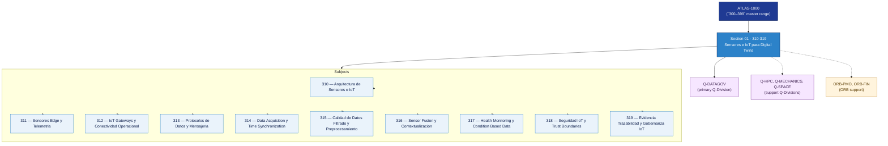

# DTCEC 310-319 · Section 01 — Sensores e IoT para Digital Twins

## 1. Purpose

Section-level index for *Sensores e IoT para Digital Twins* (`310-319`) within the DTCEC band. Sensorización, IoT, edge telemetry, data ingestion.

This section is part of the **ATLAS-1000** register, a subpart of the controlled **Q+ATLANTIDE** baseline[^baseline][^n001]. Bands classify technologies, Q-Divisions provide technical authority and ORB-Functions provide enterprise support[^n002].

## 2. Scope

- Aggregates the subjects within the `310-319` code range listed in §3.
- Inherits Q-Division authority and ORB support from the parent row in [`../README.md` §3](../README.md#3-architecture-table)[^archtable].
- Each subject folder contains its own documents. Subject codes use absolute numbering (`310`–`319`).

## 3. Subject Index

| Code | Title | Folder | Status |
|---:|---|---|---|
| `310` | Arquitectura de Sensores e IoT | [`./310_Arquitectura-de-Sensores-e-IoT/`](./310_Arquitectura-de-Sensores-e-IoT/) | reserved |
| `311` | Sensores Edge y Telemetria | [`./311_Sensores-Edge-y-Telemetria/`](./311_Sensores-Edge-y-Telemetria/) | reserved |
| `312` | IoT Gateways y Conectividad Operacional | [`./312_IoT-Gateways-y-Conectividad-Operacional/`](./312_IoT-Gateways-y-Conectividad-Operacional/) | reserved |
| `313` | Protocolos de Datos y Mensajeria | [`./313_Protocolos-de-Datos-y-Mensajeria/`](./313_Protocolos-de-Datos-y-Mensajeria/) | reserved |
| `314` | Data Acquisition y Time Synchronization | [`./314_Data-Acquisition-y-Time-Synchronization/`](./314_Data-Acquisition-y-Time-Synchronization/) | reserved |
| `315` | Calidad de Datos Filtrado y Preprocesamiento | [`./315_Calidad-de-Datos-Filtrado-y-Preprocesamiento/`](./315_Calidad-de-Datos-Filtrado-y-Preprocesamiento/) | reserved |
| `316` | Sensor Fusion y Contextualizacion | [`./316_Sensor-Fusion-y-Contextualizacion/`](./316_Sensor-Fusion-y-Contextualizacion/) | reserved |
| `317` | Health Monitoring y Condition Based Data | [`./317_Health-Monitoring-y-Condition-Based-Data/`](./317_Health-Monitoring-y-Condition-Based-Data/) | reserved |
| `318` | Seguridad IoT y Trust Boundaries | [`./318_Seguridad-IoT-y-Trust-Boundaries/`](./318_Seguridad-IoT-y-Trust-Boundaries/) | reserved |
| `319` | Evidencia Trazabilidad y Gobernanza IoT | [`./319_Evidencia-Trazabilidad-y-Gobernanza-IoT/`](./319_Evidencia-Trazabilidad-y-Gobernanza-IoT/) | reserved |

## 4. Interfaces Diagram

*Solid arrows show parent→section→subject ownership and primary Q-Division authority; dotted arrows show support Q-Divisions and ORB enterprise support.*

## 5. Footprint

| Metric | Value |
|---|---|
| Architecture | `DTCEC` — Digital Twin, Cloud, Edge & AI Architecture |
| Master range | `300–399` |
| Code range | `310-319` |
| Section | `01` — Sensores e IoT para Digital Twins |
| Subjects | 10 reserved |
| Primary Q-Division | Q-DATAGOV[^qdiv] |
| Support Q-Divisions | Q-HPC, Q-MECHANICS, Q-SPACE |
| ORB support | ORB-PMO, ORB-FIN |
| Governance class | `baseline`[^gov] |
| Folder path | `Q+ATLANTIDE/300-399_DTCEC/310-319_Sensores-e-IoT-para-Digital-Twins/` |
| Document | `README.md` (this file) |
| Parent architecture | [`../README.md`](../README.md) |
| Parent baseline | [`organization/Q+ATLANTIDE.md`](../../../organization/Q+ATLANTIDE.md) |

## Governance

Governed by [`organization/Q+ATLANTIDE.md`](../../../organization/Q+ATLANTIDE.md)[^baseline]. All subjects under this section inherit `architecture_code = DTCEC`, `primary_q_division = Q-DATAGOV`, `governance_class = baseline`. The No-AAA Rule[^n004] applies.

## 6. References & Citations

[^baseline]: **Q+ATLANTIDE controlled baseline (v1.0.0)** — [`organization/Q+ATLANTIDE.md`](../../../organization/Q+ATLANTIDE.md).

[^archtable]: **§3 — Architecture Table (parent)** — [`../README.md` §3](../README.md#3-architecture-table).

[^qdiv]: **Q-Division authority** — [`organization/Q-Divisions/`](../../../organization/Q-Divisions/).

[^gov]: **Governance class** — `baseline` for DTCEC band documents.

[^templates]: **§5 — Templates System** — [`organization/Q+ATLANTIDE.md` §5](../../../organization/Q+ATLANTIDE.md#5-templates-system).

[^n001]: **Note N-001** — Q+ATLANTIDE is a taxonomy and traceability ecosystem, not an organization chart. See [`organization/Q+ATLANTIDE.md` §4](../../../organization/Q+ATLANTIDE.md#4-notes).

[^n002]: **Note N-002** — Architecture bands classify technologies; Q-Divisions provide technical authority; ORB-Functions provide enterprise support. See [`organization/Q+ATLANTIDE.md` §4](../../../organization/Q+ATLANTIDE.md#4-notes).

[^n004]: **Note N-004 (No-AAA Rule)** — "AAA" is not a valid domain, division, architecture, interface or function in this baseline. See [`organization/Q+ATLANTIDE.md` §4](../../../organization/Q+ATLANTIDE.md#4-notes).
