# DTCEC 320–329 · Section 02 — Cloud Platforms and Data Infrastructure

## 1. Purpose

Section-level index for *Cloud Platforms and Data Infrastructure* (`320-329`) within the DTCEC band. Covers cloud architecture and service models, data lakes/warehouses/lakehouses, data pipelines (ETL/ELT/streaming), API gateways and integration services, identity/access and zero-trust controls, cloud resilience, backup and disaster recovery, cost governance and FinOps, and cloud monitoring, observability and operations.

This section is part of the **ATLAS-1000** register, a subpart of the controlled **Q+ATLANTIDE** baseline[^baseline][^n001]. Bands classify technologies, Q-Divisions provide technical authority and ORB-Functions provide enterprise support[^n002].

## 2. Scope

- Aggregates the subsections within the `320-329` code range listed in §3.
- Inherits Q-Division authority and ORB support from the parent row in [`../README.md` §3](../README.md#3-architecture-table)[^archtable].
- Each subsection folder contains its own `README.md` (subsection index) and may contain Overview and subsubject documents.

## 3. Subsection Index

| Code | Title | Folder | Status |
|---:|---|---|---|
| `320` | Cloud Platforms General | [`./320_Cloud-Platforms-General/`](./320_Cloud-Platforms-General/) | reserved |
| `321` | Cloud Architecture and Service Models | [`./321_Cloud-Architecture-and-Service-Models/`](./321_Cloud-Architecture-and-Service-Models/) | reserved |
| `322` | Data Lakes Warehouses and Lakehouses | [`./322_Data-Lakes-Warehouses-and-Lakehouses/`](./322_Data-Lakes-Warehouses-and-Lakehouses/) | reserved |
| `323` | Data Pipelines ETL ELT and Streaming | [`./323_Data-Pipelines-ETL-ELT-and-Streaming/`](./323_Data-Pipelines-ETL-ELT-and-Streaming/) | reserved |
| `324` | API Gateways and Integration Services | [`./324_API-Gateways-and-Integration-Services/`](./324_API-Gateways-and-Integration-Services/) | reserved |
| `325` | Identity Access and Zero-Trust Controls | [`./325_Identity-Access-and-Zero-Trust-Controls/`](./325_Identity-Access-and-Zero-Trust-Controls/) | reserved |
| `326` | Cloud Resilience Backup and Disaster Recovery | [`./326_Cloud-Resilience-Backup-and-Disaster-Recovery/`](./326_Cloud-Resilience-Backup-and-Disaster-Recovery/) | reserved |
| `327` | Cost Governance and FinOps | [`./327_Cost-Governance-and-FinOps/`](./327_Cost-Governance-and-FinOps/) | reserved |
| `328` | Cloud Monitoring Observability and Operations | [`./328_Cloud-Monitoring-Observability-and-Operations/`](./328_Cloud-Monitoring-Observability-and-Operations/) | reserved |
| `329` | Cloud S1000D CSDB Mapping and Traceability | [`./329_Cloud-S1000D-CSDB-Mapping-and-Traceability/`](./329_Cloud-S1000D-CSDB-Mapping-and-Traceability/) | reserved |

## 4. Interfaces Diagram

```mermaid
flowchart TB
    PARENT["ATLAS-1000<br/>(`300–399` master range)"]:::parent
    SEC["Section 02 · 320-329<br/>Cloud Platforms and Data Infrastructure"]:::sec
    PARENT --> SEC

    subgraph SUBS["Subsections"]
        direction LR
        SUB_320["320 — Cloud Platforms General"]:::sub
        SUB_321["321 — Cloud Architecture and Service Models"]:::sub
        SUB_322["322 — Data Lakes Warehouses and Lakehouses"]:::sub
        SUB_323["323 — Data Pipelines ETL ELT and Streaming"]:::sub
        SUB_324["324 — API Gateways and Integration Services"]:::sub
        SUB_325["325 — Identity Access and Zero-Trust Controls"]:::sub
        SUB_326["326 — Cloud Resilience Backup and Disaster Recovery"]:::sub
        SUB_327["327 — Cost Governance and FinOps"]:::sub
        SUB_328["328 — Cloud Monitoring Observability and Operations"]:::sub
        SUB_329["329 — Cloud S1000D CSDB Mapping and Traceability"]:::sub
    end
    SEC --> SUBS

    QPRIM["Q-HPC<br/>(primary Q-Division)"]:::qdiv
    QSUPP["Q-DATAGOV, Q-AIR, Q-GREENTECH<br/>(support Q-Divisions)"]:::qdiv
    ORB["ORB-PMO, ORB-LEG<br/>(ORB support)"]:::orb

    SEC --> QPRIM
    SEC -.-> QSUPP
    SEC -.-> ORB

    SUBS --> SUB_320
    SUBS --> SUB_321
    SUBS --> SUB_322
    SUBS --> SUB_323
    SUBS --> SUB_324
    SUBS --> SUB_325
    SUBS --> SUB_326
    SUBS --> SUB_327
    SUBS --> SUB_328
    SUBS --> SUB_329

    classDef parent fill:#1f3a93,stroke:#0b1d4a,color:#fff
    classDef sec fill:#2c82c9,stroke:#0b1d4a,color:#fff
    classDef sub fill:#eaf3fb,stroke:#2c82c9,color:#0b1d4a
    classDef qdiv fill:#f6e6ff,stroke:#7d3c98,color:#3b1f4d
    classDef orb fill:#fff4dd,stroke:#b9770e,color:#5a3b00
    classDef ext fill:#fdebd0,stroke:#b9770e,color:#5a3b00,stroke-dasharray:3 3
```

*Solid arrows show parent→section→subsection ownership and primary Q-Division authority; dotted arrows show support Q-Divisions, ORB enterprise support, and notable cross-section interfaces.*

## 5. Footprint

| Metric | Value |
|---|---|
| Architecture | `DTCEC` — Digital Twin, Cloud, Edge & AI Architecture |
| Master range | `300–399` |
| Code range | `320-329` |
| Section | `02` — Cloud Platforms and Data Infrastructure |
| Subsections | 10 reserved |
| Primary Q-Division | Q-HPC[^qdiv] |
| Support Q-Divisions | Q-DATAGOV, Q-AIR, Q-GREENTECH |
| ORB support | ORB-PMO, ORB-LEG |
| Governance class | `baseline`[^gov] |
| Folder path | `Q+ATLANTIDE/300-399_DTCEC/320-329_Cloud-Platforms-and-Data-Infrastructure/` |
| Document | `README.md` (this file) |
| Parent architecture | [`../README.md`](../README.md) |
| Parent baseline | [`organization/Q+ATLANTIDE.md`](../../../organization/Q+ATLANTIDE.md) |

## Governance

Governed by [`organization/Q+ATLANTIDE.md`](../../../organization/Q+ATLANTIDE.md)[^baseline]. All subsections under this section inherit `architecture_code = DTCEC`, `primary_q_division = Q-HPC` and `governance_class = baseline` from this section header. Templates declared in this section must populate `architecture_band`, `architecture_code = DTCEC`, `q_division_owner` and `orb_function_support` per the Templates System[^templates]. The No-AAA Rule[^n004] applies.

## 6. References & Citations

[^baseline]: **Q+ATLANTIDE controlled baseline (v1.0.0)** — [`organization/Q+ATLANTIDE.md`](../../../organization/Q+ATLANTIDE.md). Defines the controlled `000-999` architecture-band taxonomy and the ATLAS-1000 register subpart.

[^archtable]: **§3 — Architecture Table (parent)** — [`../README.md` §3](../README.md#3-architecture-table). Source of authority for primary/support Q-Divisions and ORB support of this section.

[^qdiv]: **Q-Division authority** — [`organization/Q-Divisions/`](../../../organization/Q-Divisions/). Technical-authority units for the Q+ATLANTIDE baseline.

[^gov]: **Governance class** — `baseline` denotes documents under controlled change management within the Q+ATLANTIDE baseline.

[^templates]: **§5 — Templates System** — [`organization/Q+ATLANTIDE.md` §5](../../../organization/Q+ATLANTIDE.md#5-templates-system).

[^n001]: **Note N-001** — Q+ATLANTIDE (with its ATLAS-1000 register subpart) is a taxonomy and traceability ecosystem, not an organization chart. See [`organization/Q+ATLANTIDE.md` §4](../../../organization/Q+ATLANTIDE.md#4-notes).

[^n002]: **Note N-002** — Architecture bands classify technologies; Q-Divisions provide technical authority; ORB-Functions provide enterprise support. See [`organization/Q+ATLANTIDE.md` §4](../../../organization/Q+ATLANTIDE.md#4-notes).

[^n004]: **Note N-004 (No-AAA Rule)** — "AAA" is not a valid domain, division, architecture, interface or function in this baseline. See [`organization/Q+ATLANTIDE.md` §4](../../../organization/Q+ATLANTIDE.md#4-notes).
