# DTCEC 320-329 · Section 02 — IA y Machine Learning para Digital Twins

## 1. Purpose

Section-level index for *IA y Machine Learning para Digital Twins* (`320-329`) within the DTCEC band. ML, predictive analytics, anomaly detection, IA certificable.

This section is part of the **ATLAS-1000** register, a subpart of the controlled **Q+ATLANTIDE** baseline[^baseline][^n001]. Bands classify technologies, Q-Divisions provide technical authority and ORB-Functions provide enterprise support[^n002].

## 2. Scope

- Aggregates the subjects within the `320-329` code range listed in §3.
- Inherits Q-Division authority and ORB support from the parent row in [`../README.md` §3](../README.md#3-architecture-table)[^archtable].
- Each subject folder contains its own documents. Subject codes use absolute numbering (`320`–`329`).

## 3. Subject Index

| Code | Title | Folder | Status |
|---:|---|---|---|
| `320` | Arquitectura IA ML para Gemelos Digitales | [`./320_Arquitectura-IA-ML-para-Gemelos-Digitales/`](./320_Arquitectura-IA-ML-para-Gemelos-Digitales/) | reserved |
| `321` | Modelos Predictivos y Estimacion de Estado | [`./321_Modelos-Predictivos-y-Estimacion-de-Estado/`](./321_Modelos-Predictivos-y-Estimacion-de-Estado/) | reserved |
| `322` | Anomaly Detection y Fault Diagnostics | [`./322_Anomaly-Detection-y-Fault-Diagnostics/`](./322_Anomaly-Detection-y-Fault-Diagnostics/) | reserved |
| `323` | Prognostics and Health Management PHM | [`./323_Prognostics-and-Health-Management-PHM/`](./323_Prognostics-and-Health-Management-PHM/) | reserved |
| `324` | ML Supervisado No Supervisado y Semi Supervisado | [`./324_ML-Supervisado-No-Supervisado-y-Semi-Supervisado/`](./324_ML-Supervisado-No-Supervisado-y-Semi-Supervisado/) | reserved |
| `325` | Reinforcement Learning y Control Simulado | [`./325_Reinforcement-Learning-y-Control-Simulado/`](./325_Reinforcement-Learning-y-Control-Simulado/) | reserved |
| `326` | Explainable AI y Model Interpretability | [`./326_Explainable-AI-y-Model-Interpretability/`](./326_Explainable-AI-y-Model-Interpretability/) | reserved |
| `327` | MLOps Versionado y Reproducibilidad | [`./327_MLOps-Versionado-y-Reproducibilidad/`](./327_MLOps-Versionado-y-Reproducibilidad/) | reserved |
| `328` | Bias Robustness y Validation Discipline | [`./328_Bias-Robustness-y-Validation-Discipline/`](./328_Bias-Robustness-y-Validation-Discipline/) | reserved |
| `329` | Assurance Safety y Limites de Autonomia IA | [`./329_Assurance-Safety-y-Limites-de-Autonomia-IA/`](./329_Assurance-Safety-y-Limites-de-Autonomia-IA/) | reserved |

## 4. Interfaces Diagram

```mermaid
flowchart TB
    PARENT["ATLAS-1000<br/>(`300–399` master range)"]:::parent
    SEC["Section 02 · 320-329<br/>IA y Machine Learning para Digital Twins"]:::sec
    PARENT --> SEC

    subgraph SUBS["Subjects"]
        direction LR
    SUB_320["320 — Arquitectura IA ML para Gemelos Digitales"]:::sub
    SUB_321["321 — Modelos Predictivos y Estimacion de Estado"]:::sub
    SUB_322["322 — Anomaly Detection y Fault Diagnostics"]:::sub
    SUB_323["323 — Prognostics and Health Management PHM"]:::sub
    SUB_324["324 — ML Supervisado No Supervisado y Semi Supervisado"]:::sub
    SUB_325["325 — Reinforcement Learning y Control Simulado"]:::sub
    SUB_326["326 — Explainable AI y Model Interpretability"]:::sub
    SUB_327["327 — MLOps Versionado y Reproducibilidad"]:::sub
    SUB_328["328 — Bias Robustness y Validation Discipline"]:::sub
    SUB_329["329 — Assurance Safety y Limites de Autonomia IA"]:::sub
    end
    SEC --> SUBS

    QPRIM["Q-HPC<br/>(primary Q-Division)"]:::qdiv
    QSUPP["Q-DATAGOV, Q-AIR, Q-GREENTECH<br/>(support Q-Divisions)"]:::qdiv
    ORB["ORB-PMO, ORB-LEG<br/>(ORB support)"]:::orb

    SEC --> QPRIM
    SEC -.-> QSUPP
    SEC -.-> ORB

    SUBS --> SUB_320
    SUBS --> SUB_321
    SUBS --> SUB_322
    SUBS --> SUB_323
    SUBS --> SUB_324
    SUBS --> SUB_325
    SUBS --> SUB_326
    SUBS --> SUB_327
    SUBS --> SUB_328
    SUBS --> SUB_329

    classDef parent fill:#1f3a93,stroke:#0b1d4a,color:#fff
    classDef sec fill:#2c82c9,stroke:#0b1d4a,color:#fff
    classDef sub fill:#eaf3fb,stroke:#2c82c9,color:#0b1d4a
    classDef qdiv fill:#f6e6ff,stroke:#7d3c98,color:#3b1f4d
    classDef orb fill:#fff4dd,stroke:#b9770e,color:#5a3b00
```

*Solid arrows show parent→section→subject ownership and primary Q-Division authority; dotted arrows show support Q-Divisions and ORB enterprise support.*

## 5. Footprint

| Metric | Value |
|---|---|
| Architecture | `DTCEC` — Digital Twin, Cloud, Edge & AI Architecture |
| Master range | `300–399` |
| Code range | `320-329` |
| Section | `02` — IA y Machine Learning para Digital Twins |
| Subjects | 10 reserved |
| Primary Q-Division | Q-HPC[^qdiv] |
| Support Q-Divisions | Q-DATAGOV, Q-AIR, Q-GREENTECH |
| ORB support | ORB-PMO, ORB-LEG |
| Governance class | `baseline`[^gov] |
| Folder path | `Q+ATLANTIDE/300-399_DTCEC/320-329_IA-y-Machine-Learning-para-Digital-Twins/` |
| Document | `README.md` (this file) |
| Parent architecture | [`../README.md`](../README.md) |
| Parent baseline | [`organization/Q+ATLANTIDE.md`](../../../organization/Q+ATLANTIDE.md) |

## Governance

Governed by [`organization/Q+ATLANTIDE.md`](../../../organization/Q+ATLANTIDE.md)[^baseline]. All subjects under this section inherit `architecture_code = DTCEC`, `primary_q_division = Q-HPC`, `governance_class = baseline`. The No-AAA Rule[^n004] applies.

## 6. References & Citations

[^baseline]: **Q+ATLANTIDE controlled baseline (v1.0.0)** — [`organization/Q+ATLANTIDE.md`](../../../organization/Q+ATLANTIDE.md).

[^archtable]: **§3 — Architecture Table (parent)** — [`../README.md` §3](../README.md#3-architecture-table).

[^qdiv]: **Q-Division authority** — [`organization/Q-Divisions/`](../../../organization/Q-Divisions/).

[^gov]: **Governance class** — `baseline` for DTCEC band documents.

[^templates]: **§5 — Templates System** — [`organization/Q+ATLANTIDE.md` §5](../../../organization/Q+ATLANTIDE.md#5-templates-system).

[^n001]: **Note N-001** — Q+ATLANTIDE is a taxonomy and traceability ecosystem, not an organization chart. See [`organization/Q+ATLANTIDE.md` §4](../../../organization/Q+ATLANTIDE.md#4-notes).

[^n002]: **Note N-002** — Architecture bands classify technologies; Q-Divisions provide technical authority; ORB-Functions provide enterprise support. See [`organization/Q+ATLANTIDE.md` §4](../../../organization/Q+ATLANTIDE.md#4-notes).

[^n004]: **Note N-004 (No-AAA Rule)** — "AAA" is not a valid domain, division, architecture, interface or function in this baseline. See [`organization/Q+ATLANTIDE.md` §4](../../../organization/Q+ATLANTIDE.md#4-notes).
