# DTCEC 330-339 · Section 03 — Cloud Computing y Arquitecturas Distribuidas

## 1. Purpose

Section-level index for *Cloud Computing y Arquitecturas Distribuidas* (`330-339`) within the DTCEC band. Cloud, edge, federated systems, sovereign infrastructure.

This section is part of the **ATLAS-1000** register, a subpart of the controlled **Q+ATLANTIDE** baseline[^baseline][^n001]. Bands classify technologies, Q-Divisions provide technical authority and ORB-Functions provide enterprise support[^n002].

## 2. Scope

- Aggregates the subjects within the `330-339` code range listed in §3.
- Inherits Q-Division authority and ORB support from the parent row in [`../README.md` §3](../README.md#3-architecture-table)[^archtable].
- Each subject folder contains its own documents. Subject codes use absolute numbering (`330`–`339`).

## 3. Subject Index

| Code | Title | Folder | Status |
|---:|---|---|---|
| `330` | Arquitectura Cloud para Gemelos Digitales | [`./330_Arquitectura-Cloud-para-Gemelos-Digitales/`](./330_Arquitectura-Cloud-para-Gemelos-Digitales/) | reserved |
| `331` | Computacion Distribuida y Microservicios | [`./331_Computacion-Distribuida-y-Microservicios/`](./331_Computacion-Distribuida-y-Microservicios/) | reserved |
| `332` | Data Lakes Data Mesh y Data Fabric | [`./332_Data-Lakes-Data-Mesh-y-Data-Fabric/`](./332_Data-Lakes-Data-Mesh-y-Data-Fabric/) | reserved |
| `333` | APIs Integracion y Event Driven Architecture | [`./333_APIs-Integracion-y-Event-Driven-Architecture/`](./333_APIs-Integracion-y-Event-Driven-Architecture/) | reserved |
| `334` | Orquestacion Contenedores y Kubernetes | [`./334_Orquestacion-Contenedores-y-Kubernetes/`](./334_Orquestacion-Contenedores-y-Kubernetes/) | reserved |
| `335` | HPC Cloud Hybrid y Workload Management | [`./335_HPC-Cloud-Hybrid-y-Workload-Management/`](./335_HPC-Cloud-Hybrid-y-Workload-Management/) | reserved |
| `336` | Edge Cloud Continuum | [`./336_Edge-Cloud-Continuum/`](./336_Edge-Cloud-Continuum/) | reserved |
| `337` | Observability Monitoring y Logging | [`./337_Observability-Monitoring-y-Logging/`](./337_Observability-Monitoring-y-Logging/) | reserved |
| `338` | Cloud Security IAM y Zero Trust | [`./338_Cloud-Security-IAM-y-Zero-Trust/`](./338_Cloud-Security-IAM-y-Zero-Trust/) | reserved |
| `339` | Evidencia Trazabilidad y Gobernanza Cloud | [`./339_Evidencia-Trazabilidad-y-Gobernanza-Cloud/`](./339_Evidencia-Trazabilidad-y-Gobernanza-Cloud/) | reserved |

## 4. Interfaces Diagram

```mermaid
flowchart TB
    PARENT["ATLAS-1000<br/>(`300–399` master range)"]:::parent
    SEC["Section 03 · 330-339<br/>Cloud Computing y Arquitecturas Distribuidas"]:::sec
    PARENT --> SEC

    subgraph SUBS["Subjects"]
        direction LR
    SUB_330["330 — Arquitectura Cloud para Gemelos Digitales"]:::sub
    SUB_331["331 — Computacion Distribuida y Microservicios"]:::sub
    SUB_332["332 — Data Lakes Data Mesh y Data Fabric"]:::sub
    SUB_333["333 — APIs Integracion y Event Driven Architecture"]:::sub
    SUB_334["334 — Orquestacion Contenedores y Kubernetes"]:::sub
    SUB_335["335 — HPC Cloud Hybrid y Workload Management"]:::sub
    SUB_336["336 — Edge Cloud Continuum"]:::sub
    SUB_337["337 — Observability Monitoring y Logging"]:::sub
    SUB_338["338 — Cloud Security IAM y Zero Trust"]:::sub
    SUB_339["339 — Evidencia Trazabilidad y Gobernanza Cloud"]:::sub
    end
    SEC --> SUBS

    QPRIM["Q-DATAGOV<br/>(primary Q-Division)"]:::qdiv
    QSUPP["Q-HPC, Q-INDUSTRY<br/>(support Q-Divisions)"]:::qdiv
    ORB["ORB-PMO, ORB-FIN<br/>(ORB support)"]:::orb

    SEC --> QPRIM
    SEC -.-> QSUPP
    SEC -.-> ORB

    SUBS --> SUB_330
    SUBS --> SUB_331
    SUBS --> SUB_332
    SUBS --> SUB_333
    SUBS --> SUB_334
    SUBS --> SUB_335
    SUBS --> SUB_336
    SUBS --> SUB_337
    SUBS --> SUB_338
    SUBS --> SUB_339

    classDef parent fill:#1f3a93,stroke:#0b1d4a,color:#fff
    classDef sec fill:#2c82c9,stroke:#0b1d4a,color:#fff
    classDef sub fill:#eaf3fb,stroke:#2c82c9,color:#0b1d4a
    classDef qdiv fill:#f6e6ff,stroke:#7d3c98,color:#3b1f4d
    classDef orb fill:#fff4dd,stroke:#b9770e,color:#5a3b00
```

*Solid arrows show parent→section→subject ownership and primary Q-Division authority; dotted arrows show support Q-Divisions and ORB enterprise support.*

## 5. Footprint

| Metric | Value |
|---|---|
| Architecture | `DTCEC` — Digital Twin, Cloud, Edge & AI Architecture |
| Master range | `300–399` |
| Code range | `330-339` |
| Section | `03` — Cloud Computing y Arquitecturas Distribuidas |
| Subjects | 10 reserved |
| Primary Q-Division | Q-DATAGOV[^qdiv] |
| Support Q-Divisions | Q-HPC, Q-INDUSTRY |
| ORB support | ORB-PMO, ORB-FIN |
| Governance class | `baseline`[^gov] |
| Folder path | `Q+ATLANTIDE/300-399_DTCEC/330-339_Cloud-Computing-y-Arquitecturas-Distribuidas/` |
| Document | `README.md` (this file) |
| Parent architecture | [`../README.md`](../README.md) |
| Parent baseline | [`organization/Q+ATLANTIDE.md`](../../../organization/Q+ATLANTIDE.md) |

## Governance

Governed by [`organization/Q+ATLANTIDE.md`](../../../organization/Q+ATLANTIDE.md)[^baseline]. All subjects under this section inherit `architecture_code = DTCEC`, `primary_q_division = Q-DATAGOV`, `governance_class = baseline`. The No-AAA Rule[^n004] applies.

## 6. References & Citations

[^baseline]: **Q+ATLANTIDE controlled baseline (v1.0.0)** — [`organization/Q+ATLANTIDE.md`](../../../organization/Q+ATLANTIDE.md).

[^archtable]: **§3 — Architecture Table (parent)** — [`../README.md` §3](../README.md#3-architecture-table).

[^qdiv]: **Q-Division authority** — [`organization/Q-Divisions/`](../../../organization/Q-Divisions/).

[^gov]: **Governance class** — `baseline` for DTCEC band documents.

[^templates]: **§5 — Templates System** — [`organization/Q+ATLANTIDE.md` §5](../../../organization/Q+ATLANTIDE.md#5-templates-system).

[^n001]: **Note N-001** — Q+ATLANTIDE is a taxonomy and traceability ecosystem, not an organization chart. See [`organization/Q+ATLANTIDE.md` §4](../../../organization/Q+ATLANTIDE.md#4-notes).

[^n002]: **Note N-002** — Architecture bands classify technologies; Q-Divisions provide technical authority; ORB-Functions provide enterprise support. See [`organization/Q+ATLANTIDE.md` §4](../../../organization/Q+ATLANTIDE.md#4-notes).

[^n004]: **Note N-004 (No-AAA Rule)** — "AAA" is not a valid domain, division, architecture, interface or function in this baseline. See [`organization/Q+ATLANTIDE.md` §4](../../../organization/Q+ATLANTIDE.md#4-notes).
