# DTCEC 330–339 · Section 03 — Edge Computing and Distributed Systems

## 1. Purpose

Section-level index for *Edge Computing and Distributed Systems* (`330-339`) within the DTCEC band. Covers edge node architecture, distributed compute and orchestration, real-time data processing at the edge, edge AI inference and model deployment, connectivity/latency/bandwidth management, edge resilience and offline operation, edge security and device trust, edge monitoring diagnostics and maintenance, and S1000D/CSDB mapping and traceability.

This section is part of the **ATLAS-1000** register, a subpart of the controlled **Q+ATLANTIDE** baseline[^baseline][^n001]. Bands classify technologies, Q-Divisions provide technical authority and ORB-Functions provide enterprise support[^n002].

## 2. Scope

- Aggregates the subsections within the `330-339` code range listed in §3.
- Inherits Q-Division authority and ORB support from the parent row in [`../README.md` §3](../README.md#3-architecture-table)[^archtable].
- Each subsection folder contains its own `README.md` (subsection index) and may contain Overview and subsubject documents.

## 3. Subsection Index

| Code | Title | Folder | Status |
|---:|---|---|---|
| `330` | Edge Computing General | [`./330_Edge-Computing-General/`](./330_Edge-Computing-General/) | reserved |
| `331` | Edge Node Architecture | [`./331_Edge-Node-Architecture/`](./331_Edge-Node-Architecture/) | reserved |
| `332` | Distributed Compute and Orchestration | [`./332_Distributed-Compute-and-Orchestration/`](./332_Distributed-Compute-and-Orchestration/) | reserved |
| `333` | Real-Time Data Processing at the Edge | [`./333_Real-Time-Data-Processing-at-the-Edge/`](./333_Real-Time-Data-Processing-at-the-Edge/) | reserved |
| `334` | Edge AI Inference and Model Deployment | [`./334_Edge-AI-Inference-and-Model-Deployment/`](./334_Edge-AI-Inference-and-Model-Deployment/) | reserved |
| `335` | Connectivity Latency and Bandwidth Management | [`./335_Connectivity-Latency-and-Bandwidth-Management/`](./335_Connectivity-Latency-and-Bandwidth-Management/) | reserved |
| `336` | Edge Resilience and Offline Operation | [`./336_Edge-Resilience-and-Offline-Operation/`](./336_Edge-Resilience-and-Offline-Operation/) | reserved |
| `337` | Edge Security and Device Trust | [`./337_Edge-Security-and-Device-Trust/`](./337_Edge-Security-and-Device-Trust/) | reserved |
| `338` | Edge Monitoring Diagnostics and Maintenance | [`./338_Edge-Monitoring-Diagnostics-and-Maintenance/`](./338_Edge-Monitoring-Diagnostics-and-Maintenance/) | reserved |
| `339` | Edge S1000D CSDB Mapping and Traceability | [`./339_Edge-S1000D-CSDB-Mapping-and-Traceability/`](./339_Edge-S1000D-CSDB-Mapping-and-Traceability/) | reserved |

## 4. Interfaces Diagram

```mermaid
flowchart TB
    PARENT["ATLAS-1000<br/>(`300–399` master range)"]:::parent
    SEC["Section 03 · 330-339<br/>Edge Computing and Distributed Systems"]:::sec
    PARENT --> SEC

    subgraph SUBS["Subsections"]
        direction LR
        SUB_330["330 — Edge Computing General"]:::sub
        SUB_331["331 — Edge Node Architecture"]:::sub
        SUB_332["332 — Distributed Compute and Orchestration"]:::sub
        SUB_333["333 — Real-Time Data Processing at the Edge"]:::sub
        SUB_334["334 — Edge AI Inference and Model Deployment"]:::sub
        SUB_335["335 — Connectivity Latency and Bandwidth Management"]:::sub
        SUB_336["336 — Edge Resilience and Offline Operation"]:::sub
        SUB_337["337 — Edge Security and Device Trust"]:::sub
        SUB_338["338 — Edge Monitoring Diagnostics and Maintenance"]:::sub
        SUB_339["339 — Edge S1000D CSDB Mapping and Traceability"]:::sub
    end
    SEC --> SUBS

    QPRIM["Q-DATAGOV<br/>(primary Q-Division)"]:::qdiv
    QSUPP["Q-HPC, Q-INDUSTRY<br/>(support Q-Divisions)"]:::qdiv
    ORB["ORB-PMO, ORB-FIN<br/>(ORB support)"]:::orb

    SEC --> QPRIM
    SEC -.-> QSUPP
    SEC -.-> ORB

    SUBS --> SUB_330
    SUBS --> SUB_331
    SUBS --> SUB_332
    SUBS --> SUB_333
    SUBS --> SUB_334
    SUBS --> SUB_335
    SUBS --> SUB_336
    SUBS --> SUB_337
    SUBS --> SUB_338
    SUBS --> SUB_339

    classDef parent fill:#1f3a93,stroke:#0b1d4a,color:#fff
    classDef sec fill:#2c82c9,stroke:#0b1d4a,color:#fff
    classDef sub fill:#eaf3fb,stroke:#2c82c9,color:#0b1d4a
    classDef qdiv fill:#f6e6ff,stroke:#7d3c98,color:#3b1f4d
    classDef orb fill:#fff4dd,stroke:#b9770e,color:#5a3b00
    classDef ext fill:#fdebd0,stroke:#b9770e,color:#5a3b00,stroke-dasharray:3 3
```

*Solid arrows show parent→section→subsection ownership and primary Q-Division authority; dotted arrows show support Q-Divisions, ORB enterprise support, and notable cross-section interfaces.*

## 5. Footprint

| Metric | Value |
|---|---|
| Architecture | `DTCEC` — Digital Twin, Cloud, Edge & AI Architecture |
| Master range | `300–399` |
| Code range | `330-339` |
| Section | `03` — Edge Computing and Distributed Systems |
| Subsections | 10 reserved |
| Primary Q-Division | Q-DATAGOV[^qdiv] |
| Support Q-Divisions | Q-HPC, Q-INDUSTRY |
| ORB support | ORB-PMO, ORB-FIN |
| Governance class | `baseline`[^gov] |
| Folder path | `Q+ATLANTIDE/300-399_DTCEC/330-339_Edge-Computing-and-Distributed-Systems/` |
| Document | `README.md` (this file) |
| Parent architecture | [`../README.md`](../README.md) |
| Parent baseline | [`organization/Q+ATLANTIDE.md`](../../../organization/Q+ATLANTIDE.md) |

## Governance

Governed by [`organization/Q+ATLANTIDE.md`](../../../organization/Q+ATLANTIDE.md)[^baseline]. All subsections under this section inherit `architecture_code = DTCEC`, `primary_q_division = Q-DATAGOV` and `governance_class = baseline` from this section header. Templates declared in this section must populate `architecture_band`, `architecture_code = DTCEC`, `q_division_owner` and `orb_function_support` per the Templates System[^templates]. The No-AAA Rule[^n004] applies.

## 6. References & Citations

[^baseline]: **Q+ATLANTIDE controlled baseline (v1.0.0)** — [`organization/Q+ATLANTIDE.md`](../../../organization/Q+ATLANTIDE.md). Defines the controlled `000-999` architecture-band taxonomy and the ATLAS-1000 register subpart.

[^archtable]: **§3 — Architecture Table (parent)** — [`../README.md` §3](../README.md#3-architecture-table). Source of authority for primary/support Q-Divisions and ORB support of this section.

[^qdiv]: **Q-Division authority** — [`organization/Q-Divisions/`](../../../organization/Q-Divisions/). Technical-authority units for the Q+ATLANTIDE baseline.

[^gov]: **Governance class** — `baseline` denotes documents under controlled change management within the Q+ATLANTIDE baseline.

[^templates]: **§5 — Templates System** — [`organization/Q+ATLANTIDE.md` §5](../../../organization/Q+ATLANTIDE.md#5-templates-system).

[^n001]: **Note N-001** — Q+ATLANTIDE (with its ATLAS-1000 register subpart) is a taxonomy and traceability ecosystem, not an organization chart. See [`organization/Q+ATLANTIDE.md` §4](../../../organization/Q+ATLANTIDE.md#4-notes).

[^n002]: **Note N-002** — Architecture bands classify technologies; Q-Divisions provide technical authority; ORB-Functions provide enterprise support. See [`organization/Q+ATLANTIDE.md` §4](../../../organization/Q+ATLANTIDE.md#4-notes).

[^n004]: **Note N-004 (No-AAA Rule)** — "AAA" is not a valid domain, division, architecture, interface or function in this baseline. See [`organization/Q+ATLANTIDE.md` §4](../../../organization/Q+ATLANTIDE.md#4-notes).
