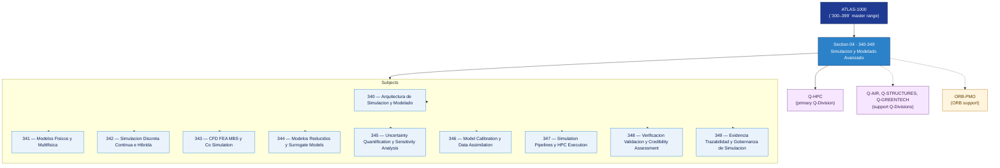

# DTCEC 340-349 · Section 04 — Simulacion y Modelado Avanzado

## 1. Purpose

Section-level index for *Simulacion y Modelado Avanzado* (`340-349`) within the DTCEC band. CFD, FEA, MBSE, mission simulation, multiphysics.

This section is part of the **ATLAS-1000** register, a subpart of the controlled **Q+ATLANTIDE** baseline[^baseline][^n001]. Bands classify technologies, Q-Divisions provide technical authority and ORB-Functions provide enterprise support[^n002].

## 2. Scope

- Aggregates the subjects within the `340-349` code range listed in §3.
- Inherits Q-Division authority and ORB support from the parent row in [`../README.md` §3](../README.md#3-architecture-table)[^archtable].
- Each subject folder contains its own documents. Subject codes use absolute numbering (`340`–`349`).

## 3. Subject Index

| Code | Title | Folder | Status |
|---:|---|---|---|
| `340` | Arquitectura de Simulacion y Modelado | [`./340_Arquitectura-de-Simulacion-y-Modelado/`](./340_Arquitectura-de-Simulacion-y-Modelado/) | reserved |
| `341` | Modelos Fisicos y Multifisica | [`./341_Modelos-Fisicos-y-Multifisica/`](./341_Modelos-Fisicos-y-Multifisica/) | reserved |
| `342` | Simulacion Discreta Continua e Hibrida | [`./342_Simulacion-Discreta-Continua-e-Hibrida/`](./342_Simulacion-Discreta-Continua-e-Hibrida/) | reserved |
| `343` | CFD FEA MBS y Co Simulation | [`./343_CFD-FEA-MBS-y-Co-Simulation/`](./343_CFD-FEA-MBS-y-Co-Simulation/) | reserved |
| `344` | Modelos Reducidos y Surrogate Models | [`./344_Modelos-Reducidos-y-Surrogate-Models/`](./344_Modelos-Reducidos-y-Surrogate-Models/) | reserved |
| `345` | Uncertainty Quantification y Sensitivity Analysis | [`./345_Uncertainty-Quantification-y-Sensitivity-Analysis/`](./345_Uncertainty-Quantification-y-Sensitivity-Analysis/) | reserved |
| `346` | Model Calibration y Data Assimilation | [`./346_Model-Calibration-y-Data-Assimilation/`](./346_Model-Calibration-y-Data-Assimilation/) | reserved |
| `347` | Simulation Pipelines y HPC Execution | [`./347_Simulation-Pipelines-y-HPC-Execution/`](./347_Simulation-Pipelines-y-HPC-Execution/) | reserved |
| `348` | Verificacion Validacion y Credibility Assessment | [`./348_Verificacion-Validacion-y-Credibility-Assessment/`](./348_Verificacion-Validacion-y-Credibility-Assessment/) | reserved |
| `349` | Evidencia Trazabilidad y Gobernanza de Simulacion | [`./349_Evidencia-Trazabilidad-y-Gobernanza-de-Simulacion/`](./349_Evidencia-Trazabilidad-y-Gobernanza-de-Simulacion/) | reserved |

## 4. Interfaces Diagram

*Solid arrows show parent→section→subject ownership and primary Q-Division authority; dotted arrows show support Q-Divisions and ORB enterprise support.*

## 5. Footprint

| Metric | Value |
|---|---|
| Architecture | `DTCEC` — Digital Twin, Cloud, Edge & AI Architecture |
| Master range | `300–399` |
| Code range | `340-349` |
| Section | `04` — Simulacion y Modelado Avanzado |
| Subjects | 10 reserved |
| Primary Q-Division | Q-HPC[^qdiv] |
| Support Q-Divisions | Q-AIR, Q-STRUCTURES, Q-GREENTECH |
| ORB support | ORB-PMO |
| Governance class | `baseline`[^gov] |
| Folder path | `Q+ATLANTIDE/300-399_DTCEC/340-349_Simulacion-y-Modelado-Avanzado/` |
| Document | `README.md` (this file) |
| Parent architecture | [`../README.md`](../README.md) |
| Parent baseline | [`organization/Q+ATLANTIDE.md`](../../../organization/Q+ATLANTIDE.md) |

## Governance

Governed by [`organization/Q+ATLANTIDE.md`](../../../organization/Q+ATLANTIDE.md)[^baseline]. All subjects under this section inherit `architecture_code = DTCEC`, `primary_q_division = Q-HPC`, `governance_class = baseline`. The No-AAA Rule[^n004] applies.

## 6. References & Citations

[^baseline]: **Q+ATLANTIDE controlled baseline (v1.0.0)** — [`organization/Q+ATLANTIDE.md`](../../../organization/Q+ATLANTIDE.md).

[^archtable]: **§3 — Architecture Table (parent)** — [`../README.md` §3](../README.md#3-architecture-table).

[^qdiv]: **Q-Division authority** — [`organization/Q-Divisions/`](../../../organization/Q-Divisions/).

[^gov]: **Governance class** — `baseline` for DTCEC band documents.

[^templates]: **§5 — Templates System** — [`organization/Q+ATLANTIDE.md` §5](../../../organization/Q+ATLANTIDE.md#5-templates-system).

[^n001]: **Note N-001** — Q+ATLANTIDE is a taxonomy and traceability ecosystem, not an organization chart. See [`organization/Q+ATLANTIDE.md` §4](../../../organization/Q+ATLANTIDE.md#4-notes).

[^n002]: **Note N-002** — Architecture bands classify technologies; Q-Divisions provide technical authority; ORB-Functions provide enterprise support. See [`organization/Q+ATLANTIDE.md` §4](../../../organization/Q+ATLANTIDE.md#4-notes).

[^n004]: **Note N-004 (No-AAA Rule)** — "AAA" is not a valid domain, division, architecture, interface or function in this baseline. See [`organization/Q+ATLANTIDE.md` §4](../../../organization/Q+ATLANTIDE.md#4-notes).
