# DTCEC 350-359 · Section 05 — Realidad Extendida y Metaverso

## 1. Purpose

Section-level index for *Realidad Extendida y Metaverso* (`350-359`) within the DTCEC band. XR, training, immersive IETP, virtual operations.

This section is part of the **ATLAS-1000** register, a subpart of the controlled **Q+ATLANTIDE** baseline[^baseline][^n001]. Bands classify technologies, Q-Divisions provide technical authority and ORB-Functions provide enterprise support[^n002].

## 2. Scope

- Aggregates the subjects within the `350-359` code range listed in §3.
- Inherits Q-Division authority and ORB support from the parent row in [`../README.md` §3](../README.md#3-architecture-table)[^archtable].
- Each subject folder contains its own documents. Subject codes use absolute numbering (`350`–`359`).

## 3. Subject Index

| Code | Title | Folder | Status |
|---:|---|---|---|
| `350` | Arquitectura XR y Entornos Inmersivos | [`./350_Arquitectura-XR-y-Entornos-Inmersivos/`](./350_Arquitectura-XR-y-Entornos-Inmersivos/) | reserved |
| `351` | Realidad Virtual para Revision y Entrenamiento | [`./351_Realidad-Virtual-para-Revision-y-Entrenamiento/`](./351_Realidad-Virtual-para-Revision-y-Entrenamiento/) | reserved |
| `352` | Realidad Aumentada para Operacion y Mantenimiento | [`./352_Realidad-Aumentada-para-Operacion-y-Mantenimiento/`](./352_Realidad-Aumentada-para-Operacion-y-Mantenimiento/) | reserved |
| `353` | Realidad Mixta y Interaccion Humano Sistema | [`./353_Realidad-Mixta-y-Interaccion-Humano-Sistema/`](./353_Realidad-Mixta-y-Interaccion-Humano-Sistema/) | reserved |
| `354` | Visualizacion 3D y Spatial Computing | [`./354_Visualizacion-3D-y-Spatial-Computing/`](./354_Visualizacion-3D-y-Spatial-Computing/) | reserved |
| `355` | Avatares Agentes y Operadores Sinteticos | [`./355_Avatares-Agentes-y-Operadores-Sinteticos/`](./355_Avatares-Agentes-y-Operadores-Sinteticos/) | reserved |
| `356` | Metaverso Industrial y Digital Workspaces | [`./356_Metaverso-Industrial-y-Digital-Workspaces/`](./356_Metaverso-Industrial-y-Digital-Workspaces/) | reserved |
| `357` | Procedimientos Interactivos y IETP XR | [`./357_Procedimientos-Interactivos-y-IETP-XR/`](./357_Procedimientos-Interactivos-y-IETP-XR/) | reserved |
| `358` | Factores Humanos Usabilidad y Safety XR | [`./358_Factores-Humanos-Usabilidad-y-Safety-XR/`](./358_Factores-Humanos-Usabilidad-y-Safety-XR/) | reserved |
| `359` | Evidencia Trazabilidad y Gobernanza XR | [`./359_Evidencia-Trazabilidad-y-Gobernanza-XR/`](./359_Evidencia-Trazabilidad-y-Gobernanza-XR/) | reserved |

## 4. Interfaces Diagram

```mermaid
flowchart TB
    PARENT["ATLAS-1000<br/>(`300–399` master range)"]:::parent
    SEC["Section 05 · 350-359<br/>Realidad Extendida y Metaverso"]:::sec
    PARENT --> SEC

    subgraph SUBS["Subjects"]
        direction LR
    SUB_350["350 — Arquitectura XR y Entornos Inmersivos"]:::sub
    SUB_351["351 — Realidad Virtual para Revision y Entrenamiento"]:::sub
    SUB_352["352 — Realidad Aumentada para Operacion y Mantenimiento"]:::sub
    SUB_353["353 — Realidad Mixta y Interaccion Humano Sistema"]:::sub
    SUB_354["354 — Visualizacion 3D y Spatial Computing"]:::sub
    SUB_355["355 — Avatares Agentes y Operadores Sinteticos"]:::sub
    SUB_356["356 — Metaverso Industrial y Digital Workspaces"]:::sub
    SUB_357["357 — Procedimientos Interactivos y IETP XR"]:::sub
    SUB_358["358 — Factores Humanos Usabilidad y Safety XR"]:::sub
    SUB_359["359 — Evidencia Trazabilidad y Gobernanza XR"]:::sub
    end
    SEC --> SUBS

    QPRIM["Q-HPC<br/>(primary Q-Division)"]:::qdiv
    QSUPP["Q-DATAGOV, Q-GROUND<br/>(support Q-Divisions)"]:::qdiv
    ORB["ORB-HR, ORB-MKTG<br/>(ORB support)"]:::orb

    SEC --> QPRIM
    SEC -.-> QSUPP
    SEC -.-> ORB

    SUBS --> SUB_350
    SUBS --> SUB_351
    SUBS --> SUB_352
    SUBS --> SUB_353
    SUBS --> SUB_354
    SUBS --> SUB_355
    SUBS --> SUB_356
    SUBS --> SUB_357
    SUBS --> SUB_358
    SUBS --> SUB_359

    classDef parent fill:#1f3a93,stroke:#0b1d4a,color:#fff
    classDef sec fill:#2c82c9,stroke:#0b1d4a,color:#fff
    classDef sub fill:#eaf3fb,stroke:#2c82c9,color:#0b1d4a
    classDef qdiv fill:#f6e6ff,stroke:#7d3c98,color:#3b1f4d
    classDef orb fill:#fff4dd,stroke:#b9770e,color:#5a3b00
```

*Solid arrows show parent→section→subject ownership and primary Q-Division authority; dotted arrows show support Q-Divisions and ORB enterprise support.*

## 5. Footprint

| Metric | Value |
|---|---|
| Architecture | `DTCEC` — Digital Twin, Cloud, Edge & AI Architecture |
| Master range | `300–399` |
| Code range | `350-359` |
| Section | `05` — Realidad Extendida y Metaverso |
| Subjects | 10 reserved |
| Primary Q-Division | Q-HPC[^qdiv] |
| Support Q-Divisions | Q-DATAGOV, Q-GROUND |
| ORB support | ORB-HR, ORB-MKTG |
| Governance class | `baseline`[^gov] |
| Folder path | `Q+ATLANTIDE/300-399_DTCEC/350-359_Realidad-Extendida-y-Metaverso/` |
| Document | `README.md` (this file) |
| Parent architecture | [`../README.md`](../README.md) |
| Parent baseline | [`organization/Q+ATLANTIDE.md`](../../../organization/Q+ATLANTIDE.md) |

## Governance

Governed by [`organization/Q+ATLANTIDE.md`](../../../organization/Q+ATLANTIDE.md)[^baseline]. All subjects under this section inherit `architecture_code = DTCEC`, `primary_q_division = Q-HPC`, `governance_class = baseline`. The No-AAA Rule[^n004] applies.

## 6. References & Citations

[^baseline]: **Q+ATLANTIDE controlled baseline (v1.0.0)** — [`organization/Q+ATLANTIDE.md`](../../../organization/Q+ATLANTIDE.md).

[^archtable]: **§3 — Architecture Table (parent)** — [`../README.md` §3](../README.md#3-architecture-table).

[^qdiv]: **Q-Division authority** — [`organization/Q-Divisions/`](../../../organization/Q-Divisions/).

[^gov]: **Governance class** — `baseline` for DTCEC band documents.

[^templates]: **§5 — Templates System** — [`organization/Q+ATLANTIDE.md` §5](../../../organization/Q+ATLANTIDE.md#5-templates-system).

[^n001]: **Note N-001** — Q+ATLANTIDE is a taxonomy and traceability ecosystem, not an organization chart. See [`organization/Q+ATLANTIDE.md` §4](../../../organization/Q+ATLANTIDE.md#4-notes).

[^n002]: **Note N-002** — Architecture bands classify technologies; Q-Divisions provide technical authority; ORB-Functions provide enterprise support. See [`organization/Q+ATLANTIDE.md` §4](../../../organization/Q+ATLANTIDE.md#4-notes).

[^n004]: **Note N-004 (No-AAA Rule)** — "AAA" is not a valid domain, division, architecture, interface or function in this baseline. See [`organization/Q+ATLANTIDE.md` §4](../../../organization/Q+ATLANTIDE.md#4-notes).
