# DTCEC 350–359 · Section 05 — Simulation, Synthetic Data and Analytics

## 1. Purpose

Section-level index for *Simulation, Synthetic Data and Analytics* (`350-359`) within the DTCEC band. Covers physics-based simulation models, system-level and mission-level simulation, synthetic data generation and validation, statistical analytics and uncertainty quantification, predictive analytics and prognostics, optimisation and decision support, simulation-test correlation and calibration, analytics governance and reproducibility, and S1000D/CSDB mapping and traceability.

This section is part of the **ATLAS-1000** register, a subpart of the controlled **Q+ATLANTIDE** baseline[^baseline][^n001]. Bands classify technologies, Q-Divisions provide technical authority and ORB-Functions provide enterprise support[^n002].

## 2. Scope

- Aggregates the subsections within the `350-359` code range listed in §3.
- Inherits Q-Division authority and ORB support from the parent row in [`../README.md` §3](../README.md#3-architecture-table)[^archtable].
- Each subsection folder contains its own `README.md` (subsection index) and may contain Overview and subsubject documents.

## 3. Subsection Index

| Code | Title | Folder | Status |
|---:|---|---|---|
| `350` | Simulation and Analytics General | [`./350_Simulation-and-Analytics-General/`](./350_Simulation-and-Analytics-General/) | reserved |
| `351` | Physics-Based Simulation Models | [`./351_Physics-Based-Simulation-Models/`](./351_Physics-Based-Simulation-Models/) | reserved |
| `352` | System-Level and Mission-Level Simulation | [`./352_System-Level-and-Mission-Level-Simulation/`](./352_System-Level-and-Mission-Level-Simulation/) | reserved |
| `353` | Synthetic Data Generation and Validation | [`./353_Synthetic-Data-Generation-and-Validation/`](./353_Synthetic-Data-Generation-and-Validation/) | reserved |
| `354` | Statistical Analytics and Uncertainty Quantification | [`./354_Statistical-Analytics-and-Uncertainty-Quantification/`](./354_Statistical-Analytics-and-Uncertainty-Quantification/) | reserved |
| `355` | Predictive Analytics and Prognostics | [`./355_Predictive-Analytics-and-Prognostics/`](./355_Predictive-Analytics-and-Prognostics/) | reserved |
| `356` | Optimization and Decision Support | [`./356_Optimization-and-Decision-Support/`](./356_Optimization-and-Decision-Support/) | reserved |
| `357` | Simulation Test Correlation and Calibration | [`./357_Simulation-Test-Correlation-and-Calibration/`](./357_Simulation-Test-Correlation-and-Calibration/) | reserved |
| `358` | Analytics Governance and Reproducibility | [`./358_Analytics-Governance-and-Reproducibility/`](./358_Analytics-Governance-and-Reproducibility/) | reserved |
| `359` | Simulation S1000D CSDB Mapping and Traceability | [`./359_Simulation-S1000D-CSDB-Mapping-and-Traceability/`](./359_Simulation-S1000D-CSDB-Mapping-and-Traceability/) | reserved |

## 4. Interfaces Diagram

```mermaid
flowchart TB
    PARENT["ATLAS-1000<br/>(`300–399` master range)"]:::parent
    SEC["Section 05 · 350-359<br/>Simulation, Synthetic Data and Analytics"]:::sec
    PARENT --> SEC

    subgraph SUBS["Subsections"]
        direction LR
        SUB_350["350 — Simulation and Analytics General"]:::sub
        SUB_351["351 — Physics-Based Simulation Models"]:::sub
        SUB_352["352 — System-Level and Mission-Level Simulation"]:::sub
        SUB_353["353 — Synthetic Data Generation and Validation"]:::sub
        SUB_354["354 — Statistical Analytics and Uncertainty Quantification"]:::sub
        SUB_355["355 — Predictive Analytics and Prognostics"]:::sub
        SUB_356["356 — Optimization and Decision Support"]:::sub
        SUB_357["357 — Simulation Test Correlation and Calibration"]:::sub
        SUB_358["358 — Analytics Governance and Reproducibility"]:::sub
        SUB_359["359 — Simulation S1000D CSDB Mapping and Traceability"]:::sub
    end
    SEC --> SUBS

    QPRIM["Q-HPC<br/>(primary Q-Division)"]:::qdiv
    QSUPP["Q-DATAGOV, Q-GROUND<br/>(support Q-Divisions)"]:::qdiv
    ORB["ORB-HR, ORB-MKTG<br/>(ORB support)"]:::orb

    SEC --> QPRIM
    SEC -.-> QSUPP
    SEC -.-> ORB

    SUBS --> SUB_350
    SUBS --> SUB_351
    SUBS --> SUB_352
    SUBS --> SUB_353
    SUBS --> SUB_354
    SUBS --> SUB_355
    SUBS --> SUB_356
    SUBS --> SUB_357
    SUBS --> SUB_358
    SUBS --> SUB_359

    classDef parent fill:#1f3a93,stroke:#0b1d4a,color:#fff
    classDef sec fill:#2c82c9,stroke:#0b1d4a,color:#fff
    classDef sub fill:#eaf3fb,stroke:#2c82c9,color:#0b1d4a
    classDef qdiv fill:#f6e6ff,stroke:#7d3c98,color:#3b1f4d
    classDef orb fill:#fff4dd,stroke:#b9770e,color:#5a3b00
    classDef ext fill:#fdebd0,stroke:#b9770e,color:#5a3b00,stroke-dasharray:3 3
```

*Solid arrows show parent→section→subsection ownership and primary Q-Division authority; dotted arrows show support Q-Divisions, ORB enterprise support, and notable cross-section interfaces.*

## 5. Footprint

| Metric | Value |
|---|---|
| Architecture | `DTCEC` — Digital Twin, Cloud, Edge & AI Architecture |
| Master range | `300–399` |
| Code range | `350-359` |
| Section | `05` — Simulation, Synthetic Data and Analytics |
| Subsections | 10 reserved |
| Primary Q-Division | Q-HPC[^qdiv] |
| Support Q-Divisions | Q-DATAGOV, Q-GROUND |
| ORB support | ORB-HR, ORB-MKTG |
| Governance class | `baseline`[^gov] |
| Folder path | `Q+ATLANTIDE/300-399_DTCEC/350-359_Simulation-Synthetic-Data-and-Analytics/` |
| Document | `README.md` (this file) |
| Parent architecture | [`../README.md`](../README.md) |
| Parent baseline | [`organization/Q+ATLANTIDE.md`](../../../organization/Q+ATLANTIDE.md) |

## Governance

Governed by [`organization/Q+ATLANTIDE.md`](../../../organization/Q+ATLANTIDE.md)[^baseline]. All subsections under this section inherit `architecture_code = DTCEC`, `primary_q_division = Q-HPC` and `governance_class = baseline` from this section header. Templates declared in this section must populate `architecture_band`, `architecture_code = DTCEC`, `q_division_owner` and `orb_function_support` per the Templates System[^templates]. The No-AAA Rule[^n004] applies.

## 6. References & Citations

[^baseline]: **Q+ATLANTIDE controlled baseline (v1.0.0)** — [`organization/Q+ATLANTIDE.md`](../../../organization/Q+ATLANTIDE.md). Defines the controlled `000-999` architecture-band taxonomy and the ATLAS-1000 register subpart.

[^archtable]: **§3 — Architecture Table (parent)** — [`../README.md` §3](../README.md#3-architecture-table). Source of authority for primary/support Q-Divisions and ORB support of this section.

[^qdiv]: **Q-Division authority** — [`organization/Q-Divisions/`](../../../organization/Q-Divisions/). Technical-authority units for the Q+ATLANTIDE baseline.

[^gov]: **Governance class** — `baseline` denotes documents under controlled change management within the Q+ATLANTIDE baseline.

[^templates]: **§5 — Templates System** — [`organization/Q+ATLANTIDE.md` §5](../../../organization/Q+ATLANTIDE.md#5-templates-system).

[^n001]: **Note N-001** — Q+ATLANTIDE (with its ATLAS-1000 register subpart) is a taxonomy and traceability ecosystem, not an organization chart. See [`organization/Q+ATLANTIDE.md` §4](../../../organization/Q+ATLANTIDE.md#4-notes).

[^n002]: **Note N-002** — Architecture bands classify technologies; Q-Divisions provide technical authority; ORB-Functions provide enterprise support. See [`organization/Q+ATLANTIDE.md` §4](../../../organization/Q+ATLANTIDE.md#4-notes).

[^n004]: **Note N-004 (No-AAA Rule)** — "AAA" is not a valid domain, division, architecture, interface or function in this baseline. See [`organization/Q+ATLANTIDE.md` §4](../../../organization/Q+ATLANTIDE.md#4-notes).
