# DTCEC 360-369 · Section 06 — Blockchain y Tecnologias Descentralizadas

## 1. Purpose

Section-level index for *Blockchain y Tecnologias Descentralizadas* (`360-369`) within the DTCEC band. DPP, traceability ledger, smart contracts, evidence chain.

This section is part of the **ATLAS-1000** register, a subpart of the controlled **Q+ATLANTIDE** baseline[^baseline][^n001]. Bands classify technologies, Q-Divisions provide technical authority and ORB-Functions provide enterprise support[^n002].

## 2. Scope

- Aggregates the subjects within the `360-369` code range listed in §3.
- Inherits Q-Division authority and ORB support from the parent row in [`../README.md` §3](../README.md#3-architecture-table)[^archtable].
- Each subject folder contains its own documents. Subject codes use absolute numbering (`360`–`369`).

## 3. Subject Index

| Code | Title | Folder | Status |
|---:|---|---|---|
| `360` | Arquitectura Blockchain y DLT | [`./360_Arquitectura-Blockchain-y-DLT/`](./360_Arquitectura-Blockchain-y-DLT/) | reserved |
| `361` | Ledgers Distribuidos y Registro Inmutable | [`./361_Ledgers-Distribuidos-y-Registro-Inmutable/`](./361_Ledgers-Distribuidos-y-Registro-Inmutable/) | reserved |
| `362` | Smart Contracts y Reglas Ejecutables | [`./362_Smart-Contracts-y-Reglas-Ejecutables/`](./362_Smart-Contracts-y-Reglas-Ejecutables/) | reserved |
| `363` | Digital Product Passport DPP y SSOT | [`./363_Digital-Product-Passport-DPP-y-SSOT/`](./363_Digital-Product-Passport-DPP-y-SSOT/) | reserved |
| `364` | Provenance Trazabilidad y Cadena de Custodia | [`./364_Provenance-Trazabilidad-y-Cadena-de-Custodia/`](./364_Provenance-Trazabilidad-y-Cadena-de-Custodia/) | reserved |
| `365` | Identidad Descentralizada y Verifiable Credentials | [`./365_Identidad-Descentralizada-y-Verifiable-Credentials/`](./365_Identidad-Descentralizada-y-Verifiable-Credentials/) | reserved |
| `366` | Tokenizacion Activos y Gobernanza de Valores | [`./366_Tokenizacion-Activos-y-Gobernanza-de-Valores/`](./366_Tokenizacion-Activos-y-Gobernanza-de-Valores/) | reserved |
| `367` | Interoperabilidad DLT y Oraculos | [`./367_Interoperabilidad-DLT-y-Oraculos/`](./367_Interoperabilidad-DLT-y-Oraculos/) | reserved |
| `368` | Seguridad Privacidad y Riesgos DLT | [`./368_Seguridad-Privacidad-y-Riesgos-DLT/`](./368_Seguridad-Privacidad-y-Riesgos-DLT/) | reserved |
| `369` | Evidencia Trazabilidad y Gobernanza Descentralizada | [`./369_Evidencia-Trazabilidad-y-Gobernanza-Descentralizada/`](./369_Evidencia-Trazabilidad-y-Gobernanza-Descentralizada/) | reserved |

## 4. Interfaces Diagram

```mermaid
flowchart TB
    PARENT["ATLAS-1000<br/>(`300–399` master range)"]:::parent
    SEC["Section 06 · 360-369<br/>Blockchain y Tecnologias Descentralizadas"]:::sec
    PARENT --> SEC

    subgraph SUBS["Subjects"]
        direction LR
    SUB_360["360 — Arquitectura Blockchain y DLT"]:::sub
    SUB_361["361 — Ledgers Distribuidos y Registro Inmutable"]:::sub
    SUB_362["362 — Smart Contracts y Reglas Ejecutables"]:::sub
    SUB_363["363 — Digital Product Passport DPP y SSOT"]:::sub
    SUB_364["364 — Provenance Trazabilidad y Cadena de Custodia"]:::sub
    SUB_365["365 — Identidad Descentralizada y Verifiable Credentials"]:::sub
    SUB_366["366 — Tokenizacion Activos y Gobernanza de Valores"]:::sub
    SUB_367["367 — Interoperabilidad DLT y Oraculos"]:::sub
    SUB_368["368 — Seguridad Privacidad y Riesgos DLT"]:::sub
    SUB_369["369 — Evidencia Trazabilidad y Gobernanza Descentralizada"]:::sub
    end
    SEC --> SUBS

    QPRIM["Q-DATAGOV<br/>(primary Q-Division)"]:::qdiv
    QSUPP["Q-HPC, Q-INDUSTRY<br/>(support Q-Divisions)"]:::qdiv
    ORB["ORB-LEG, ORB-PMO<br/>(ORB support)"]:::orb

    SEC --> QPRIM
    SEC -.-> QSUPP
    SEC -.-> ORB

    SUBS --> SUB_360
    SUBS --> SUB_361
    SUBS --> SUB_362
    SUBS --> SUB_363
    SUBS --> SUB_364
    SUBS --> SUB_365
    SUBS --> SUB_366
    SUBS --> SUB_367
    SUBS --> SUB_368
    SUBS --> SUB_369

    classDef parent fill:#1f3a93,stroke:#0b1d4a,color:#fff
    classDef sec fill:#2c82c9,stroke:#0b1d4a,color:#fff
    classDef sub fill:#eaf3fb,stroke:#2c82c9,color:#0b1d4a
    classDef qdiv fill:#f6e6ff,stroke:#7d3c98,color:#3b1f4d
    classDef orb fill:#fff4dd,stroke:#b9770e,color:#5a3b00
```

*Solid arrows show parent→section→subject ownership and primary Q-Division authority; dotted arrows show support Q-Divisions and ORB enterprise support.*

## 5. Footprint

| Metric | Value |
|---|---|
| Architecture | `DTCEC` — Digital Twin, Cloud, Edge & AI Architecture |
| Master range | `300–399` |
| Code range | `360-369` |
| Section | `06` — Blockchain y Tecnologias Descentralizadas |
| Subjects | 10 reserved |
| Primary Q-Division | Q-DATAGOV[^qdiv] |
| Support Q-Divisions | Q-HPC, Q-INDUSTRY |
| ORB support | ORB-LEG, ORB-PMO |
| Governance class | `baseline`[^gov] |
| Folder path | `Q+ATLANTIDE/300-399_DTCEC/360-369_Blockchain-y-Tecnologias-Descentralizadas/` |
| Document | `README.md` (this file) |
| Parent architecture | [`../README.md`](../README.md) |
| Parent baseline | [`organization/Q+ATLANTIDE.md`](../../../organization/Q+ATLANTIDE.md) |

## Governance

Governed by [`organization/Q+ATLANTIDE.md`](../../../organization/Q+ATLANTIDE.md)[^baseline]. All subjects under this section inherit `architecture_code = DTCEC`, `primary_q_division = Q-DATAGOV`, `governance_class = baseline`. The No-AAA Rule[^n004] applies.

## 6. References & Citations

[^baseline]: **Q+ATLANTIDE controlled baseline (v1.0.0)** — [`organization/Q+ATLANTIDE.md`](../../../organization/Q+ATLANTIDE.md).

[^archtable]: **§3 — Architecture Table (parent)** — [`../README.md` §3](../README.md#3-architecture-table).

[^qdiv]: **Q-Division authority** — [`organization/Q-Divisions/`](../../../organization/Q-Divisions/).

[^gov]: **Governance class** — `baseline` for DTCEC band documents.

[^templates]: **§5 — Templates System** — [`organization/Q+ATLANTIDE.md` §5](../../../organization/Q+ATLANTIDE.md#5-templates-system).

[^n001]: **Note N-001** — Q+ATLANTIDE is a taxonomy and traceability ecosystem, not an organization chart. See [`organization/Q+ATLANTIDE.md` §4](../../../organization/Q+ATLANTIDE.md#4-notes).

[^n002]: **Note N-002** — Architecture bands classify technologies; Q-Divisions provide technical authority; ORB-Functions provide enterprise support. See [`organization/Q+ATLANTIDE.md` §4](../../../organization/Q+ATLANTIDE.md#4-notes).

[^n004]: **Note N-004 (No-AAA Rule)** — "AAA" is not a valid domain, division, architecture, interface or function in this baseline. See [`organization/Q+ATLANTIDE.md` §4](../../../organization/Q+ATLANTIDE.md#4-notes).
