# DTCEC 360–369 · Section 06 — XR Visualization and Human-Machine Interfaces

## 1. Purpose

Section-level index for *XR Visualization and Human-Machine Interfaces* (`360-369`) within the DTCEC band. Covers extended reality architecture, AR maintenance and training, VR simulation and operations, MR engineering and inspection, 3D visualisation and interactive dashboards, human factors and usability governance, haptic/voice/gesture interfaces, XR content management and validation, and S1000D/CSDB mapping and traceability.

This section is part of the **ATLAS-1000** register, a subpart of the controlled **Q+ATLANTIDE** baseline[^baseline][^n001]. Bands classify technologies, Q-Divisions provide technical authority and ORB-Functions provide enterprise support[^n002].

## 2. Scope

- Aggregates the subsections within the `360-369` code range listed in §3.
- Inherits Q-Division authority and ORB support from the parent row in [`../README.md` §3](../README.md#3-architecture-table)[^archtable].
- Each subsection folder contains its own `README.md` (subsection index) and may contain Overview and subsubject documents.

## 3. Subsection Index

| Code | Title | Folder | Status |
|---:|---|---|---|
| `360` | XR and HMI General | [`./360_XR-and-HMI-General/`](./360_XR-and-HMI-General/) | reserved |
| `361` | Extended Reality Architecture | [`./361_Extended-Reality-Architecture/`](./361_Extended-Reality-Architecture/) | reserved |
| `362` | Augmented Reality Maintenance and Training | [`./362_Augmented-Reality-Maintenance-and-Training/`](./362_Augmented-Reality-Maintenance-and-Training/) | reserved |
| `363` | Virtual Reality Simulation and Operations | [`./363_Virtual-Reality-Simulation-and-Operations/`](./363_Virtual-Reality-Simulation-and-Operations/) | reserved |
| `364` | Mixed Reality Engineering and Inspection | [`./364_Mixed-Reality-Engineering-and-Inspection/`](./364_Mixed-Reality-Engineering-and-Inspection/) | reserved |
| `365` | 3D Visualization and Interactive Dashboards | [`./365_3D-Visualization-and-Interactive-Dashboards/`](./365_3D-Visualization-and-Interactive-Dashboards/) | reserved |
| `366` | Human Factors and Usability Governance | [`./366_Human-Factors-and-Usability-Governance/`](./366_Human-Factors-and-Usability-Governance/) | reserved |
| `367` | Haptic Voice and Gesture Interfaces | [`./367_Haptic-Voice-and-Gesture-Interfaces/`](./367_Haptic-Voice-and-Gesture-Interfaces/) | reserved |
| `368` | XR Content Management and Validation | [`./368_XR-Content-Management-and-Validation/`](./368_XR-Content-Management-and-Validation/) | reserved |
| `369` | XR S1000D CSDB Mapping and Traceability | [`./369_XR-S1000D-CSDB-Mapping-and-Traceability/`](./369_XR-S1000D-CSDB-Mapping-and-Traceability/) | reserved |

## 4. Interfaces Diagram

```mermaid
flowchart TB
    PARENT["ATLAS-1000<br/>(`300–399` master range)"]:::parent
    SEC["Section 06 · 360-369<br/>XR Visualization and Human-Machine Interfaces"]:::sec
    PARENT --> SEC

    subgraph SUBS["Subsections"]
        direction LR
        SUB_360["360 — XR and HMI General"]:::sub
        SUB_361["361 — Extended Reality Architecture"]:::sub
        SUB_362["362 — Augmented Reality Maintenance and Training"]:::sub
        SUB_363["363 — Virtual Reality Simulation and Operations"]:::sub
        SUB_364["364 — Mixed Reality Engineering and Inspection"]:::sub
        SUB_365["365 — 3D Visualization and Interactive Dashboards"]:::sub
        SUB_366["366 — Human Factors and Usability Governance"]:::sub
        SUB_367["367 — Haptic Voice and Gesture Interfaces"]:::sub
        SUB_368["368 — XR Content Management and Validation"]:::sub
        SUB_369["369 — XR S1000D CSDB Mapping and Traceability"]:::sub
    end
    SEC --> SUBS

    QPRIM["Q-DATAGOV<br/>(primary Q-Division)"]:::qdiv
    QSUPP["Q-HPC, Q-INDUSTRY<br/>(support Q-Divisions)"]:::qdiv
    ORB["ORB-LEG, ORB-PMO<br/>(ORB support)"]:::orb

    SEC --> QPRIM
    SEC -.-> QSUPP
    SEC -.-> ORB

    SUBS --> SUB_360
    SUBS --> SUB_361
    SUBS --> SUB_362
    SUBS --> SUB_363
    SUBS --> SUB_364
    SUBS --> SUB_365
    SUBS --> SUB_366
    SUBS --> SUB_367
    SUBS --> SUB_368
    SUBS --> SUB_369

    classDef parent fill:#1f3a93,stroke:#0b1d4a,color:#fff
    classDef sec fill:#2c82c9,stroke:#0b1d4a,color:#fff
    classDef sub fill:#eaf3fb,stroke:#2c82c9,color:#0b1d4a
    classDef qdiv fill:#f6e6ff,stroke:#7d3c98,color:#3b1f4d
    classDef orb fill:#fff4dd,stroke:#b9770e,color:#5a3b00
    classDef ext fill:#fdebd0,stroke:#b9770e,color:#5a3b00,stroke-dasharray:3 3
```

*Solid arrows show parent→section→subsection ownership and primary Q-Division authority; dotted arrows show support Q-Divisions, ORB enterprise support, and notable cross-section interfaces.*

## 5. Footprint

| Metric | Value |
|---|---|
| Architecture | `DTCEC` — Digital Twin, Cloud, Edge & AI Architecture |
| Master range | `300–399` |
| Code range | `360-369` |
| Section | `06` — XR Visualization and Human-Machine Interfaces |
| Subsections | 10 reserved |
| Primary Q-Division | Q-DATAGOV[^qdiv] |
| Support Q-Divisions | Q-HPC, Q-INDUSTRY |
| ORB support | ORB-LEG, ORB-PMO |
| Governance class | `baseline`[^gov] |
| Folder path | `Q+ATLANTIDE/300-399_DTCEC/360-369_XR-Visualization-and-Human-Machine-Interfaces/` |
| Document | `README.md` (this file) |
| Parent architecture | [`../README.md`](../README.md) |
| Parent baseline | [`organization/Q+ATLANTIDE.md`](../../../organization/Q+ATLANTIDE.md) |

## Governance

Governed by [`organization/Q+ATLANTIDE.md`](../../../organization/Q+ATLANTIDE.md)[^baseline]. All subsections under this section inherit `architecture_code = DTCEC`, `primary_q_division = Q-DATAGOV` and `governance_class = baseline` from this section header. Templates declared in this section must populate `architecture_band`, `architecture_code = DTCEC`, `q_division_owner` and `orb_function_support` per the Templates System[^templates]. The No-AAA Rule[^n004] applies.

## 6. References & Citations

[^baseline]: **Q+ATLANTIDE controlled baseline (v1.0.0)** — [`organization/Q+ATLANTIDE.md`](../../../organization/Q+ATLANTIDE.md). Defines the controlled `000-999` architecture-band taxonomy and the ATLAS-1000 register subpart.

[^archtable]: **§3 — Architecture Table (parent)** — [`../README.md` §3](../README.md#3-architecture-table). Source of authority for primary/support Q-Divisions and ORB support of this section.

[^qdiv]: **Q-Division authority** — [`organization/Q-Divisions/`](../../../organization/Q-Divisions/). Technical-authority units for the Q+ATLANTIDE baseline.

[^gov]: **Governance class** — `baseline` denotes documents under controlled change management within the Q+ATLANTIDE baseline.

[^templates]: **§5 — Templates System** — [`organization/Q+ATLANTIDE.md` §5](../../../organization/Q+ATLANTIDE.md#5-templates-system).

[^n001]: **Note N-001** — Q+ATLANTIDE (with its ATLAS-1000 register subpart) is a taxonomy and traceability ecosystem, not an organization chart. See [`organization/Q+ATLANTIDE.md` §4](../../../organization/Q+ATLANTIDE.md#4-notes).

[^n002]: **Note N-002** — Architecture bands classify technologies; Q-Divisions provide technical authority; ORB-Functions provide enterprise support. See [`organization/Q+ATLANTIDE.md` §4](../../../organization/Q+ATLANTIDE.md#4-notes).

[^n004]: **Note N-004 (No-AAA Rule)** — "AAA" is not a valid domain, division, architecture, interface or function in this baseline. See [`organization/Q+ATLANTIDE.md` §4](../../../organization/Q+ATLANTIDE.md#4-notes).
