# DTCEC 370–379 · Section 07 — Blockchain, DLT and Traceability Ledgers

## 1. Purpose

Section-level index for *Blockchain, DLT and Traceability Ledgers* (`370-379`) within the DTCEC band. Covers distributed ledger architecture, smart contracts and automated governance, Digital Product Passport (DPP) integration, evidence anchoring and audit trails, supply-chain traceability and provenance, identity/credentials/signature systems, privacy/permissioning/data segregation, ledger monitoring/operations/recovery, and S1000D/CSDB mapping and traceability.

This section is part of the **ATLAS-1000** register, a subpart of the controlled **Q+ATLANTIDE** baseline[^baseline][^n001]. Bands classify technologies, Q-Divisions provide technical authority and ORB-Functions provide enterprise support[^n002].

## 2. Scope

- Aggregates the subsections within the `370-379` code range listed in §3.
- Inherits Q-Division authority and ORB support from the parent row in [`../README.md` §3](../README.md#3-architecture-table)[^archtable].
- Each subsection folder contains its own `README.md` (subsection index) and may contain Overview and subsubject documents.

## 3. Subsection Index

| Code | Title | Folder | Status |
|---:|---|---|---|
| `370` | Blockchain DLT General | [`./370_Blockchain-DLT-General/`](./370_Blockchain-DLT-General/) | reserved |
| `371` | Distributed Ledger Architecture | [`./371_Distributed-Ledger-Architecture/`](./371_Distributed-Ledger-Architecture/) | reserved |
| `372` | Smart Contracts and Automated Governance | [`./372_Smart-Contracts-and-Automated-Governance/`](./372_Smart-Contracts-and-Automated-Governance/) | reserved |
| `373` | Digital Product Passport DPP Integration | [`./373_Digital-Product-Passport-DPP-Integration/`](./373_Digital-Product-Passport-DPP-Integration/) | reserved |
| `374` | Evidence Anchoring and Audit Trails | [`./374_Evidence-Anchoring-and-Audit-Trails/`](./374_Evidence-Anchoring-and-Audit-Trails/) | reserved |
| `375` | Supply Chain Traceability and Provenance | [`./375_Supply-Chain-Traceability-and-Provenance/`](./375_Supply-Chain-Traceability-and-Provenance/) | reserved |
| `376` | Identity Credentials and Signature Systems | [`./376_Identity-Credentials-and-Signature-Systems/`](./376_Identity-Credentials-and-Signature-Systems/) | reserved |
| `377` | Privacy Permissioning and Data Segregation | [`./377_Privacy-Permissioning-and-Data-Segregation/`](./377_Privacy-Permissioning-and-Data-Segregation/) | reserved |
| `378` | Ledger Monitoring Operations and Recovery | [`./378_Ledger-Monitoring-Operations-and-Recovery/`](./378_Ledger-Monitoring-Operations-and-Recovery/) | reserved |
| `379` | Blockchain S1000D CSDB Mapping and Traceability | [`./379_Blockchain-S1000D-CSDB-Mapping-and-Traceability/`](./379_Blockchain-S1000D-CSDB-Mapping-and-Traceability/) | reserved |

## 4. Interfaces Diagram

```mermaid
flowchart TB
    PARENT["ATLAS-1000<br/>(`300–399` master range)"]:::parent
    SEC["Section 07 · 370-379<br/>Blockchain, DLT and Traceability Ledgers"]:::sec
    PARENT --> SEC

    subgraph SUBS["Subsections"]
        direction LR
        SUB_370["370 — Blockchain DLT General"]:::sub
        SUB_371["371 — Distributed Ledger Architecture"]:::sub
        SUB_372["372 — Smart Contracts and Automated Governance"]:::sub
        SUB_373["373 — Digital Product Passport DPP Integration"]:::sub
        SUB_374["374 — Evidence Anchoring and Audit Trails"]:::sub
        SUB_375["375 — Supply Chain Traceability and Provenance"]:::sub
        SUB_376["376 — Identity Credentials and Signature Systems"]:::sub
        SUB_377["377 — Privacy Permissioning and Data Segregation"]:::sub
        SUB_378["378 — Ledger Monitoring Operations and Recovery"]:::sub
        SUB_379["379 — Blockchain S1000D CSDB Mapping and Traceability"]:::sub
    end
    SEC --> SUBS

    QPRIM["Q-DATAGOV<br/>(primary Q-Division)"]:::qdiv
    QSUPP["Q-HPC, Q-INDUSTRY<br/>(support Q-Divisions)"]:::qdiv
    ORB["ORB-LEG, ORB-PMO<br/>(ORB support)"]:::orb

    SEC --> QPRIM
    SEC -.-> QSUPP
    SEC -.-> ORB

    SUBS --> SUB_370
    SUBS --> SUB_371
    SUBS --> SUB_372
    SUBS --> SUB_373
    SUBS --> SUB_374
    SUBS --> SUB_375
    SUBS --> SUB_376
    SUBS --> SUB_377
    SUBS --> SUB_378
    SUBS --> SUB_379

    classDef parent fill:#1f3a93,stroke:#0b1d4a,color:#fff
    classDef sec fill:#2c82c9,stroke:#0b1d4a,color:#fff
    classDef sub fill:#eaf3fb,stroke:#2c82c9,color:#0b1d4a
    classDef qdiv fill:#f6e6ff,stroke:#7d3c98,color:#3b1f4d
    classDef orb fill:#fff4dd,stroke:#b9770e,color:#5a3b00
    classDef ext fill:#fdebd0,stroke:#b9770e,color:#5a3b00,stroke-dasharray:3 3
```

*Solid arrows show parent→section→subsection ownership and primary Q-Division authority; dotted arrows show support Q-Divisions, ORB enterprise support, and notable cross-section interfaces.*

## 5. Footprint

| Metric | Value |
|---|---|
| Architecture | `DTCEC` — Digital Twin, Cloud, Edge & AI Architecture |
| Master range | `300–399` |
| Code range | `370-379` |
| Section | `07` — Blockchain, DLT and Traceability Ledgers |
| Subsections | 10 reserved |
| Primary Q-Division | Q-DATAGOV[^qdiv] |
| Support Q-Divisions | Q-HPC, Q-INDUSTRY |
| ORB support | ORB-LEG, ORB-PMO |
| Governance class | `baseline`[^gov] |
| Folder path | `Q+ATLANTIDE/300-399_DTCEC/370-379_Blockchain-DLT-and-Traceability-Ledgers/` |
| Document | `README.md` (this file) |
| Parent architecture | [`../README.md`](../README.md) |
| Parent baseline | [`organization/Q+ATLANTIDE.md`](../../../organization/Q+ATLANTIDE.md) |

## Governance

Governed by [`organization/Q+ATLANTIDE.md`](../../../organization/Q+ATLANTIDE.md)[^baseline]. All subsections under this section inherit `architecture_code = DTCEC`, `primary_q_division = Q-DATAGOV` and `governance_class = baseline` from this section header. Templates declared in this section must populate `architecture_band`, `architecture_code = DTCEC`, `q_division_owner` and `orb_function_support` per the Templates System[^templates]. The No-AAA Rule[^n004] applies.

## 6. References & Citations

[^baseline]: **Q+ATLANTIDE controlled baseline (v1.0.0)** — [`organization/Q+ATLANTIDE.md`](../../../organization/Q+ATLANTIDE.md). Defines the controlled `000-999` architecture-band taxonomy and the ATLAS-1000 register subpart.

[^archtable]: **§3 — Architecture Table (parent)** — [`../README.md` §3](../README.md#3-architecture-table). Source of authority for primary/support Q-Divisions and ORB support of this section.

[^qdiv]: **Q-Division authority** — [`organization/Q-Divisions/`](../../../organization/Q-Divisions/). Technical-authority units for the Q+ATLANTIDE baseline.

[^gov]: **Governance class** — `baseline` denotes documents under controlled change management within the Q+ATLANTIDE baseline.

[^templates]: **§5 — Templates System** — [`organization/Q+ATLANTIDE.md` §5](../../../organization/Q+ATLANTIDE.md#5-templates-system).

[^n001]: **Note N-001** — Q+ATLANTIDE (with its ATLAS-1000 register subpart) is a taxonomy and traceability ecosystem, not an organization chart. See [`organization/Q+ATLANTIDE.md` §4](../../../organization/Q+ATLANTIDE.md#4-notes).

[^n002]: **Note N-002** — Architecture bands classify technologies; Q-Divisions provide technical authority; ORB-Functions provide enterprise support. See [`organization/Q+ATLANTIDE.md` §4](../../../organization/Q+ATLANTIDE.md#4-notes).

[^n004]: **Note N-004 (No-AAA Rule)** — "AAA" is not a valid domain, division, architecture, interface or function in this baseline. See [`organization/Q+ATLANTIDE.md` §4](../../../organization/Q+ATLANTIDE.md#4-notes).
