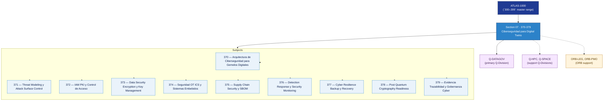

# DTCEC 370-379 · Section 07 — Ciberseguridad para Digital Twins

## 1. Purpose

Section-level index for *Ciberseguridad para Digital Twins* (`370-379`) within the DTCEC band. Security-by-design, model integrity, access control, cyber resilience.

This section is part of the **ATLAS-1000** register, a subpart of the controlled **Q+ATLANTIDE** baseline[^baseline][^n001]. Bands classify technologies, Q-Divisions provide technical authority and ORB-Functions provide enterprise support[^n002].

## 2. Scope

- Aggregates the subjects within the `370-379` code range listed in §3.
- Inherits Q-Division authority and ORB support from the parent row in [`../README.md` §3](../README.md#3-architecture-table)[^archtable].
- Each subject folder contains its own documents. Subject codes use absolute numbering (`370`–`379`).

## 3. Subject Index

| Code | Title | Folder | Status |
|---:|---|---|---|
| `370` | Arquitectura de Ciberseguridad para Gemelos Digitales | [`./370_Arquitectura-de-Ciberseguridad-para-Gemelos-Digitales/`](./370_Arquitectura-de-Ciberseguridad-para-Gemelos-Digitales/) | reserved |
| `371` | Threat Modeling y Attack Surface Control | [`./371_Threat-Modeling-y-Attack-Surface-Control/`](./371_Threat-Modeling-y-Attack-Surface-Control/) | reserved |
| `372` | IAM PKI y Control de Acceso | [`./372_IAM-PKI-y-Control-de-Acceso/`](./372_IAM-PKI-y-Control-de-Acceso/) | reserved |
| `373` | Data Security Encryption y Key Management | [`./373_Data-Security-Encryption-y-Key-Management/`](./373_Data-Security-Encryption-y-Key-Management/) | reserved |
| `374` | Seguridad OT ICS y Sistemas Embebidos | [`./374_Seguridad-OT-ICS-y-Sistemas-Embebidos/`](./374_Seguridad-OT-ICS-y-Sistemas-Embebidos/) | reserved |
| `375` | Supply Chain Security y SBOM | [`./375_Supply-Chain-Security-y-SBOM/`](./375_Supply-Chain-Security-y-SBOM/) | reserved |
| `376` | Detection Response y Security Monitoring | [`./376_Detection-Response-y-Security-Monitoring/`](./376_Detection-Response-y-Security-Monitoring/) | reserved |
| `377` | Cyber Resilience Backup y Recovery | [`./377_Cyber-Resilience-Backup-y-Recovery/`](./377_Cyber-Resilience-Backup-y-Recovery/) | reserved |
| `378` | Post Quantum Cryptography Readiness | [`./378_Post-Quantum-Cryptography-Readiness/`](./378_Post-Quantum-Cryptography-Readiness/) | reserved |
| `379` | Evidencia Trazabilidad y Gobernanza Cyber | [`./379_Evidencia-Trazabilidad-y-Gobernanza-Cyber/`](./379_Evidencia-Trazabilidad-y-Gobernanza-Cyber/) | reserved |

## 4. Interfaces Diagram

*Solid arrows show parent→section→subject ownership and primary Q-Division authority; dotted arrows show support Q-Divisions and ORB enterprise support.*

## 5. Footprint

| Metric | Value |
|---|---|
| Architecture | `DTCEC` — Digital Twin, Cloud, Edge & AI Architecture |
| Master range | `300–399` |
| Code range | `370-379` |
| Section | `07` — Ciberseguridad para Digital Twins |
| Subjects | 10 reserved |
| Primary Q-Division | Q-DATAGOV[^qdiv] |
| Support Q-Divisions | Q-HPC, Q-SPACE |
| ORB support | ORB-LEG, ORB-PMO |
| Governance class | `baseline`[^gov] |
| Folder path | `Q+ATLANTIDE/300-399_DTCEC/370-379_Ciberseguridad-para-Digital-Twins/` |
| Document | `README.md` (this file) |
| Parent architecture | [`../README.md`](../README.md) |
| Parent baseline | [`organization/Q+ATLANTIDE.md`](../../../organization/Q+ATLANTIDE.md) |

## Governance

Governed by [`organization/Q+ATLANTIDE.md`](../../../organization/Q+ATLANTIDE.md)[^baseline]. All subjects under this section inherit `architecture_code = DTCEC`, `primary_q_division = Q-DATAGOV`, `governance_class = baseline`. The No-AAA Rule[^n004] applies.

## 6. References & Citations

[^baseline]: **Q+ATLANTIDE controlled baseline (v1.0.0)** — [`organization/Q+ATLANTIDE.md`](../../../organization/Q+ATLANTIDE.md).

[^archtable]: **§3 — Architecture Table (parent)** — [`../README.md` §3](../README.md#3-architecture-table).

[^qdiv]: **Q-Division authority** — [`organization/Q-Divisions/`](../../../organization/Q-Divisions/).

[^gov]: **Governance class** — `baseline` for DTCEC band documents.

[^templates]: **§5 — Templates System** — [`organization/Q+ATLANTIDE.md` §5](../../../organization/Q+ATLANTIDE.md#5-templates-system).

[^n001]: **Note N-001** — Q+ATLANTIDE is a taxonomy and traceability ecosystem, not an organization chart. See [`organization/Q+ATLANTIDE.md` §4](../../../organization/Q+ATLANTIDE.md#4-notes).

[^n002]: **Note N-002** — Architecture bands classify technologies; Q-Divisions provide technical authority; ORB-Functions provide enterprise support. See [`organization/Q+ATLANTIDE.md` §4](../../../organization/Q+ATLANTIDE.md#4-notes).

[^n004]: **Note N-004 (No-AAA Rule)** — "AAA" is not a valid domain, division, architecture, interface or function in this baseline. See [`organization/Q+ATLANTIDE.md` §4](../../../organization/Q+ATLANTIDE.md#4-notes).
