# DTCEC 380-389 · Section 08 — Analytics y Business Intelligence

## 1. Purpose

Section-level index for *Analytics y Business Intelligence* (`380-389`) within the DTCEC band. KPI, EVM analytics, operations intelligence, dashboards.

This section is part of the **ATLAS-1000** register, a subpart of the controlled **Q+ATLANTIDE** baseline[^baseline][^n001]. Bands classify technologies, Q-Divisions provide technical authority and ORB-Functions provide enterprise support[^n002].

## 2. Scope

- Aggregates the subjects within the `380-389` code range listed in §3.
- Inherits Q-Division authority and ORB support from the parent row in [`../README.md` §3](../README.md#3-architecture-table)[^archtable].
- Each subject folder contains its own documents. Subject codes use absolute numbering (`380`–`389`).

## 3. Subject Index

| Code | Title | Folder | Status |
|---:|---|---|---|
| `380` | Arquitectura Analytics y BI | [`./380_Arquitectura-Analytics-y-BI/`](./380_Arquitectura-Analytics-y-BI/) | reserved |
| `381` | Data Warehousing y Semantic Layers | [`./381_Data-Warehousing-y-Semantic-Layers/`](./381_Data-Warehousing-y-Semantic-Layers/) | reserved |
| `382` | KPIs Metricas y Performance Management | [`./382_KPIs-Metricas-y-Performance-Management/`](./382_KPIs-Metricas-y-Performance-Management/) | reserved |
| `383` | Dashboards Reporting y Decision Support | [`./383_Dashboards-Reporting-y-Decision-Support/`](./383_Dashboards-Reporting-y-Decision-Support/) | reserved |
| `384` | Operational Analytics y Real Time Monitoring | [`./384_Operational-Analytics-y-Real-Time-Monitoring/`](./384_Operational-Analytics-y-Real-Time-Monitoring/) | reserved |
| `385` | Predictive Analytics y Forecasting | [`./385_Predictive-Analytics-y-Forecasting/`](./385_Predictive-Analytics-y-Forecasting/) | reserved |
| `386` | Prescriptive Analytics y Optimization | [`./386_Prescriptive-Analytics-y-Optimization/`](./386_Prescriptive-Analytics-y-Optimization/) | reserved |
| `387` | Data Governance Lineage y Quality | [`./387_Data-Governance-Lineage-y-Quality/`](./387_Data-Governance-Lineage-y-Quality/) | reserved |
| `388` | Auditability Explainability y Management Reviews | [`./388_Auditability-Explainability-y-Management-Reviews/`](./388_Auditability-Explainability-y-Management-Reviews/) | reserved |
| `389` | Evidencia Trazabilidad y Gobernanza Analytics | [`./389_Evidencia-Trazabilidad-y-Gobernanza-Analytics/`](./389_Evidencia-Trazabilidad-y-Gobernanza-Analytics/) | reserved |

## 4. Interfaces Diagram

```mermaid
flowchart TB
    PARENT["ATLAS-1000<br/>(`300–399` master range)"]:::parent
    SEC["Section 08 · 380-389<br/>Analytics y Business Intelligence"]:::sec
    PARENT --> SEC

    subgraph SUBS["Subjects"]
        direction LR
    SUB_380["380 — Arquitectura Analytics y BI"]:::sub
    SUB_381["381 — Data Warehousing y Semantic Layers"]:::sub
    SUB_382["382 — KPIs Metricas y Performance Management"]:::sub
    SUB_383["383 — Dashboards Reporting y Decision Support"]:::sub
    SUB_384["384 — Operational Analytics y Real Time Monitoring"]:::sub
    SUB_385["385 — Predictive Analytics y Forecasting"]:::sub
    SUB_386["386 — Prescriptive Analytics y Optimization"]:::sub
    SUB_387["387 — Data Governance Lineage y Quality"]:::sub
    SUB_388["388 — Auditability Explainability y Management Reviews"]:::sub
    SUB_389["389 — Evidencia Trazabilidad y Gobernanza Analytics"]:::sub
    end
    SEC --> SUBS

    QPRIM["Q-DATAGOV<br/>(primary Q-Division)"]:::qdiv
    QSUPP["Q-HPC, Q-INDUSTRY<br/>(support Q-Divisions)"]:::qdiv
    ORB["ORB-PMO, ORB-FIN<br/>(ORB support)"]:::orb

    SEC --> QPRIM
    SEC -.-> QSUPP
    SEC -.-> ORB

    SUBS --> SUB_380
    SUBS --> SUB_381
    SUBS --> SUB_382
    SUBS --> SUB_383
    SUBS --> SUB_384
    SUBS --> SUB_385
    SUBS --> SUB_386
    SUBS --> SUB_387
    SUBS --> SUB_388
    SUBS --> SUB_389

    classDef parent fill:#1f3a93,stroke:#0b1d4a,color:#fff
    classDef sec fill:#2c82c9,stroke:#0b1d4a,color:#fff
    classDef sub fill:#eaf3fb,stroke:#2c82c9,color:#0b1d4a
    classDef qdiv fill:#f6e6ff,stroke:#7d3c98,color:#3b1f4d
    classDef orb fill:#fff4dd,stroke:#b9770e,color:#5a3b00
```

*Solid arrows show parent→section→subject ownership and primary Q-Division authority; dotted arrows show support Q-Divisions and ORB enterprise support.*

## 5. Footprint

| Metric | Value |
|---|---|
| Architecture | `DTCEC` — Digital Twin, Cloud, Edge & AI Architecture |
| Master range | `300–399` |
| Code range | `380-389` |
| Section | `08` — Analytics y Business Intelligence |
| Subjects | 10 reserved |
| Primary Q-Division | Q-DATAGOV[^qdiv] |
| Support Q-Divisions | Q-HPC, Q-INDUSTRY |
| ORB support | ORB-PMO, ORB-FIN |
| Governance class | `baseline`[^gov] |
| Folder path | `Q+ATLANTIDE/300-399_DTCEC/380-389_Analytics-y-Business-Intelligence/` |
| Document | `README.md` (this file) |
| Parent architecture | [`../README.md`](../README.md) |
| Parent baseline | [`organization/Q+ATLANTIDE.md`](../../../organization/Q+ATLANTIDE.md) |

## Governance

Governed by [`organization/Q+ATLANTIDE.md`](../../../organization/Q+ATLANTIDE.md)[^baseline]. All subjects under this section inherit `architecture_code = DTCEC`, `primary_q_division = Q-DATAGOV`, `governance_class = baseline`. The No-AAA Rule[^n004] applies.

## 6. References & Citations

[^baseline]: **Q+ATLANTIDE controlled baseline (v1.0.0)** — [`organization/Q+ATLANTIDE.md`](../../../organization/Q+ATLANTIDE.md).

[^archtable]: **§3 — Architecture Table (parent)** — [`../README.md` §3](../README.md#3-architecture-table).

[^qdiv]: **Q-Division authority** — [`organization/Q-Divisions/`](../../../organization/Q-Divisions/).

[^gov]: **Governance class** — `baseline` for DTCEC band documents.

[^templates]: **§5 — Templates System** — [`organization/Q+ATLANTIDE.md` §5](../../../organization/Q+ATLANTIDE.md#5-templates-system).

[^n001]: **Note N-001** — Q+ATLANTIDE is a taxonomy and traceability ecosystem, not an organization chart. See [`organization/Q+ATLANTIDE.md` §4](../../../organization/Q+ATLANTIDE.md#4-notes).

[^n002]: **Note N-002** — Architecture bands classify technologies; Q-Divisions provide technical authority; ORB-Functions provide enterprise support. See [`organization/Q+ATLANTIDE.md` §4](../../../organization/Q+ATLANTIDE.md#4-notes).

[^n004]: **Note N-004 (No-AAA Rule)** — "AAA" is not a valid domain, division, architecture, interface or function in this baseline. See [`organization/Q+ATLANTIDE.md` §4](../../../organization/Q+ATLANTIDE.md#4-notes).
