# DTCEC 380–389 · Section 08 — Cyber-Physical Integration and IoT

## 1. Purpose

Section-level index for *Cyber-Physical Integration and IoT* (`380-389`) within the DTCEC band. Covers IoT device architecture and sensor nodes, Industrial IoT and Operational Technology interfaces, sensor fusion and data acquisition, control loops and cyber-physical feedback, device identity/provisioning/configuration, IoT connectivity protocols and gateways, cyber-physical safety and risk controls, IoT monitoring/diagnostics/maintenance, and S1000D/CSDB mapping and traceability.

This section is part of the **ATLAS-1000** register, a subpart of the controlled **Q+ATLANTIDE** baseline[^baseline][^n001]. Bands classify technologies, Q-Divisions provide technical authority and ORB-Functions provide enterprise support[^n002].

## 2. Scope

- Aggregates the subsections within the `380-389` code range listed in §3.
- Inherits Q-Division authority and ORB support from the parent row in [`../README.md` §3](../README.md#3-architecture-table)[^archtable].
- Each subsection folder contains its own `README.md` (subsection index) and may contain Overview and subsubject documents.

## 3. Subsection Index

| Code | Title | Folder | Status |
|---:|---|---|---|
| `380` | Cyber-Physical Integration General | [`./380_Cyber-Physical-Integration-General/`](./380_Cyber-Physical-Integration-General/) | reserved |
| `381` | IoT Device Architecture and Sensor Nodes | [`./381_IoT-Device-Architecture-and-Sensor-Nodes/`](./381_IoT-Device-Architecture-and-Sensor-Nodes/) | reserved |
| `382` | Industrial IoT and Operational Technology Interfaces | [`./382_Industrial-IoT-and-Operational-Technology-Interfaces/`](./382_Industrial-IoT-and-Operational-Technology-Interfaces/) | reserved |
| `383` | Sensor Fusion and Data Acquisition | [`./383_Sensor-Fusion-and-Data-Acquisition/`](./383_Sensor-Fusion-and-Data-Acquisition/) | reserved |
| `384` | Control Loops and Cyber-Physical Feedback | [`./384_Control-Loops-and-Cyber-Physical-Feedback/`](./384_Control-Loops-and-Cyber-Physical-Feedback/) | reserved |
| `385` | Device Identity Provisioning and Configuration | [`./385_Device-Identity-Provisioning-and-Configuration/`](./385_Device-Identity-Provisioning-and-Configuration/) | reserved |
| `386` | IoT Connectivity Protocols and Gateways | [`./386_IoT-Connectivity-Protocols-and-Gateways/`](./386_IoT-Connectivity-Protocols-and-Gateways/) | reserved |
| `387` | Cyber-Physical Safety and Risk Controls | [`./387_Cyber-Physical-Safety-and-Risk-Controls/`](./387_Cyber-Physical-Safety-and-Risk-Controls/) | reserved |
| `388` | IoT Monitoring Diagnostics and Maintenance | [`./388_IoT-Monitoring-Diagnostics-and-Maintenance/`](./388_IoT-Monitoring-Diagnostics-and-Maintenance/) | reserved |
| `389` | IoT S1000D CSDB Mapping and Traceability | [`./389_IoT-S1000D-CSDB-Mapping-and-Traceability/`](./389_IoT-S1000D-CSDB-Mapping-and-Traceability/) | reserved |

## 4. Interfaces Diagram

```mermaid
flowchart TB
    PARENT["ATLAS-1000<br/>(`300–399` master range)"]:::parent
    SEC["Section 08 · 380-389<br/>Cyber-Physical Integration and IoT"]:::sec
    PARENT --> SEC

    subgraph SUBS["Subsections"]
        direction LR
        SUB_380["380 — Cyber-Physical Integration General"]:::sub
        SUB_381["381 — IoT Device Architecture and Sensor Nodes"]:::sub
        SUB_382["382 — Industrial IoT and Operational Technology Interfaces"]:::sub
        SUB_383["383 — Sensor Fusion and Data Acquisition"]:::sub
        SUB_384["384 — Control Loops and Cyber-Physical Feedback"]:::sub
        SUB_385["385 — Device Identity Provisioning and Configuration"]:::sub
        SUB_386["386 — IoT Connectivity Protocols and Gateways"]:::sub
        SUB_387["387 — Cyber-Physical Safety and Risk Controls"]:::sub
        SUB_388["388 — IoT Monitoring Diagnostics and Maintenance"]:::sub
        SUB_389["389 — IoT S1000D CSDB Mapping and Traceability"]:::sub
    end
    SEC --> SUBS

    QPRIM["Q-DATAGOV<br/>(primary Q-Division)"]:::qdiv
    QSUPP["Q-HPC, Q-INDUSTRY<br/>(support Q-Divisions)"]:::qdiv
    ORB["ORB-PMO, ORB-FIN<br/>(ORB support)"]:::orb

    SEC --> QPRIM
    SEC -.-> QSUPP
    SEC -.-> ORB

    SUBS --> SUB_380
    SUBS --> SUB_381
    SUBS --> SUB_382
    SUBS --> SUB_383
    SUBS --> SUB_384
    SUBS --> SUB_385
    SUBS --> SUB_386
    SUBS --> SUB_387
    SUBS --> SUB_388
    SUBS --> SUB_389

    classDef parent fill:#1f3a93,stroke:#0b1d4a,color:#fff
    classDef sec fill:#2c82c9,stroke:#0b1d4a,color:#fff
    classDef sub fill:#eaf3fb,stroke:#2c82c9,color:#0b1d4a
    classDef qdiv fill:#f6e6ff,stroke:#7d3c98,color:#3b1f4d
    classDef orb fill:#fff4dd,stroke:#b9770e,color:#5a3b00
    classDef ext fill:#fdebd0,stroke:#b9770e,color:#5a3b00,stroke-dasharray:3 3
```

*Solid arrows show parent→section→subsection ownership and primary Q-Division authority; dotted arrows show support Q-Divisions, ORB enterprise support, and notable cross-section interfaces.*

## 5. Footprint

| Metric | Value |
|---|---|
| Architecture | `DTCEC` — Digital Twin, Cloud, Edge & AI Architecture |
| Master range | `300–399` |
| Code range | `380-389` |
| Section | `08` — Cyber-Physical Integration and IoT |
| Subsections | 10 reserved |
| Primary Q-Division | Q-DATAGOV[^qdiv] |
| Support Q-Divisions | Q-HPC, Q-INDUSTRY |
| ORB support | ORB-PMO, ORB-FIN |
| Governance class | `baseline`[^gov] |
| Folder path | `Q+ATLANTIDE/300-399_DTCEC/380-389_Cyber-Physical-Integration-and-IoT/` |
| Document | `README.md` (this file) |
| Parent architecture | [`../README.md`](../README.md) |
| Parent baseline | [`organization/Q+ATLANTIDE.md`](../../../organization/Q+ATLANTIDE.md) |

## Governance

Governed by [`organization/Q+ATLANTIDE.md`](../../../organization/Q+ATLANTIDE.md)[^baseline]. All subsections under this section inherit `architecture_code = DTCEC`, `primary_q_division = Q-DATAGOV` and `governance_class = baseline` from this section header. Templates declared in this section must populate `architecture_band`, `architecture_code = DTCEC`, `q_division_owner` and `orb_function_support` per the Templates System[^templates]. The No-AAA Rule[^n004] applies.

## 6. References & Citations

[^baseline]: **Q+ATLANTIDE controlled baseline (v1.0.0)** — [`organization/Q+ATLANTIDE.md`](../../../organization/Q+ATLANTIDE.md). Defines the controlled `000-999` architecture-band taxonomy and the ATLAS-1000 register subpart.

[^archtable]: **§3 — Architecture Table (parent)** — [`../README.md` §3](../README.md#3-architecture-table). Source of authority for primary/support Q-Divisions and ORB support of this section.

[^qdiv]: **Q-Division authority** — [`organization/Q-Divisions/`](../../../organization/Q-Divisions/). Technical-authority units for the Q+ATLANTIDE baseline.

[^gov]: **Governance class** — `baseline` denotes documents under controlled change management within the Q+ATLANTIDE baseline.

[^templates]: **§5 — Templates System** — [`organization/Q+ATLANTIDE.md` §5](../../../organization/Q+ATLANTIDE.md#5-templates-system).

[^n001]: **Note N-001** — Q+ATLANTIDE (with its ATLAS-1000 register subpart) is a taxonomy and traceability ecosystem, not an organization chart. See [`organization/Q+ATLANTIDE.md` §4](../../../organization/Q+ATLANTIDE.md#4-notes).

[^n002]: **Note N-002** — Architecture bands classify technologies; Q-Divisions provide technical authority; ORB-Functions provide enterprise support. See [`organization/Q+ATLANTIDE.md` §4](../../../organization/Q+ATLANTIDE.md#4-notes).

[^n004]: **Note N-004 (No-AAA Rule)** — "AAA" is not a valid domain, division, architecture, interface or function in this baseline. See [`organization/Q+ATLANTIDE.md` §4](../../../organization/Q+ATLANTIDE.md#4-notes).
