# DTCEC 390–399 · Section 09 — DTCEC Expansion Registry and Cross-Domain Interfaces

## 1. Purpose

Section-level index for *DTCEC Expansion Registry and Cross-Domain Interfaces* (`390-399`) within the DTCEC band. Covers cross-domain interfaces to ATLAS aircraft systems, STA space systems, EPTA energy and propulsion, AMTA materials, CYB cybersecurity, the DTCEC designator registry, future programs and variants reserved space, common architectures and reuse patterns, and the master traceability and evidence registry.

This section is part of the **ATLAS-1000** register, a subpart of the controlled **Q+ATLANTIDE** baseline[^baseline][^n001]. Bands classify technologies, Q-Divisions provide technical authority and ORB-Functions provide enterprise support[^n002].

## 2. Scope

- Aggregates the subsections within the `390-399` code range listed in §3.
- Inherits Q-Division authority and ORB support from the parent row in [`../README.md` §3](../README.md#3-architecture-table)[^archtable].
- Each subsection folder contains its own `README.md` (subsection index) and may contain Overview and subsubject documents.

## 3. Subsection Index

| Code | Title | Folder | Status |
|---:|---|---|---|
| `390` | DTCEC Expansion General | [`./390_DTCEC-Expansion-General/`](./390_DTCEC-Expansion-General/) | reserved |
| `391` | Cross-Domain Interfaces to ATLAS Aircraft Systems | [`./391_Cross-Domain-Interfaces-to-ATLAS-Aircraft-Systems/`](./391_Cross-Domain-Interfaces-to-ATLAS-Aircraft-Systems/) | reserved |
| `392` | Cross-Domain Interfaces to STA Space Systems | [`./392_Cross-Domain-Interfaces-to-STA-Space-Systems/`](./392_Cross-Domain-Interfaces-to-STA-Space-Systems/) | reserved |
| `393` | Cross-Domain Interfaces to EPTA Energy and Propulsion | [`./393_Cross-Domain-Interfaces-to-EPTA-Energy-and-Propulsion/`](./393_Cross-Domain-Interfaces-to-EPTA-Energy-and-Propulsion/) | reserved |
| `394` | Cross-Domain Interfaces to AMTA Materials | [`./394_Cross-Domain-Interfaces-to-AMTA-Materials/`](./394_Cross-Domain-Interfaces-to-AMTA-Materials/) | reserved |
| `395` | Cross-Domain Interfaces to CYB Cybersecurity | [`./395_Cross-Domain-Interfaces-to-CYB-Cybersecurity/`](./395_Cross-Domain-Interfaces-to-CYB-Cybersecurity/) | reserved |
| `396` | DTCEC Designator Registry | [`./396_DTCEC-Designator-Registry/`](./396_DTCEC-Designator-Registry/) | reserved |
| `397` | DTCEC Future Programs and Variants Reserved | [`./397_DTCEC-Future-Programs-and-Variants-Reserved/`](./397_DTCEC-Future-Programs-and-Variants-Reserved/) | reserved |
| `398` | DTCEC Common Architectures and Reuse Patterns | [`./398_DTCEC-Common-Architectures-and-Reuse-Patterns/`](./398_DTCEC-Common-Architectures-and-Reuse-Patterns/) | reserved |
| `399` | DTCEC Master Traceability and Evidence Registry | [`./399_DTCEC-Master-Traceability-and-Evidence-Registry/`](./399_DTCEC-Master-Traceability-and-Evidence-Registry/) | reserved |

## 4. Interfaces Diagram

```mermaid
flowchart TB
    PARENT["ATLAS-1000<br/>(`300–399` master range)"]:::parent
    SEC["Section 09 · 390-399<br/>DTCEC Expansion Registry and Cross-Domain Interfaces"]:::sec
    PARENT --> SEC

    subgraph SUBS["Subsections"]
        direction LR
        SUB_390["390 — DTCEC Expansion General"]:::sub
        SUB_391["391 — Cross-Domain Interfaces to ATLAS Aircraft Systems"]:::sub
        SUB_392["392 — Cross-Domain Interfaces to STA Space Systems"]:::sub
        SUB_393["393 — Cross-Domain Interfaces to EPTA Energy and Propulsion"]:::sub
        SUB_394["394 — Cross-Domain Interfaces to AMTA Materials"]:::sub
        SUB_395["395 — Cross-Domain Interfaces to CYB Cybersecurity"]:::sub
        SUB_396["396 — DTCEC Designator Registry"]:::sub
        SUB_397["397 — DTCEC Future Programs and Variants Reserved"]:::sub
        SUB_398["398 — DTCEC Common Architectures and Reuse Patterns"]:::sub
        SUB_399["399 — DTCEC Master Traceability and Evidence Registry"]:::sub
    end
    SEC --> SUBS

    QPRIM["Q-HORIZON<br/>(primary Q-Division)"]:::qdiv
    QSUPP["Q-HPC, Q-DATAGOV<br/>(support Q-Divisions)"]:::qdiv
    ORB["ORB-PMO, ORB-LEG<br/>(ORB support)"]:::orb

    EXT_ATLAS["ATLAS — Aircraft Systems"]:::ext
    EXT_STA["STA — Space Systems"]:::ext
    EXT_EPTA["EPTA — Energy and Propulsion"]:::ext
    EXT_AMTA["AMTA — Materials"]:::ext
    EXT_CYB["CYB — Cybersecurity"]:::ext

    SEC --> QPRIM
    SEC -.-> QSUPP
    SEC -.-> ORB

    SUB_391 -.-> EXT_ATLAS
    SUB_392 -.-> EXT_STA
    SUB_393 -.-> EXT_EPTA
    SUB_394 -.-> EXT_AMTA
    SUB_395 -.-> EXT_CYB

    SUBS --> SUB_390
    SUBS --> SUB_391
    SUBS --> SUB_392
    SUBS --> SUB_393
    SUBS --> SUB_394
    SUBS --> SUB_395
    SUBS --> SUB_396
    SUBS --> SUB_397
    SUBS --> SUB_398
    SUBS --> SUB_399

    classDef parent fill:#1f3a93,stroke:#0b1d4a,color:#fff
    classDef sec fill:#2c82c9,stroke:#0b1d4a,color:#fff
    classDef sub fill:#eaf3fb,stroke:#2c82c9,color:#0b1d4a
    classDef qdiv fill:#f6e6ff,stroke:#7d3c98,color:#3b1f4d
    classDef orb fill:#fff4dd,stroke:#b9770e,color:#5a3b00
    classDef ext fill:#fdebd0,stroke:#b9770e,color:#5a3b00,stroke-dasharray:3 3
```

*Solid arrows show parent→section→subsection ownership and primary Q-Division authority; dotted arrows show support Q-Divisions, ORB enterprise support, and cross-domain interfaces to other architecture bands.*

## 5. Footprint

| Metric | Value |
|---|---|
| Architecture | `DTCEC` — Digital Twin, Cloud, Edge & AI Architecture |
| Master range | `300–399` |
| Code range | `390-399` |
| Section | `09` — DTCEC Expansion Registry and Cross-Domain Interfaces |
| Subsections | 10 reserved |
| Primary Q-Division | Q-HORIZON[^qdiv] |
| Support Q-Divisions | Q-HPC, Q-DATAGOV |
| ORB support | ORB-PMO, ORB-LEG |
| Governance class | `baseline`[^gov] |
| Folder path | `Q+ATLANTIDE/300-399_DTCEC/390-399_DTCEC-Expansion-Registry-and-Cross-Domain-Interfaces/` |
| Document | `README.md` (this file) |
| Parent architecture | [`../README.md`](../README.md) |
| Parent baseline | [`organization/Q+ATLANTIDE.md`](../../../organization/Q+ATLANTIDE.md) |

## Governance

Governed by [`organization/Q+ATLANTIDE.md`](../../../organization/Q+ATLANTIDE.md)[^baseline]. All subsections under this section inherit `architecture_code = DTCEC`, `primary_q_division = Q-HORIZON` and `governance_class = baseline` from this section header. Templates declared in this section must populate `architecture_band`, `architecture_code = DTCEC`, `q_division_owner` and `orb_function_support` per the Templates System[^templates]. The No-AAA Rule[^n004] applies.

## 6. References & Citations

[^baseline]: **Q+ATLANTIDE controlled baseline (v1.0.0)** — [`organization/Q+ATLANTIDE.md`](../../../organization/Q+ATLANTIDE.md). Defines the controlled `000-999` architecture-band taxonomy and the ATLAS-1000 register subpart.

[^archtable]: **§3 — Architecture Table (parent)** — [`../README.md` §3](../README.md#3-architecture-table). Source of authority for primary/support Q-Divisions and ORB support of this section.

[^qdiv]: **Q-Division authority** — [`organization/Q-Divisions/`](../../../organization/Q-Divisions/). Technical-authority units for the Q+ATLANTIDE baseline.

[^gov]: **Governance class** — `baseline` denotes documents under controlled change management within the Q+ATLANTIDE baseline.

[^templates]: **§5 — Templates System** — [`organization/Q+ATLANTIDE.md` §5](../../../organization/Q+ATLANTIDE.md#5-templates-system).

[^n001]: **Note N-001** — Q+ATLANTIDE (with its ATLAS-1000 register subpart) is a taxonomy and traceability ecosystem, not an organization chart. See [`organization/Q+ATLANTIDE.md` §4](../../../organization/Q+ATLANTIDE.md#4-notes).

[^n002]: **Note N-002** — Architecture bands classify technologies; Q-Divisions provide technical authority; ORB-Functions provide enterprise support. See [`organization/Q+ATLANTIDE.md` §4](../../../organization/Q+ATLANTIDE.md#4-notes).

[^n004]: **Note N-004 (No-AAA Rule)** — "AAA" is not a valid domain, division, architecture, interface or function in this baseline. See [`organization/Q+ATLANTIDE.md` §4](../../../organization/Q+ATLANTIDE.md#4-notes).
