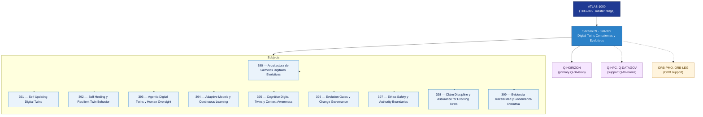

# DTCEC 390-399 · Section 09 — Digital Twins Conscientes y Evolutivos

## 1. Purpose

Section-level index for *Digital Twins Conscientes y Evolutivos* (`390-399`) within the DTCEC band. Adaptive twins, self-updating models, governed autonomy.

This section is part of the **ATLAS-1000** register, a subpart of the controlled **Q+ATLANTIDE** baseline[^baseline][^n001]. Bands classify technologies, Q-Divisions provide technical authority and ORB-Functions provide enterprise support[^n002].

## 2. Scope

- Aggregates the subjects within the `390-399` code range listed in §3.
- Inherits Q-Division authority and ORB support from the parent row in [`../README.md` §3](../README.md#3-architecture-table)[^archtable].
- Each subject folder contains its own documents. Subject codes use absolute numbering (`390`–`399`).

## 3. Subject Index

| Code | Title | Folder | Status |
|---:|---|---|---|
| `390` | Arquitectura de Gemelos Digitales Evolutivos | [`./390_Arquitectura-de-Gemelos-Digitales-Evolutivos/`](./390_Arquitectura-de-Gemelos-Digitales-Evolutivos/) | reserved |
| `391` | Self Updating Digital Twins | [`./391_Self-Updating-Digital-Twins/`](./391_Self-Updating-Digital-Twins/) | reserved |
| `392` | Self Healing y Resilient Twin Behavior | [`./392_Self-Healing-y-Resilient-Twin-Behavior/`](./392_Self-Healing-y-Resilient-Twin-Behavior/) | reserved |
| `393` | Agentic Digital Twins y Human Oversight | [`./393_Agentic-Digital-Twins-y-Human-Oversight/`](./393_Agentic-Digital-Twins-y-Human-Oversight/) | reserved |
| `394` | Adaptive Models y Continuous Learning | [`./394_Adaptive-Models-y-Continuous-Learning/`](./394_Adaptive-Models-y-Continuous-Learning/) | reserved |
| `395` | Cognitive Digital Twins y Context Awareness | [`./395_Cognitive-Digital-Twins-y-Context-Awareness/`](./395_Cognitive-Digital-Twins-y-Context-Awareness/) | reserved |
| `396` | Evolution Gates y Change Governance | [`./396_Evolution-Gates-y-Change-Governance/`](./396_Evolution-Gates-y-Change-Governance/) | reserved |
| `397` | Ethics Safety y Authority Boundaries | [`./397_Ethics-Safety-y-Authority-Boundaries/`](./397_Ethics-Safety-y-Authority-Boundaries/) | reserved |
| `398` | Claim Discipline y Assurance for Evolving Twins | [`./398_Claim-Discipline-y-Assurance-for-Evolving-Twins/`](./398_Claim-Discipline-y-Assurance-for-Evolving-Twins/) | reserved |
| `399` | Evidencia Trazabilidad y Gobernanza Evolutiva | [`./399_Evidencia-Trazabilidad-y-Gobernanza-Evolutiva/`](./399_Evidencia-Trazabilidad-y-Gobernanza-Evolutiva/) | reserved |

## 4. Interfaces Diagram

*Solid arrows show parent→section→subject ownership and primary Q-Division authority; dotted arrows show support Q-Divisions and ORB enterprise support.*

## 5. Footprint

| Metric | Value |
|---|---|
| Architecture | `DTCEC` — Digital Twin, Cloud, Edge & AI Architecture |
| Master range | `300–399` |
| Code range | `390-399` |
| Section | `09` — Digital Twins Conscientes y Evolutivos |
| Subjects | 10 reserved |
| Primary Q-Division | Q-HORIZON[^qdiv] |
| Support Q-Divisions | Q-HPC, Q-DATAGOV |
| ORB support | ORB-PMO, ORB-LEG |
| Governance class | `baseline`[^gov] |
| Folder path | `Q+ATLANTIDE/300-399_DTCEC/390-399_Digital-Twins-Conscientes-y-Evolutivos/` |
| Document | `README.md` (this file) |
| Parent architecture | [`../README.md`](../README.md) |
| Parent baseline | [`organization/Q+ATLANTIDE.md`](../../../organization/Q+ATLANTIDE.md) |

## Governance

Governed by [`organization/Q+ATLANTIDE.md`](../../../organization/Q+ATLANTIDE.md)[^baseline]. All subjects under this section inherit `architecture_code = DTCEC`, `primary_q_division = Q-HORIZON`, `governance_class = baseline`. The No-AAA Rule[^n004] applies.

## 6. References & Citations

[^baseline]: **Q+ATLANTIDE controlled baseline (v1.0.0)** — [`organization/Q+ATLANTIDE.md`](../../../organization/Q+ATLANTIDE.md).

[^archtable]: **§3 — Architecture Table (parent)** — [`../README.md` §3](../README.md#3-architecture-table).

[^qdiv]: **Q-Division authority** — [`organization/Q-Divisions/`](../../../organization/Q-Divisions/).

[^gov]: **Governance class** — `baseline` for DTCEC band documents.

[^templates]: **§5 — Templates System** — [`organization/Q+ATLANTIDE.md` §5](../../../organization/Q+ATLANTIDE.md#5-templates-system).

[^n001]: **Note N-001** — Q+ATLANTIDE is a taxonomy and traceability ecosystem, not an organization chart. See [`organization/Q+ATLANTIDE.md` §4](../../../organization/Q+ATLANTIDE.md#4-notes).

[^n002]: **Note N-002** — Architecture bands classify technologies; Q-Divisions provide technical authority; ORB-Functions provide enterprise support. See [`organization/Q+ATLANTIDE.md` §4](../../../organization/Q+ATLANTIDE.md#4-notes).

[^n004]: **Note N-004 (No-AAA Rule)** — "AAA" is not a valid domain, division, architecture, interface or function in this baseline. See [`organization/Q+ATLANTIDE.md` §4](../../../organization/Q+ATLANTIDE.md#4-notes).
