# EPTA 400-409 · Section 00 — Energy and Propulsion General and Governance

## 1. Purpose

Section-level index for *Energy and Propulsion General and Governance* (`400-409`) within the EPTA band. Energía y Propulsión — General y Gobernanza: Taxonomy, requirements governance, safety/certification basis, classification, performance metrics, sustainability accounting, interface control, S1000D traceability.

This section is part of the **ATLAS-1000** register, a subpart of the controlled **Q+ATLANTIDE** baseline[^baseline][^n001]. Bands classify technologies, Q-Divisions provide technical authority and ORB-Functions provide enterprise support[^n002].

## 2. Scope

- Aggregates the subsections within the `400-409` code range listed in §3.
- Inherits Q-Division authority and ORB support from the parent row in [`../README.md` §3](../README.md#3-architecture-table)[^archtable].
- Each subsection folder contains its own `README.md` (subsection index) and may contain subsubject documents.

## 3. Subsection Index

| Code | Title | Folder | Status |
|---:|---|---|---|
| `400` | EPTA General | [`./400_EPTA-General/`](./400_EPTA-General/) | active |
| `401` | Energy and Propulsion Taxonomy | [`./401_Energy-and-Propulsion-Taxonomy/`](./401_Energy-and-Propulsion-Taxonomy/) | active |
| `402` | Requirements and Architecture Governance | [`./402_Requirements-and-Architecture-Governance/`](./402_Requirements-and-Architecture-Governance/) | active |
| `403` | Safety, Certification and Compliance Basis | [`./403_Safety-Certification-and-Compliance-Basis/`](./403_Safety-Certification-and-Compliance-Basis/) | active |
| `404` | Energy Carrier Classification | [`./404_Energy-Carrier-Classification/`](./404_Energy-Carrier-Classification/) | active |
| `405` | Propulsion System Classification | [`./405_Propulsion-System-Classification/`](./405_Propulsion-System-Classification/) | active |
| `406` | Performance and Efficiency Metrics | [`./406_Performance-and-Efficiency-Metrics/`](./406_Performance-and-Efficiency-Metrics/) | active |
| `407` | Sustainability and Emissions Accounting | [`./407_Sustainability-and-Emissions-Accounting/`](./407_Sustainability-and-Emissions-Accounting/) | active |
| `408` | Interface Control and Integration Rules | [`./408_Interface-Control-and-Integration-Rules/`](./408_Interface-Control-and-Integration-Rules/) | active |
| `409` | EPTA S1000D CSDB Mapping and Traceability | [`./409_EPTA-S1000D-CSDB-Mapping-and-Traceability/`](./409_EPTA-S1000D-CSDB-Mapping-and-Traceability/) | active |

## 4. Interfaces Diagram

```mermaid
flowchart TB
    PARENT["EPTA band<br/>(`400–499` master range)"]:::parent
    SEC["Section 00 · 400-409<br/>Energy and Propulsion General and Governance"]:::sec
    PARENT --> SEC

    subgraph SUBS["Subsections"]
        direction LR
        SUB_400["400 — EPTA General"]:::sub
        SUB_401["401 — Energy and Propulsion Taxonomy"]:::sub
        SUB_402["402 — Requirements and Architecture Governance"]:::sub
        SUB_403["403 — Safety, Certification and Compliance Basis"]:::sub
        SUB_404["404 — Energy Carrier Classification"]:::sub
        SUB_405["405 — Propulsion System Classification"]:::sub
        SUB_406["406 — Performance and Efficiency Metrics"]:::sub
        SUB_407["407 — Sustainability and Emissions Accounting"]:::sub
        SUB_408["408 — Interface Control and Integration Rules"]:::sub
        SUB_409["409 — EPTA S1000D CSDB Mapping and Traceability"]:::sub
    end
    SEC --> SUB_400
    SEC --> SUB_401
    SEC --> SUB_402
    SEC --> SUB_403
    SEC --> SUB_404
    SEC --> SUB_405
    SEC --> SUB_406
    SEC --> SUB_407
    SEC --> SUB_408
    SEC --> SUB_409

    QPRIM["Q-GREENTECH<br/>(primary Q-Division)"]:::qdiv
    QSUPP["Q-MECHANICS, Q-DATAGOV, Q-INDUSTRY, Q-HORIZON<br/>(support Q-Divisions)"]:::qdiv
    ORB["ORB-PMO, ORB-LEG<br/>(ORB support)"]:::orb

    SEC --> QPRIM
    SEC -.-> QSUPP
    SEC -.-> ORB

    classDef parent fill:#1f3a93,stroke:#0b1d4a,color:#fff
    classDef sec fill:#2c82c9,stroke:#0b1d4a,color:#fff
    classDef sub fill:#eaf3fb,stroke:#2c82c9,color:#0b1d4a
    classDef qdiv fill:#f6e6ff,stroke:#7d3c98,color:#3b1f4d
    classDef orb fill:#fff4dd,stroke:#b9770e,color:#5a3b00
```

*Solid arrows show parent→section→subsection ownership and primary Q-Division authority; dotted arrows show support Q-Divisions and ORB enterprise support.*

## 5. Footprint

| Metric | Value |
|---|---|
| Architecture | `EPTA` — Energy and Propulsion Technology Architecture |
| Master range | `400–499` |
| Code range | `400-409` |
| Section | `00` — Energy and Propulsion General and Governance |
| Subsections | 10 populated |
| Primary Q-Division | Q-GREENTECH[^qdiv] |
| Support Q-Divisions | Q-MECHANICS, Q-DATAGOV, Q-INDUSTRY, Q-HORIZON |
| ORB support | ORB-PMO, ORB-LEG |
| Governance class | `baseline`[^gov] |
| Folder path | `Q+ATLANTIDE/400-499_EPTA/400-409_Energy-and-Propulsion-General-and-Governance/` |
| Document | `README.md` (this file) |
| Parent architecture | [`../README.md`](../README.md) |
| Parent baseline | [`organization/Q+ATLANTIDE.md`](../../../../organization/Q+ATLANTIDE.md) |

## Governance

Governed by [`organization/Q+ATLANTIDE.md`](../../../../organization/Q+ATLANTIDE.md)[^baseline]. All subsections under this section inherit `architecture_code = EPTA`, `primary_q_division = Q-GREENTECH` and `governance_class = baseline` from this section header. Templates declared in this section must populate `architecture_band`, `architecture_code = EPTA`, `q_division_owner` and `orb_function_support` per the Templates System[^templates]. The No-AAA Rule[^n004] applies.

## 6. References & Citations

[^baseline]: **Q+ATLANTIDE controlled baseline (v1.0.0)** — [`organization/Q+ATLANTIDE.md`](../../../../organization/Q+ATLANTIDE.md).

[^archtable]: **§3 — Architecture Table (parent)** — [`../README.md` §3](../README.md#3-architecture-table).

[^qdiv]: **Q-Division authority** — [`organization/Q-Divisions/`](../../../../organization/Q-Divisions/).

[^gov]: **Governance class** — `baseline` denotes documents under controlled change management within the Q+ATLANTIDE baseline.

[^templates]: **§5 — Templates System** — [`organization/Q+ATLANTIDE.md` §5](../../../../organization/Q+ATLANTIDE.md#5-templates-system).

[^n001]: **Note N-001** — Q+ATLANTIDE (with its ATLAS-1000 register subpart) is a taxonomy and traceability ecosystem, not an organization chart. See [`organization/Q+ATLANTIDE.md` §4](../../../../organization/Q+ATLANTIDE.md#4-notes).

[^n002]: **Note N-002** — Architecture bands classify technologies; Q-Divisions provide technical authority; ORB-Functions provide enterprise support. See [`organization/Q+ATLANTIDE.md` §4](../../../../organization/Q+ATLANTIDE.md#4-notes).

[^n004]: **Note N-004 (No-AAA Rule)** — "AAA" is not a valid domain, division, architecture, interface or function in this baseline. See [`organization/Q+ATLANTIDE.md` §4](../../../../organization/Q+ATLANTIDE.md#4-notes).
