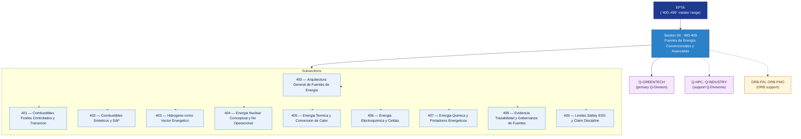

# EPTA 400–409 · Section 00 — Fuentes de Energía Convencionales y Avanzadas

## 1. Purpose

Section-level index for *Fuentes de Energía Convencionales y Avanzadas* (`400-409`) within the EPTA band. Conventional and advanced energy sources: primary energy architectures, fossil fuels (controlled transition), synthetic fuels and SAF, hydrogen energy vector, nuclear conceptual, thermal conversion, electrochemical cells, chemical energy carriers, evidence governance, safety and ESG limits.

This section is part of the **ATLAS-1000** register, a subpart of the **Q+ATLANTIDE** baseline[^baseline][^n001]. Bands classify technologies, Q-Divisions provide technical authority and ORB-Functions provide enterprise support[^n002].

## 2. Scope

- Aggregates the subsections within the `400-409` code range listed in §3.
- Inherits Q-Division authority and ORB support from the parent row in [`../README.md` §3](../README.md#3-architecture-table)[^archtable].
- Each subsection folder contains its own `README.md` (subsection index) and may contain Overview and subsubject documents.
- All subsections under this section declare `governance_class: baseline` and maintain evidence traceability per the Q+ATLANTIDE templates system[^templates].

## 3. Subsection Index

| Code | Title | Folder | Status |
| ---: | --- | --- | --- |
| `400` | Arquitectura General de Fuentes de Energia | [`./400_Arquitectura-General-de-Fuentes-de-Energia/`](./400_Arquitectura-General-de-Fuentes-de-Energia/) | active |
| `401` | Combustibles Fosiles Controlados y Transicion | [`./401_Combustibles-Fosiles-Controlados-y-Transicion/`](./401_Combustibles-Fosiles-Controlados-y-Transicion/) | active |
| `402` | Combustibles Sinteticos y SAF | [`./402_Combustibles-Sinteticos-y-SAF/`](./402_Combustibles-Sinteticos-y-SAF/) | active |
| `403` | Hidrogeno como Vector Energetico | [`./403_Hidrogeno-como-Vector-Energetico/`](./403_Hidrogeno-como-Vector-Energetico/) | active |
| `404` | Energia Nuclear Conceptual y No Operacional | [`./404_Energia-Nuclear-Conceptual-y-No-Operacional/`](./404_Energia-Nuclear-Conceptual-y-No-Operacional/) | active |
| `405` | Energia Termica y Conversion de Calor | [`./405_Energia-Termica-y-Conversion-de-Calor/`](./405_Energia-Termica-y-Conversion-de-Calor/) | active |
| `406` | Energia Electroquimica y Celdas | [`./406_Energia-Electroquimica-y-Celdas/`](./406_Energia-Electroquimica-y-Celdas/) | active |
| `407` | Energia Quimica y Portadores Energeticos | [`./407_Energia-Quimica-y-Portadores-Energeticos/`](./407_Energia-Quimica-y-Portadores-Energeticos/) | active |
| `408` | Evidencia Trazabilidad y Gobernanza de Fuentes | [`./408_Evidencia-Trazabilidad-y-Gobernanza-de-Fuentes/`](./408_Evidencia-Trazabilidad-y-Gobernanza-de-Fuentes/) | active |
| `409` | Limites Safety ESG y Claim Discipline | [`./409_Limites-Safety-ESG-y-Claim-Discipline/`](./409_Limites-Safety-ESG-y-Claim-Discipline/) | active |

## 4. Interfaces Diagram

*Solid arrows show parent→section→subsection ownership and primary Q-Division authority; dotted arrows show support Q-Divisions and ORB enterprise support.*

## 5. Footprint

| Metric | Value |
| --- | --- |
| Architecture | `EPTA` — Energy & Propulsion Technology Architecture |
| Master range | `400–499` |
| Code range | `400-409` |
| Section | `00` — Fuentes de Energía Convencionales y Avanzadas |
| Subsections | 10 populated |
| Primary Q-Division | Q-GREENTECH[^qdiv] |
| Support Q-Divisions | Q-HPC, Q-INDUSTRY |
| ORB support | ORB-FIN, ORB-PMO |
| Governance class | `baseline`[^gov] |
| Folder path | `Q+ATLANTIDE/400-499_EPTA/400-409_Fuentes-de-Energia-Convencionales-y-Avanzadas/` |
| Document | `README.md` (this file) |
| Parent architecture | [`../README.md`](../README.md) |
| Parent baseline | [`organization/Q+ATLANTIDE.md`](../../../organization/Q+ATLANTIDE.md) |

## Governance

Governed by [`organization/Q+ATLANTIDE.md`](../../../organization/Q+ATLANTIDE.md)[^baseline]. All subsections under this section inherit `architecture_code = EPTA`, `primary_q_division = Q-GREENTECH`, and `governance_class = baseline` from this section header. Energy source documents must maintain evidence traceability per the Q+ATLANTIDE templates system[^templates]. Relevant standards include IEC 61508 (functional safety), ISO 50001 (energy management), and S1000D (technical documentation). The No-AAA Rule[^n004] applies.

## 6. References & Citations

[^baseline]: **Q+ATLANTIDE controlled baseline (v1.0.0)** — [`organization/Q+ATLANTIDE.md`](../../../organization/Q+ATLANTIDE.md). Defines the controlled `000-999` architecture-band taxonomy and the ATLAS-1000 register subpart.

[^archtable]: **§3 — Architecture Table (parent)** — [`../README.md` §3](../README.md#3-architecture-table). Source of authority for primary/support Q-Divisions and ORB support of this section.

[^qdiv]: **Q-Division authority** — [`organization/Q-Divisions/`](../../../organization/Q-Divisions/). Technical-authority units for the Q+ATLANTIDE baseline.

[^gov]: **Governance class** — `baseline` denotes documents under standard Q+ATLANTIDE traceability and evidence requirements without additional restricted-band controls.

[^templates]: **§5 — Templates System** — [`organization/Q+ATLANTIDE.md` §5](../../../organization/Q+ATLANTIDE.md#5-templates-system).

[^n001]: **Note N-001** — Q+ATLANTIDE (with its ATLAS-1000 register subpart) is a taxonomy and traceability ecosystem, not an organization chart. See [`organization/Q+ATLANTIDE.md` §4](../../../organization/Q+ATLANTIDE.md#4-notes).

[^n002]: **Note N-002** — Architecture bands classify technologies; Q-Divisions provide technical authority; ORB-Functions provide enterprise support. See [`organization/Q+ATLANTIDE.md` §4](../../../organization/Q+ATLANTIDE.md#4-notes).

[^n004]: **Note N-004 (No-AAA Rule)** — "AAA" is not a valid domain, division, architecture, interface or function in this baseline. See [`organization/Q+ATLANTIDE.md` §4](../../../organization/Q+ATLANTIDE.md#4-notes).
