# EPTA 410-419 · Section 01 — Conventional and Advanced Turbomachinery

## 1. Purpose

Section-level index for *Conventional and Advanced Turbomachinery* (`410-419`) within the EPTA band. Turbomaquinaria Convencional y Avanzada: Gas turbine core, compressors/fans/bypass, combustors, turbines/nozzles/exhaust, gearboxes/shafts, FADEC/health monitoring, advanced cycles (intercooling, recuperation, BLI), maintenance/life management.

This section is part of the **ATLAS-1000** register, a subpart of the controlled **Q+ATLANTIDE** baseline[^baseline][^n001]. Bands classify technologies, Q-Divisions provide technical authority and ORB-Functions provide enterprise support[^n002].

## 2. Scope

- Aggregates the subsections within the `410-419` code range listed in §3.
- Inherits Q-Division authority and ORB support from the parent row in [`../README.md` §3](../README.md#3-architecture-table)[^archtable].
- Each subsection folder contains its own `README.md` (subsection index) and may contain subsubject documents.

## 3. Subsection Index

| Code | Title | Folder | Status |
|---:|---|---|---|
| `410` | Turbomachinery General | [`./410_Turbomachinery-General/`](./410_Turbomachinery-General/) | active |
| `411` | Gas Turbine Core Architecture | [`./411_Gas-Turbine-Core-Architecture/`](./411_Gas-Turbine-Core-Architecture/) | active |
| `412` | Compressors, Fans and Bypass Systems | [`./412_Compressors-Fans-and-Bypass-Systems/`](./412_Compressors-Fans-and-Bypass-Systems/) | active |
| `413` | Combustors and Emission Control | [`./413_Combustors-and-Emission-Control/`](./413_Combustors-and-Emission-Control/) | active |
| `414` | Turbines, Nozzles and Exhaust Systems | [`./414_Turbines-Nozzles-and-Exhaust-Systems/`](./414_Turbines-Nozzles-and-Exhaust-Systems/) | active |
| `415` | Gearboxes, Shafts and Mechanical Transmission | [`./415_Gearboxes-Shafts-and-Mechanical-Transmission/`](./415_Gearboxes-Shafts-and-Mechanical-Transmission/) | active |
| `416` | Engine Control, FADEC and Health Monitoring | [`./416_Engine-Control-FADEC-and-Health-Monitoring/`](./416_Engine-Control-FADEC-and-Health-Monitoring/) | active |
| `417` | Advanced Cycles — Intercooling, Recuperation and BLI | [`./417_Advanced-Cycles-Intercooling-Recuperation-and-BLI/`](./417_Advanced-Cycles-Intercooling-Recuperation-and-BLI/) | active |
| `418` | Maintenance, Inspection and Life Management | [`./418_Maintenance-Inspection-and-Life-Management/`](./418_Maintenance-Inspection-and-Life-Management/) | active |
| `419` | Turbomachinery S1000D CSDB Mapping and Traceability | [`./419_Turbomachinery-S1000D-CSDB-Mapping-and-Traceability/`](./419_Turbomachinery-S1000D-CSDB-Mapping-and-Traceability/) | active |

## 4. Interfaces Diagram

```mermaid
flowchart TB
    PARENT["EPTA band<br/>(`400–499` master range)"]:::parent
    SEC["Section 01 · 410-419<br/>Conventional and Advanced Turbomachinery"]:::sec
    PARENT --> SEC

    subgraph SUBS["Subsections"]
        direction LR
        SUB_410["410 — Turbomachinery General"]:::sub
        SUB_411["411 — Gas Turbine Core Architecture"]:::sub
        SUB_412["412 — Compressors, Fans and Bypass Systems"]:::sub
        SUB_413["413 — Combustors and Emission Control"]:::sub
        SUB_414["414 — Turbines, Nozzles and Exhaust Systems"]:::sub
        SUB_415["415 — Gearboxes, Shafts and Mechanical Transmission"]:::sub
        SUB_416["416 — Engine Control, FADEC and Health Monitoring"]:::sub
        SUB_417["417 — Advanced Cycles — Intercooling, Recuperation and BLI"]:::sub
        SUB_418["418 — Maintenance, Inspection and Life Management"]:::sub
        SUB_419["419 — Turbomachinery S1000D CSDB Mapping and Traceability"]:::sub
    end
    SEC --> SUB_410
    SEC --> SUB_411
    SEC --> SUB_412
    SEC --> SUB_413
    SEC --> SUB_414
    SEC --> SUB_415
    SEC --> SUB_416
    SEC --> SUB_417
    SEC --> SUB_418
    SEC --> SUB_419

    QPRIM["Q-MECHANICS<br/>(primary Q-Division)"]:::qdiv
    QSUPP["Q-GREENTECH, Q-DATAGOV, Q-AIR, Q-INDUSTRY<br/>(support Q-Divisions)"]:::qdiv
    ORB["ORB-PMO, ORB-FIN<br/>(ORB support)"]:::orb

    SEC --> QPRIM
    SEC -.-> QSUPP
    SEC -.-> ORB

    classDef parent fill:#1f3a93,stroke:#0b1d4a,color:#fff
    classDef sec fill:#2c82c9,stroke:#0b1d4a,color:#fff
    classDef sub fill:#eaf3fb,stroke:#2c82c9,color:#0b1d4a
    classDef qdiv fill:#f6e6ff,stroke:#7d3c98,color:#3b1f4d
    classDef orb fill:#fff4dd,stroke:#b9770e,color:#5a3b00
```

*Solid arrows show parent→section→subsection ownership and primary Q-Division authority; dotted arrows show support Q-Divisions and ORB enterprise support.*

## 5. Footprint

| Metric | Value |
|---|---|
| Architecture | `EPTA` — Energy and Propulsion Technology Architecture |
| Master range | `400–499` |
| Code range | `410-419` |
| Section | `01` — Conventional and Advanced Turbomachinery |
| Subsections | 10 populated |
| Primary Q-Division | Q-MECHANICS[^qdiv] |
| Support Q-Divisions | Q-GREENTECH, Q-DATAGOV, Q-AIR, Q-INDUSTRY |
| ORB support | ORB-PMO, ORB-FIN |
| Governance class | `baseline`[^gov] |
| Folder path | `Q+ATLANTIDE/400-499_EPTA/410-419_Conventional-and-Advanced-Turbomachinery/` |
| Document | `README.md` (this file) |
| Parent architecture | [`../README.md`](../README.md) |
| Parent baseline | [`organization/Q+ATLANTIDE.md`](../../../../organization/Q+ATLANTIDE.md) |

## Governance

Governed by [`organization/Q+ATLANTIDE.md`](../../../../organization/Q+ATLANTIDE.md)[^baseline]. All subsections under this section inherit `architecture_code = EPTA`, `primary_q_division = Q-MECHANICS` and `governance_class = baseline` from this section header. Templates declared in this section must populate `architecture_band`, `architecture_code = EPTA`, `q_division_owner` and `orb_function_support` per the Templates System[^templates]. The No-AAA Rule[^n004] applies.

## 6. References & Citations

[^baseline]: **Q+ATLANTIDE controlled baseline (v1.0.0)** — [`organization/Q+ATLANTIDE.md`](../../../../organization/Q+ATLANTIDE.md).

[^archtable]: **§3 — Architecture Table (parent)** — [`../README.md` §3](../README.md#3-architecture-table).

[^qdiv]: **Q-Division authority** — [`organization/Q-Divisions/`](../../../../organization/Q-Divisions/).

[^gov]: **Governance class** — `baseline` denotes documents under controlled change management within the Q+ATLANTIDE baseline.

[^templates]: **§5 — Templates System** — [`organization/Q+ATLANTIDE.md` §5](../../../../organization/Q+ATLANTIDE.md#5-templates-system).

[^n001]: **Note N-001** — Q+ATLANTIDE (with its ATLAS-1000 register subpart) is a taxonomy and traceability ecosystem, not an organization chart. See [`organization/Q+ATLANTIDE.md` §4](../../../../organization/Q+ATLANTIDE.md#4-notes).

[^n002]: **Note N-002** — Architecture bands classify technologies; Q-Divisions provide technical authority; ORB-Functions provide enterprise support. See [`organization/Q+ATLANTIDE.md` §4](../../../../organization/Q+ATLANTIDE.md#4-notes).

[^n004]: **Note N-004 (No-AAA Rule)** — "AAA" is not a valid domain, division, architecture, interface or function in this baseline. See [`organization/Q+ATLANTIDE.md` §4](../../../../organization/Q+ATLANTIDE.md#4-notes).
