# EPTA 410–419 · Section 01 — Energías Renovables

## 1. Purpose

Section-level index for *Energías Renovables* (`410-419`) within the EPTA band. Renewable energy sources: solar PV and thermal, onshore/offshore/altitude wind, hydraulic/tidal/ocean, geothermal, biomass and circular fuels, power-to-X and e-fuels, integration at airports and spaceports, evidence governance, environmental and social limits.

This section is part of the **ATLAS-1000** register, a subpart of the **Q+ATLANTIDE** baseline[^baseline][^n001]. Bands classify technologies, Q-Divisions provide technical authority and ORB-Functions provide enterprise support[^n002].

## 2. Scope

- Aggregates the subsections within the `410-419` code range listed in §3.
- Inherits Q-Division authority and ORB support from the parent row in [`../README.md` §3](../README.md#3-architecture-table)[^archtable].
- Each subsection folder contains its own `README.md` (subsection index) and may contain Overview and subsubject documents.
- All subsections under this section declare `governance_class: baseline` and maintain evidence traceability per the Q+ATLANTIDE templates system[^templates].

## 3. Subsection Index

| Code | Title | Folder | Status |
| ---: | --- | --- | --- |
| `410` | Arquitectura General de Energias Renovables | [`./410_Arquitectura-General-de-Energias-Renovables/`](./410_Arquitectura-General-de-Energias-Renovables/) | active |
| `411` | Energia Solar Fotovoltaica y Termica | [`./411_Energia-Solar-Fotovoltaica-y-Termica/`](./411_Energia-Solar-Fotovoltaica-y-Termica/) | active |
| `412` | Energia Eolica Onshore Offshore y Altitud | [`./412_Energia-Eolica-Onshore-Offshore-y-Altitud/`](./412_Energia-Eolica-Onshore-Offshore-y-Altitud/) | active |
| `413` | Energia Hidraulica Mareomotriz y Oceanica | [`./413_Energia-Hidraulica-Mareomotriz-y-Oceanica/`](./413_Energia-Hidraulica-Mareomotriz-y-Oceanica/) | active |
| `414` | Geotermia y Fuentes Termicas Renovables | [`./414_Geotermia-y-Fuentes-Termicas-Renovables/`](./414_Geotermia-y-Fuentes-Termicas-Renovables/) | active |
| `415` | Biomasa Biocombustibles y Combustibles Circulares | [`./415_Biomasa-Biocombustibles-y-Combustibles-Circulares/`](./415_Biomasa-Biocombustibles-y-Combustibles-Circulares/) | active |
| `416` | Renewable Power-to-X y E-Fuels | [`./416_Renewable-Power-to-X-y-E-Fuels/`](./416_Renewable-Power-to-X-y-E-Fuels/) | active |
| `417` | Integracion Renovable en Aeropuertos y Spaceports | [`./417_Integracion-Renovable-en-Aeropuertos-y-Spaceports/`](./417_Integracion-Renovable-en-Aeropuertos-y-Spaceports/) | active |
| `418` | Evidencia Trazabilidad y Gobernanza Renovable | [`./418_Evidencia-Trazabilidad-y-Gobernanza-Renovable/`](./418_Evidencia-Trazabilidad-y-Gobernanza-Renovable/) | active |
| `419` | Limites Ambientales Territoriales y Sociales | [`./419_Limites-Ambientales-Territoriales-y-Sociales/`](./419_Limites-Ambientales-Territoriales-y-Sociales/) | active |

## 4. Interfaces Diagram

```mermaid
flowchart TB
    PARENT["EPTA<br/>(`400–499` master range)"]:::parent
    SEC["Section 01 · 410-419<br/>Energías Renovables"]:::sec
    PARENT --> SEC

    subgraph SUBS["Subsections"]
        direction LR
        SUB_410["410 — Arquitectura General de Energias Renovables"]:::sub
        SUB_411["411 — Energia Solar Fotovoltaica y Termica"]:::sub
        SUB_412["412 — Energia Eolica Onshore Offshore y Altitud"]:::sub
        SUB_413["413 — Energia Hidraulica Mareomotriz y Oceanica"]:::sub
        SUB_414["414 — Geotermia y Fuentes Termicas Renovables"]:::sub
        SUB_415["415 — Biomasa Biocombustibles y Combustibles Circulares"]:::sub
        SUB_416["416 — Renewable Power-to-X y E-Fuels"]:::sub
        SUB_417["417 — Integracion Renovable en Aeropuertos y Spaceports"]:::sub
        SUB_418["418 — Evidencia Trazabilidad y Gobernanza Renovable"]:::sub
        SUB_419["419 — Limites Ambientales Territoriales y Sociales"]:::sub
    end
    SEC --> SUBS

    SUBS --> SUB_410
    SUBS --> SUB_411
    SUBS --> SUB_412
    SUBS --> SUB_413
    SUBS --> SUB_414
    SUBS --> SUB_415
    SUBS --> SUB_416
    SUBS --> SUB_417
    SUBS --> SUB_418
    SUBS --> SUB_419

    QPRIM["Q-GREENTECH<br/>(primary Q-Division)"]:::qdiv
    QSUPP["Q-INDUSTRY, Q-HORIZON<br/>(support Q-Divisions)"]:::qdiv
    ORB["ORB-CSR, ORB-FIN<br/>(ORB support)"]:::orb

    SEC --> QPRIM
    SEC -.-> QSUPP
    SEC -.-> ORB

    classDef parent fill:#1f3a93,stroke:#0b1d4a,color:#fff
    classDef sec fill:#2c82c9,stroke:#0b1d4a,color:#fff
    classDef sub fill:#eaf3fb,stroke:#2c82c9,color:#0b1d4a
    classDef qdiv fill:#f6e6ff,stroke:#7d3c98,color:#3b1f4d
    classDef orb fill:#fff4dd,stroke:#b9770e,color:#5a3b00
```

*Solid arrows show parent→section→subsection ownership and primary Q-Division authority; dotted arrows show support Q-Divisions and ORB enterprise support.*

## 5. Footprint

| Metric | Value |
| --- | --- |
| Architecture | `EPTA` — Energy & Propulsion Technology Architecture |
| Master range | `400–499` |
| Code range | `410-419` |
| Section | `01` — Energías Renovables |
| Subsections | 10 populated |
| Primary Q-Division | Q-GREENTECH[^qdiv] |
| Support Q-Divisions | Q-INDUSTRY, Q-HORIZON |
| ORB support | ORB-CSR, ORB-FIN |
| Governance class | `baseline`[^gov] |
| Folder path | `Q+ATLANTIDE/400-499_EPTA/410-419_Energias-Renovables/` |
| Document | `README.md` (this file) |
| Parent architecture | [`../README.md`](../README.md) |
| Parent baseline | [`organization/Q+ATLANTIDE.md`](../../../organization/Q+ATLANTIDE.md) |

## Governance

Governed by [`organization/Q+ATLANTIDE.md`](../../../organization/Q+ATLANTIDE.md)[^baseline]. All subsections under this section inherit `architecture_code = EPTA`, `primary_q_division = Q-GREENTECH`, and `governance_class = baseline` from this section header. Renewable energy documents must maintain evidence traceability per the Q+ATLANTIDE templates system[^templates]. Relevant standards include ISO 50001 (energy management systems), IEC 61508 (functional safety), and S1000D (technical documentation). The No-AAA Rule[^n004] applies.

## 6. References & Citations

[^baseline]: **Q+ATLANTIDE controlled baseline (v1.0.0)** — [`organization/Q+ATLANTIDE.md`](../../../organization/Q+ATLANTIDE.md). Defines the controlled `000-999` architecture-band taxonomy and the ATLAS-1000 register subpart.

[^archtable]: **§3 — Architecture Table (parent)** — [`../README.md` §3](../README.md#3-architecture-table). Source of authority for primary/support Q-Divisions and ORB support of this section.

[^qdiv]: **Q-Division authority** — [`organization/Q-Divisions/`](../../../organization/Q-Divisions/). Technical-authority units for the Q+ATLANTIDE baseline.

[^gov]: **Governance class** — `baseline` denotes documents under standard Q+ATLANTIDE traceability and evidence requirements without additional restricted-band controls.

[^templates]: **§5 — Templates System** — [`organization/Q+ATLANTIDE.md` §5](../../../organization/Q+ATLANTIDE.md#5-templates-system).

[^n001]: **Note N-001** — Q+ATLANTIDE (with its ATLAS-1000 register subpart) is a taxonomy and traceability ecosystem, not an organization chart. See [`organization/Q+ATLANTIDE.md` §4](../../../organization/Q+ATLANTIDE.md#4-notes).

[^n002]: **Note N-002** — Architecture bands classify technologies; Q-Divisions provide technical authority; ORB-Functions provide enterprise support. See [`organization/Q+ATLANTIDE.md` §4](../../../organization/Q+ATLANTIDE.md#4-notes).

[^n004]: **Note N-004 (No-AAA Rule)** — "AAA" is not a valid domain, division, architecture, interface or function in this baseline. See [`organization/Q+ATLANTIDE.md` §4](../../../organization/Q+ATLANTIDE.md#4-notes).
