# EPTA 420–429 · Section 02 — Almacenamiento de Energía

## 1. Purpose

Section-level index for *Almacenamiento de Energía* (`420-429`) within the EPTA band. Energy storage systems: batteries and electrochemical systems, supercapacitors, hydrogen storage and chemical carriers, thermal and cryogenic storage, mechanical/flywheel/pressure storage, distributed storage and microgrids, BMS/EMS control, evidence governance, thermal runaway safety and operability limits.

This section is part of the **ATLAS-1000** register, a subpart of the **Q+ATLANTIDE** baseline[^baseline][^n001]. Bands classify technologies, Q-Divisions provide technical authority and ORB-Functions provide enterprise support[^n002].

## 2. Scope

- Aggregates the subsections within the `420-429` code range listed in §3.
- Inherits Q-Division authority and ORB support from the parent row in [`../README.md` §3](../README.md#3-architecture-table)[^archtable].
- Each subsection folder contains its own `README.md` (subsection index) and may contain Overview and subsubject documents.
- All subsections under this section declare `governance_class: baseline` and maintain evidence traceability per the Q+ATLANTIDE templates system[^templates].

## 3. Subsection Index

| Code | Title | Folder | Status |
| ---: | --- | --- | --- |
| `420` | Arquitectura General de Almacenamiento | [`./420_Arquitectura-General-de-Almacenamiento/`](./420_Arquitectura-General-de-Almacenamiento/) | active |
| `421` | Baterias y Sistemas Electroquimicos | [`./421_Baterias-y-Sistemas-Electroquimicos/`](./421_Baterias-y-Sistemas-Electroquimicos/) | active |
| `422` | Supercapacitores y Almacenamiento Rapido | [`./422_Supercapacitores-y-Almacenamiento-Rapido/`](./422_Supercapacitores-y-Almacenamiento-Rapido/) | active |
| `423` | Hidrogeno Almacenado y Portadores Quimicos | [`./423_Hidrogeno-Almacenado-y-Portadores-Quimicos/`](./423_Hidrogeno-Almacenado-y-Portadores-Quimicos/) | active |
| `424` | Almacenamiento Termico y Criogenico | [`./424_Almacenamiento-Termico-y-Criogenico/`](./424_Almacenamiento-Termico-y-Criogenico/) | active |
| `425` | Almacenamiento Mecanico Volantes y Presion | [`./425_Almacenamiento-Mecanico-Volantes-y-Presion/`](./425_Almacenamiento-Mecanico-Volantes-y-Presion/) | active |
| `426` | Almacenamiento Distribuido y Microgrids | [`./426_Almacenamiento-Distribuido-y-Microgrids/`](./426_Almacenamiento-Distribuido-y-Microgrids/) | active |
| `427` | BMS EMS y Control de Estado Energetico | [`./427_BMS-EMS-y-Control-de-Estado-Energetico/`](./427_BMS-EMS-y-Control-de-Estado-Energetico/) | active |
| `428` | Evidencia Trazabilidad y Gobernanza de Almacenamiento | [`./428_Evidencia-Trazabilidad-y-Gobernanza-de-Almacenamiento/`](./428_Evidencia-Trazabilidad-y-Gobernanza-de-Almacenamiento/) | active |
| `429` | Safety Thermal Runaway y Limites de Operabilidad | [`./429_Safety-Thermal-Runaway-y-Limites-de-Operabilidad/`](./429_Safety-Thermal-Runaway-y-Limites-de-Operabilidad/) | active |

## 4. Interfaces Diagram

```mermaid
flowchart TB
    PARENT["EPTA<br/>(`400–499` master range)"]:::parent
    SEC["Section 02 · 420-429<br/>Almacenamiento de Energía"]:::sec
    PARENT --> SEC

    subgraph SUBS["Subsections"]
        direction LR
        SUB_420["420 — Arquitectura General de Almacenamiento"]:::sub
        SUB_421["421 — Baterias y Sistemas Electroquimicos"]:::sub
        SUB_422["422 — Supercapacitores y Almacenamiento Rapido"]:::sub
        SUB_423["423 — Hidrogeno Almacenado y Portadores Quimicos"]:::sub
        SUB_424["424 — Almacenamiento Termico y Criogenico"]:::sub
        SUB_425["425 — Almacenamiento Mecanico Volantes y Presion"]:::sub
        SUB_426["426 — Almacenamiento Distribuido y Microgrids"]:::sub
        SUB_427["427 — BMS EMS y Control de Estado Energetico"]:::sub
        SUB_428["428 — Evidencia Trazabilidad y Gobernanza de Almacenamiento"]:::sub
        SUB_429["429 — Safety Thermal Runaway y Limites de Operabilidad"]:::sub
    end
    SEC --> SUBS

    SUBS --> SUB_420
    SUBS --> SUB_421
    SUBS --> SUB_422
    SUBS --> SUB_423
    SUBS --> SUB_424
    SUBS --> SUB_425
    SUBS --> SUB_426
    SUBS --> SUB_427
    SUBS --> SUB_428
    SUBS --> SUB_429

    QPRIM["Q-GREENTECH<br/>(primary Q-Division)"]:::qdiv
    QSUPP["Q-STRUCTURES, Q-HPC<br/>(support Q-Divisions)"]:::qdiv
    ORB["ORB-PMO, ORB-LEG<br/>(ORB support)"]:::orb

    SEC --> QPRIM
    SEC -.-> QSUPP
    SEC -.-> ORB

    classDef parent fill:#1f3a93,stroke:#0b1d4a,color:#fff
    classDef sec fill:#2c82c9,stroke:#0b1d4a,color:#fff
    classDef sub fill:#eaf3fb,stroke:#2c82c9,color:#0b1d4a
    classDef qdiv fill:#f6e6ff,stroke:#7d3c98,color:#3b1f4d
    classDef orb fill:#fff4dd,stroke:#b9770e,color:#5a3b00
```

*Solid arrows show parent→section→subsection ownership and primary Q-Division authority; dotted arrows show support Q-Divisions and ORB enterprise support.*

## 5. Footprint

| Metric | Value |
| --- | --- |
| Architecture | `EPTA` — Energy & Propulsion Technology Architecture |
| Master range | `400–499` |
| Code range | `420-429` |
| Section | `02` — Almacenamiento de Energía |
| Subsections | 10 populated |
| Primary Q-Division | Q-GREENTECH[^qdiv] |
| Support Q-Divisions | Q-STRUCTURES, Q-HPC |
| ORB support | ORB-PMO, ORB-LEG |
| Governance class | `baseline`[^gov] |
| Folder path | `Q+ATLANTIDE/400-499_EPTA/420-429_Almacenamiento-de-Energia/` |
| Document | `README.md` (this file) |
| Parent architecture | [`../README.md`](../README.md) |
| Parent baseline | [`organization/Q+ATLANTIDE.md`](../../../organization/Q+ATLANTIDE.md) |

## Governance

Governed by [`organization/Q+ATLANTIDE.md`](../../../organization/Q+ATLANTIDE.md)[^baseline]. All subsections under this section inherit `architecture_code = EPTA`, `primary_q_division = Q-GREENTECH`, and `governance_class = baseline` from this section header. Energy storage documents must maintain evidence traceability per the Q+ATLANTIDE templates system[^templates]. Relevant standards include IEC 61508 (functional safety), ISO 50001 (energy management), AS9100D (aerospace quality management), and S1000D (technical documentation). The No-AAA Rule[^n004] applies.

## 6. References & Citations

[^baseline]: **Q+ATLANTIDE controlled baseline (v1.0.0)** — [`organization/Q+ATLANTIDE.md`](../../../organization/Q+ATLANTIDE.md). Defines the controlled `000-999` architecture-band taxonomy and the ATLAS-1000 register subpart.

[^archtable]: **§3 — Architecture Table (parent)** — [`../README.md` §3](../README.md#3-architecture-table). Source of authority for primary/support Q-Divisions and ORB support of this section.

[^qdiv]: **Q-Division authority** — [`organization/Q-Divisions/`](../../../organization/Q-Divisions/). Technical-authority units for the Q+ATLANTIDE baseline.

[^gov]: **Governance class** — `baseline` denotes documents under standard Q+ATLANTIDE traceability and evidence requirements without additional restricted-band controls.

[^templates]: **§5 — Templates System** — [`organization/Q+ATLANTIDE.md` §5](../../../organization/Q+ATLANTIDE.md#5-templates-system).

[^n001]: **Note N-001** — Q+ATLANTIDE (with its ATLAS-1000 register subpart) is a taxonomy and traceability ecosystem, not an organization chart. See [`organization/Q+ATLANTIDE.md` §4](../../../organization/Q+ATLANTIDE.md#4-notes).

[^n002]: **Note N-002** — Architecture bands classify technologies; Q-Divisions provide technical authority; ORB-Functions provide enterprise support. See [`organization/Q+ATLANTIDE.md` §4](../../../organization/Q+ATLANTIDE.md#4-notes).

[^n004]: **Note N-004 (No-AAA Rule)** — "AAA" is not a valid domain, division, architecture, interface or function in this baseline. See [`organization/Q+ATLANTIDE.md` §4](../../../organization/Q+ATLANTIDE.md#4-notes).
