# EPTA 420-429 · Section 02 — Hybrid-Electric and All-Electric Propulsion

## 1. Purpose

Section-level index for *Hybrid-Electric and All-Electric Propulsion* (`420-429`) within the EPTA band. Propulsión Híbrido-Eléctrica y Totalmente Eléctrica: Electric propulsion architecture, electric motors/drives, inverters/converters/power electronics, high-voltage distribution, energy management/propulsion control, redundancy/fault-tolerance, EMI/EMC, maintenance/ground safety.

This section is part of the **ATLAS-1000** register, a subpart of the controlled **Q+ATLANTIDE** baseline[^baseline][^n001]. Bands classify technologies, Q-Divisions provide technical authority and ORB-Functions provide enterprise support[^n002].

## 2. Scope

- Aggregates the subsections within the `420-429` code range listed in §3.
- Inherits Q-Division authority and ORB support from the parent row in [`../README.md` §3](../README.md#3-architecture-table)[^archtable].
- Each subsection folder contains its own `README.md` (subsection index) and may contain subsubject documents.

## 3. Subsection Index

| Code | Title | Folder | Status |
|---:|---|---|---|
| `420` | Hybrid-Electric and All-Electric General | [`./420_Hybrid-Electric-and-All-Electric-General/`](./420_Hybrid-Electric-and-All-Electric-General/) | active |
| `421` | Electric Propulsion Architecture | [`./421_Electric-Propulsion-Architecture/`](./421_Electric-Propulsion-Architecture/) | active |
| `422` | Electric Motors and Drive Systems | [`./422_Electric-Motors-and-Drive-Systems/`](./422_Electric-Motors-and-Drive-Systems/) | active |
| `423` | Inverters, Converters and Power Electronics | [`./423_Inverters-Converters-and-Power-Electronics/`](./423_Inverters-Converters-and-Power-Electronics/) | active |
| `424` | High-Voltage Distribution and Protection | [`./424_High-Voltage-Distribution-and-Protection/`](./424_High-Voltage-Distribution-and-Protection/) | active |
| `425` | Energy Management and Propulsion Control | [`./425_Energy-Management-and-Propulsion-Control/`](./425_Energy-Management-and-Propulsion-Control/) | active |
| `426` | Redundancy, Fault-Tolerance and Degraded Modes | [`./426_Redundancy-Fault-Tolerance-and-Degraded-Modes/`](./426_Redundancy-Fault-Tolerance-and-Degraded-Modes/) | active |
| `427` | EMI/EMC, Bonding and Insulation Coordination | [`./427_EMI-EMC-Bonding-and-Insulation-Coordination/`](./427_EMI-EMC-Bonding-and-Insulation-Coordination/) | active |
| `428` | Maintenance, Test and Ground Safety | [`./428_Maintenance-Test-and-Ground-Safety/`](./428_Maintenance-Test-and-Ground-Safety/) | active |
| `429` | Electric Propulsion S1000D CSDB Mapping and Traceability | [`./429_Electric-Propulsion-S1000D-CSDB-Mapping-and-Traceability/`](./429_Electric-Propulsion-S1000D-CSDB-Mapping-and-Traceability/) | active |

## 4. Interfaces Diagram

```mermaid
flowchart TB
    PARENT["EPTA band<br/>(`400–499` master range)"]:::parent
    SEC["Section 02 · 420-429<br/>Hybrid-Electric and All-Electric Propulsion"]:::sec
    PARENT --> SEC

    subgraph SUBS["Subsections"]
        direction LR
        SUB_420["420 — Hybrid-Electric and All-Electric General"]:::sub
        SUB_421["421 — Electric Propulsion Architecture"]:::sub
        SUB_422["422 — Electric Motors and Drive Systems"]:::sub
        SUB_423["423 — Inverters, Converters and Power Electronics"]:::sub
        SUB_424["424 — High-Voltage Distribution and Protection"]:::sub
        SUB_425["425 — Energy Management and Propulsion Control"]:::sub
        SUB_426["426 — Redundancy, Fault-Tolerance and Degraded Modes"]:::sub
        SUB_427["427 — EMI/EMC, Bonding and Insulation Coordination"]:::sub
        SUB_428["428 — Maintenance, Test and Ground Safety"]:::sub
        SUB_429["429 — Electric Propulsion S1000D CSDB Mapping and Traceability"]:::sub
    end
    SEC --> SUB_420
    SEC --> SUB_421
    SEC --> SUB_422
    SEC --> SUB_423
    SEC --> SUB_424
    SEC --> SUB_425
    SEC --> SUB_426
    SEC --> SUB_427
    SEC --> SUB_428
    SEC --> SUB_429

    QPRIM["Q-MECHANICS<br/>(primary Q-Division)"]:::qdiv
    QSUPP["Q-GREENTECH, Q-AIR, Q-HPC, Q-INDUSTRY<br/>(support Q-Divisions)"]:::qdiv
    ORB["ORB-PMO, ORB-FIN, ORB-CSR<br/>(ORB support)"]:::orb

    SEC --> QPRIM
    SEC -.-> QSUPP
    SEC -.-> ORB

    classDef parent fill:#1f3a93,stroke:#0b1d4a,color:#fff
    classDef sec fill:#2c82c9,stroke:#0b1d4a,color:#fff
    classDef sub fill:#eaf3fb,stroke:#2c82c9,color:#0b1d4a
    classDef qdiv fill:#f6e6ff,stroke:#7d3c98,color:#3b1f4d
    classDef orb fill:#fff4dd,stroke:#b9770e,color:#5a3b00
```

*Solid arrows show parent→section→subsection ownership and primary Q-Division authority; dotted arrows show support Q-Divisions and ORB enterprise support.*

## 5. Footprint

| Metric | Value |
|---|---|
| Architecture | `EPTA` — Energy and Propulsion Technology Architecture |
| Master range | `400–499` |
| Code range | `420-429` |
| Section | `02` — Hybrid-Electric and All-Electric Propulsion |
| Subsections | 10 populated |
| Primary Q-Division | Q-MECHANICS[^qdiv] |
| Support Q-Divisions | Q-GREENTECH, Q-AIR, Q-HPC, Q-INDUSTRY |
| ORB support | ORB-PMO, ORB-FIN, ORB-CSR |
| Governance class | `baseline`[^gov] |
| Folder path | `Q+ATLANTIDE/400-499_EPTA/420-429_Hybrid-Electric-and-All-Electric-Propulsion/` |
| Document | `README.md` (this file) |
| Parent architecture | [`../README.md`](../README.md) |
| Parent baseline | [`organization/Q+ATLANTIDE.md`](../../../../organization/Q+ATLANTIDE.md) |

## Governance

Governed by [`organization/Q+ATLANTIDE.md`](../../../../organization/Q+ATLANTIDE.md)[^baseline]. All subsections under this section inherit `architecture_code = EPTA`, `primary_q_division = Q-MECHANICS` and `governance_class = baseline` from this section header. Templates declared in this section must populate `architecture_band`, `architecture_code = EPTA`, `q_division_owner` and `orb_function_support` per the Templates System[^templates]. The No-AAA Rule[^n004] applies.

## 6. References & Citations

[^baseline]: **Q+ATLANTIDE controlled baseline (v1.0.0)** — [`organization/Q+ATLANTIDE.md`](../../../../organization/Q+ATLANTIDE.md).

[^archtable]: **§3 — Architecture Table (parent)** — [`../README.md` §3](../README.md#3-architecture-table).

[^qdiv]: **Q-Division authority** — [`organization/Q-Divisions/`](../../../../organization/Q-Divisions/).

[^gov]: **Governance class** — `baseline` denotes documents under controlled change management within the Q+ATLANTIDE baseline.

[^templates]: **§5 — Templates System** — [`organization/Q+ATLANTIDE.md` §5](../../../../organization/Q+ATLANTIDE.md#5-templates-system).

[^n001]: **Note N-001** — Q+ATLANTIDE (with its ATLAS-1000 register subpart) is a taxonomy and traceability ecosystem, not an organization chart. See [`organization/Q+ATLANTIDE.md` §4](../../../../organization/Q+ATLANTIDE.md#4-notes).

[^n002]: **Note N-002** — Architecture bands classify technologies; Q-Divisions provide technical authority; ORB-Functions provide enterprise support. See [`organization/Q+ATLANTIDE.md` §4](../../../../organization/Q+ATLANTIDE.md#4-notes).

[^n004]: **Note N-004 (No-AAA Rule)** — "AAA" is not a valid domain, division, architecture, interface or function in this baseline. See [`organization/Q+ATLANTIDE.md` §4](../../../../organization/Q+ATLANTIDE.md#4-notes).
