# EPTA 430–439 · Section 03 — Gestión y Distribución de Energía

## 1. Purpose

Section-level index for *Gestión y Distribución de Energía* (`430-439`) within the EPTA band. Energy management and distribution: microgrids, AC/DC power electronics conversion, high/low voltage distribution, EMS, load shedding and degraded modes, protection and fault management, EMC/grounding, evidence governance, safety and operability boundaries.

This section is part of the **ATLAS-1000** register, a subpart of the **Q+ATLANTIDE** baseline[^baseline][^n001]. Bands classify technologies, Q-Divisions provide technical authority and ORB-Functions provide enterprise support[^n002].

## 2. Scope

- Aggregates the subsections within the `430-439` code range listed in §3.
- Inherits Q-Division authority and ORB support from the parent row in [`../README.md` §3](../README.md#3-architecture-table)[^archtable].
- Each subsection folder contains its own `README.md` (subsection index) and may contain Overview and subsubject documents.
- All subsections under this section declare `governance_class: baseline` and maintain evidence traceability per the Q+ATLANTIDE templates system[^templates].

## 3. Subsection Index

| Code | Title | Folder | Status |
| ---: | --- | --- | --- |
| `430` | Arquitectura General de Gestion y Distribucion | [`./430_Arquitectura-General-de-Gestion-y-Distribucion/`](./430_Arquitectura-General-de-Gestion-y-Distribucion/) | active |
| `431` | Microgrids y Sistemas Energeticos Distribuidos | [`./431_Microgrids-y-Sistemas-Energeticos-Distribuidos/`](./431_Microgrids-y-Sistemas-Energeticos-Distribuidos/) | active |
| `432` | Conversion AC-DC DC-AC y Power Electronics | [`./432_Conversion-AC-DC-DC-AC-y-Power-Electronics/`](./432_Conversion-AC-DC-DC-AC-y-Power-Electronics/) | active |
| `433` | Distribucion Alta Tension y Baja Tension | [`./433_Distribucion-Alta-Tension-y-Baja-Tension/`](./433_Distribucion-Alta-Tension-y-Baja-Tension/) | active |
| `434` | Energy Management System EMS | [`./434_Energy-Management-System-EMS/`](./434_Energy-Management-System-EMS/) | active |
| `435` | Load Shedding Prioridad y Modos Degradados | [`./435_Load-Shedding-Prioridad-y-Modos-Degradados/`](./435_Load-Shedding-Prioridad-y-Modos-Degradados/) | active |
| `436` | Protecciones Aislamiento y Fault Management | [`./436_Protecciones-Aislamiento-y-Fault-Management/`](./436_Protecciones-Aislamiento-y-Fault-Management/) | active |
| `437` | EMC Grounding Bonding y Segregacion | [`./437_EMC-Grounding-Bonding-y-Segregacion/`](./437_EMC-Grounding-Bonding-y-Segregacion/) | active |
| `438` | Evidencia Trazabilidad y Gobernanza de Distribucion | [`./438_Evidencia-Trazabilidad-y-Gobernanza-de-Distribucion/`](./438_Evidencia-Trazabilidad-y-Gobernanza-de-Distribucion/) | active |
| `439` | Safety Operability y Assurance Boundaries | [`./439_Safety-Operability-y-Assurance-Boundaries/`](./439_Safety-Operability-y-Assurance-Boundaries/) | active |

## 4. Interfaces Diagram

```mermaid
flowchart TB
    PARENT["EPTA<br/>(`400–499` master range)"]:::parent
    SEC["Section 03 · 430-439<br/>Gestión y Distribución de Energía"]:::sec
    PARENT --> SEC

    subgraph SUBS["Subsections"]
        direction LR
        SUB_430["430 — Arquitectura General de Gestion y Distribucion"]:::sub
        SUB_431["431 — Microgrids y Sistemas Energeticos Distribuidos"]:::sub
        SUB_432["432 — Conversion AC-DC DC-AC y Power Electronics"]:::sub
        SUB_433["433 — Distribucion Alta Tension y Baja Tension"]:::sub
        SUB_434["434 — Energy Management System EMS"]:::sub
        SUB_435["435 — Load Shedding Prioridad y Modos Degradados"]:::sub
        SUB_436["436 — Protecciones Aislamiento y Fault Management"]:::sub
        SUB_437["437 — EMC Grounding Bonding y Segregacion"]:::sub
        SUB_438["438 — Evidencia Trazabilidad y Gobernanza de Distribucion"]:::sub
        SUB_439["439 — Safety Operability y Assurance Boundaries"]:::sub
    end
    SEC --> SUBS

    SUBS --> SUB_430
    SUBS --> SUB_431
    SUBS --> SUB_432
    SUBS --> SUB_433
    SUBS --> SUB_434
    SUBS --> SUB_435
    SUBS --> SUB_436
    SUBS --> SUB_437
    SUBS --> SUB_438
    SUBS --> SUB_439

    QPRIM["Q-GREENTECH<br/>(primary Q-Division)"]:::qdiv
    QSUPP["Q-MECHANICS, Q-DATAGOV, Q-HPC<br/>(support Q-Divisions)"]:::qdiv
    ORB["ORB-PMO, ORB-LEG<br/>(ORB support)"]:::orb

    SEC --> QPRIM
    SEC -.-> QSUPP
    SEC -.-> ORB

    classDef parent fill:#1f3a93,stroke:#0b1d4a,color:#fff
    classDef sec fill:#2c82c9,stroke:#0b1d4a,color:#fff
    classDef sub fill:#eaf3fb,stroke:#2c82c9,color:#0b1d4a
    classDef qdiv fill:#f6e6ff,stroke:#7d3c98,color:#3b1f4d
    classDef orb fill:#fff4dd,stroke:#b9770e,color:#5a3b00
```

*Solid arrows show parent→section→subsection ownership and primary Q-Division authority; dotted arrows show support Q-Divisions and ORB enterprise support.*

## 5. Footprint

| Metric | Value |
| --- | --- |
| Architecture | `EPTA` — Energy & Propulsion Technology Architecture |
| Master range | `400–499` |
| Code range | `430-439` |
| Section | `03` — Gestión y Distribución de Energía |
| Subsections | 10 populated |
| Primary Q-Division | Q-GREENTECH[^qdiv] |
| Support Q-Divisions | Q-MECHANICS, Q-DATAGOV, Q-HPC |
| ORB support | ORB-PMO, ORB-LEG |
| Governance class | `baseline`[^gov] |
| Folder path | `Q+ATLANTIDE/400-499_EPTA/430-439_Gestion-y-Distribucion-de-Energia/` |
| Document | `README.md` (this file) |
| Parent architecture | [`../README.md`](../README.md) |
| Parent baseline | [`organization/Q+ATLANTIDE.md`](../../../organization/Q+ATLANTIDE.md) |

## Governance

Governed by [`organization/Q+ATLANTIDE.md`](../../../organization/Q+ATLANTIDE.md)[^baseline]. All subsections under this section inherit `architecture_code = EPTA`, `primary_q_division = Q-GREENTECH`, and `governance_class = baseline` from this section header. Energy management and distribution documents must maintain evidence traceability per the Q+ATLANTIDE templates system[^templates]. Relevant standards include IEC 61508 (functional safety), ISO 50001 (energy management), SAE AS6968 (aircraft electric power characteristics), AS9100D (aerospace quality management), and S1000D (technical documentation). The No-AAA Rule[^n004] applies.

## 6. References & Citations

[^baseline]: **Q+ATLANTIDE controlled baseline (v1.0.0)** — [`organization/Q+ATLANTIDE.md`](../../../organization/Q+ATLANTIDE.md). Defines the controlled `000-999` architecture-band taxonomy and the ATLAS-1000 register subpart.

[^archtable]: **§3 — Architecture Table (parent)** — [`../README.md` §3](../README.md#3-architecture-table). Source of authority for primary/support Q-Divisions and ORB support of this section.

[^qdiv]: **Q-Division authority** — [`organization/Q-Divisions/`](../../../organization/Q-Divisions/). Technical-authority units for the Q+ATLANTIDE baseline.

[^gov]: **Governance class** — `baseline` denotes documents under standard Q+ATLANTIDE traceability and evidence requirements without additional restricted-band controls.

[^templates]: **§5 — Templates System** — [`organization/Q+ATLANTIDE.md` §5](../../../organization/Q+ATLANTIDE.md#5-templates-system).

[^n001]: **Note N-001** — Q+ATLANTIDE (with its ATLAS-1000 register subpart) is a taxonomy and traceability ecosystem, not an organization chart. See [`organization/Q+ATLANTIDE.md` §4](../../../organization/Q+ATLANTIDE.md#4-notes).

[^n002]: **Note N-002** — Architecture bands classify technologies; Q-Divisions provide technical authority; ORB-Functions provide enterprise support. See [`organization/Q+ATLANTIDE.md` §4](../../../organization/Q+ATLANTIDE.md#4-notes).

[^n004]: **Note N-004 (No-AAA Rule)** — "AAA" is not a valid domain, division, architecture, interface or function in this baseline. See [`organization/Q+ATLANTIDE.md` §4](../../../organization/Q+ATLANTIDE.md#4-notes).
