# EPTA 430-439 · Section 03 — Hydrogen Propulsion and Fuel-Cell Systems

## 1. Purpose

Section-level index for *Hydrogen Propulsion and Fuel-Cell Systems* (`430-439`) within the EPTA band. Propulsión por Hidrógeno y Sistemas de Pilas de Combustible: LH2 storage/cryogenic tanks, hydrogen distribution/conditioning/valves, fuel-cell stacks/balance-of-plant, hydrogen combustion/turbine adaptation, hydrogen safety/leak detection, cryogenic thermal management, ground servicing infrastructure, maintenance/contamination control.

This section is part of the **ATLAS-1000** register, a subpart of the controlled **Q+ATLANTIDE** baseline[^baseline][^n001]. Bands classify technologies, Q-Divisions provide technical authority and ORB-Functions provide enterprise support[^n002].

## 2. Scope

- Aggregates the subsections within the `430-439` code range listed in §3.
- Inherits Q-Division authority and ORB support from the parent row in [`../README.md` §3](../README.md#3-architecture-table)[^archtable].
- Each subsection folder contains its own `README.md` (subsection index) and may contain subsubject documents.

## 3. Subsection Index

| Code | Title | Folder | Status |
|---:|---|---|---|
| `430` | Hydrogen Propulsion General | [`./430_Hydrogen-Propulsion-General/`](./430_Hydrogen-Propulsion-General/) | active |
| `431` | LH₂ Storage and Cryogenic Tank Architecture | [`./431_LH2-Storage-and-Cryogenic-Tank-Architecture/`](./431_LH2-Storage-and-Cryogenic-Tank-Architecture/) | active |
| `432` | Hydrogen Distribution, Conditioning and Valves | [`./432_Hydrogen-Distribution-Conditioning-and-Valves/`](./432_Hydrogen-Distribution-Conditioning-and-Valves/) | active |
| `433` | Fuel-Cell Stacks and Balance of Plant | [`./433_Fuel-Cell-Stacks-and-Balance-of-Plant/`](./433_Fuel-Cell-Stacks-and-Balance-of-Plant/) | active |
| `434` | Hydrogen Combustion and Turbine Adaptation | [`./434_Hydrogen-Combustion-and-Turbine-Adaptation/`](./434_Hydrogen-Combustion-and-Turbine-Adaptation/) | active |
| `435` | Hydrogen Safety, Leak Detection and Ventilation | [`./435_Hydrogen-Safety-Leak-Detection-and-Ventilation/`](./435_Hydrogen-Safety-Leak-Detection-and-Ventilation/) | active |
| `436` | Cryogenic Thermal Management and Boil-Off Control | [`./436_Cryogenic-Thermal-Management-and-Boil-Off-Control/`](./436_Cryogenic-Thermal-Management-and-Boil-Off-Control/) | active |
| `437` | Hydrogen Ground Servicing and Infrastructure Interfaces | [`./437_Hydrogen-Ground-Servicing-and-Infrastructure-Interfaces/`](./437_Hydrogen-Ground-Servicing-and-Infrastructure-Interfaces/) | active |
| `438` | Maintenance, Inspection and Contamination Control | [`./438_Maintenance-Inspection-and-Contamination-Control/`](./438_Maintenance-Inspection-and-Contamination-Control/) | active |
| `439` | Hydrogen Systems S1000D CSDB Mapping and Traceability | [`./439_Hydrogen-Systems-S1000D-CSDB-Mapping-and-Traceability/`](./439_Hydrogen-Systems-S1000D-CSDB-Mapping-and-Traceability/) | active |

## 4. Interfaces Diagram

```mermaid
flowchart TB
    PARENT["EPTA band<br/>(`400–499` master range)"]:::parent
    SEC["Section 03 · 430-439<br/>Hydrogen Propulsion and Fuel-Cell Systems"]:::sec
    PARENT --> SEC

    subgraph SUBS["Subsections"]
        direction LR
        SUB_430["430 — Hydrogen Propulsion General"]:::sub
        SUB_431["431 — LH₂ Storage and Cryogenic Tank Architecture"]:::sub
        SUB_432["432 — Hydrogen Distribution, Conditioning and Valves"]:::sub
        SUB_433["433 — Fuel-Cell Stacks and Balance of Plant"]:::sub
        SUB_434["434 — Hydrogen Combustion and Turbine Adaptation"]:::sub
        SUB_435["435 — Hydrogen Safety, Leak Detection and Ventilation"]:::sub
        SUB_436["436 — Cryogenic Thermal Management and Boil-Off Control"]:::sub
        SUB_437["437 — Hydrogen Ground Servicing and Infrastructure Interfaces"]:::sub
        SUB_438["438 — Maintenance, Inspection and Contamination Control"]:::sub
        SUB_439["439 — Hydrogen Systems S1000D CSDB Mapping and Traceability"]:::sub
    end
    SEC --> SUB_430
    SEC --> SUB_431
    SEC --> SUB_432
    SEC --> SUB_433
    SEC --> SUB_434
    SEC --> SUB_435
    SEC --> SUB_436
    SEC --> SUB_437
    SEC --> SUB_438
    SEC --> SUB_439

    QPRIM["Q-GREENTECH<br/>(primary Q-Division)"]:::qdiv
    QSUPP["Q-MECHANICS, Q-AIR, Q-HORIZON, Q-INDUSTRY<br/>(support Q-Divisions)"]:::qdiv
    ORB["ORB-PMO, ORB-LEG, ORB-CSR<br/>(ORB support)"]:::orb

    SEC --> QPRIM
    SEC -.-> QSUPP
    SEC -.-> ORB

    classDef parent fill:#1f3a93,stroke:#0b1d4a,color:#fff
    classDef sec fill:#2c82c9,stroke:#0b1d4a,color:#fff
    classDef sub fill:#eaf3fb,stroke:#2c82c9,color:#0b1d4a
    classDef qdiv fill:#f6e6ff,stroke:#7d3c98,color:#3b1f4d
    classDef orb fill:#fff4dd,stroke:#b9770e,color:#5a3b00
```

*Solid arrows show parent→section→subsection ownership and primary Q-Division authority; dotted arrows show support Q-Divisions and ORB enterprise support.*

## 5. Footprint

| Metric | Value |
|---|---|
| Architecture | `EPTA` — Energy and Propulsion Technology Architecture |
| Master range | `400–499` |
| Code range | `430-439` |
| Section | `03` — Hydrogen Propulsion and Fuel-Cell Systems |
| Subsections | 10 populated |
| Primary Q-Division | Q-GREENTECH[^qdiv] |
| Support Q-Divisions | Q-MECHANICS, Q-AIR, Q-HORIZON, Q-INDUSTRY |
| ORB support | ORB-PMO, ORB-LEG, ORB-CSR |
| Governance class | `baseline`[^gov] |
| Folder path | `Q+ATLANTIDE/400-499_EPTA/430-439_Hydrogen-Propulsion-and-Fuel-Cell-Systems/` |
| Document | `README.md` (this file) |
| Parent architecture | [`../README.md`](../README.md) |
| Parent baseline | [`organization/Q+ATLANTIDE.md`](../../../../organization/Q+ATLANTIDE.md) |

## Governance

Governed by [`organization/Q+ATLANTIDE.md`](../../../../organization/Q+ATLANTIDE.md)[^baseline]. All subsections under this section inherit `architecture_code = EPTA`, `primary_q_division = Q-GREENTECH` and `governance_class = baseline` from this section header. Templates declared in this section must populate `architecture_band`, `architecture_code = EPTA`, `q_division_owner` and `orb_function_support` per the Templates System[^templates]. The No-AAA Rule[^n004] applies.

## 6. References & Citations

[^baseline]: **Q+ATLANTIDE controlled baseline (v1.0.0)** — [`organization/Q+ATLANTIDE.md`](../../../../organization/Q+ATLANTIDE.md).

[^archtable]: **§3 — Architecture Table (parent)** — [`../README.md` §3](../README.md#3-architecture-table).

[^qdiv]: **Q-Division authority** — [`organization/Q-Divisions/`](../../../../organization/Q-Divisions/).

[^gov]: **Governance class** — `baseline` denotes documents under controlled change management within the Q+ATLANTIDE baseline.

[^templates]: **§5 — Templates System** — [`organization/Q+ATLANTIDE.md` §5](../../../../organization/Q+ATLANTIDE.md#5-templates-system).

[^n001]: **Note N-001** — Q+ATLANTIDE (with its ATLAS-1000 register subpart) is a taxonomy and traceability ecosystem, not an organization chart. See [`organization/Q+ATLANTIDE.md` §4](../../../../organization/Q+ATLANTIDE.md#4-notes).

[^n002]: **Note N-002** — Architecture bands classify technologies; Q-Divisions provide technical authority; ORB-Functions provide enterprise support. See [`organization/Q+ATLANTIDE.md` §4](../../../../organization/Q+ATLANTIDE.md#4-notes).

[^n004]: **Note N-004 (No-AAA Rule)** — "AAA" is not a valid domain, division, architecture, interface or function in this baseline. See [`organization/Q+ATLANTIDE.md` §4](../../../../organization/Q+ATLANTIDE.md#4-notes).
