# EPTA 440-449 · Section 04 — Battery Energy Storage and Power Conversion

## 1. Purpose

Section-level index for *Battery Energy Storage and Power Conversion* (`440-449`) within the EPTA band. Almacenamiento de Energía en Baterías y Conversión de Potencia: Battery cell chemistry/module architecture, battery pack design/structural integration, BMS, thermal runaway protection, DC-DC converters/power conditioning, charging interfaces/ground energy systems, SoC/SoH/prognostics, maintenance/replacement/end-of-life.

This section is part of the **ATLAS-1000** register, a subpart of the controlled **Q+ATLANTIDE** baseline[^baseline][^n001]. Bands classify technologies, Q-Divisions provide technical authority and ORB-Functions provide enterprise support[^n002].

## 2. Scope

- Aggregates the subsections within the `440-449` code range listed in §3.
- Inherits Q-Division authority and ORB support from the parent row in [`../README.md` §3](../README.md#3-architecture-table)[^archtable].
- Each subsection folder contains its own `README.md` (subsection index) and may contain subsubject documents.

## 3. Subsection Index

| Code | Title | Folder | Status |
|---:|---|---|---|
| `440` | Battery and Power Conversion General | [`./440_Battery-and-Power-Conversion-General/`](./440_Battery-and-Power-Conversion-General/) | active |
| `441` | Battery Cell Chemistry and Module Architecture | [`./441_Battery-Cell-Chemistry-and-Module-Architecture/`](./441_Battery-Cell-Chemistry-and-Module-Architecture/) | active |
| `442` | Battery Pack Design and Structural Integration | [`./442_Battery-Pack-Design-and-Structural-Integration/`](./442_Battery-Pack-Design-and-Structural-Integration/) | active |
| `443` | Battery Management System (BMS) | [`./443_Battery-Management-System-BMS/`](./443_Battery-Management-System-BMS/) | active |
| `444` | Thermal Runaway Protection and Containment | [`./444_Thermal-Runaway-Protection-and-Containment/`](./444_Thermal-Runaway-Protection-and-Containment/) | active |
| `445` | DC-DC Converters and Power Conditioning | [`./445_DC-DC-Converters-and-Power-Conditioning/`](./445_DC-DC-Converters-and-Power-Conditioning/) | active |
| `446` | Charging Interfaces and Ground Energy Systems | [`./446_Charging-Interfaces-and-Ground-Energy-Systems/`](./446_Charging-Interfaces-and-Ground-Energy-Systems/) | active |
| `447` | State of Charge, State of Health and Prognostics | [`./447_State-of-Charge-State-of-Health-and-Prognostics/`](./447_State-of-Charge-State-of-Health-and-Prognostics/) | active |
| `448` | Maintenance, Replacement and End-of-Life Handling | [`./448_Maintenance-Replacement-and-End-of-Life-Handling/`](./448_Maintenance-Replacement-and-End-of-Life-Handling/) | active |
| `449` | Battery Systems S1000D CSDB Mapping and Traceability | [`./449_Battery-Systems-S1000D-CSDB-Mapping-and-Traceability/`](./449_Battery-Systems-S1000D-CSDB-Mapping-and-Traceability/) | active |

## 4. Interfaces Diagram

```mermaid
flowchart TB
    PARENT["EPTA band<br/>(`400–499` master range)"]:::parent
    SEC["Section 04 · 440-449<br/>Battery Energy Storage and Power Conversion"]:::sec
    PARENT --> SEC

    subgraph SUBS["Subsections"]
        direction LR
        SUB_440["440 — Battery and Power Conversion General"]:::sub
        SUB_441["441 — Battery Cell Chemistry and Module Architecture"]:::sub
        SUB_442["442 — Battery Pack Design and Structural Integration"]:::sub
        SUB_443["443 — Battery Management System (BMS)"]:::sub
        SUB_444["444 — Thermal Runaway Protection and Containment"]:::sub
        SUB_445["445 — DC-DC Converters and Power Conditioning"]:::sub
        SUB_446["446 — Charging Interfaces and Ground Energy Systems"]:::sub
        SUB_447["447 — State of Charge, State of Health and Prognostics"]:::sub
        SUB_448["448 — Maintenance, Replacement and End-of-Life Handling"]:::sub
        SUB_449["449 — Battery Systems S1000D CSDB Mapping and Traceability"]:::sub
    end
    SEC --> SUB_440
    SEC --> SUB_441
    SEC --> SUB_442
    SEC --> SUB_443
    SEC --> SUB_444
    SEC --> SUB_445
    SEC --> SUB_446
    SEC --> SUB_447
    SEC --> SUB_448
    SEC --> SUB_449

    QPRIM["Q-GREENTECH<br/>(primary Q-Division)"]:::qdiv
    QSUPP["Q-MECHANICS, Q-AIR, Q-HPC, Q-INDUSTRY<br/>(support Q-Divisions)"]:::qdiv
    ORB["ORB-PMO, ORB-FIN, ORB-CSR<br/>(ORB support)"]:::orb

    SEC --> QPRIM
    SEC -.-> QSUPP
    SEC -.-> ORB

    classDef parent fill:#1f3a93,stroke:#0b1d4a,color:#fff
    classDef sec fill:#2c82c9,stroke:#0b1d4a,color:#fff
    classDef sub fill:#eaf3fb,stroke:#2c82c9,color:#0b1d4a
    classDef qdiv fill:#f6e6ff,stroke:#7d3c98,color:#3b1f4d
    classDef orb fill:#fff4dd,stroke:#b9770e,color:#5a3b00
```

*Solid arrows show parent→section→subsection ownership and primary Q-Division authority; dotted arrows show support Q-Divisions and ORB enterprise support.*

## 5. Footprint

| Metric | Value |
|---|---|
| Architecture | `EPTA` — Energy and Propulsion Technology Architecture |
| Master range | `400–499` |
| Code range | `440-449` |
| Section | `04` — Battery Energy Storage and Power Conversion |
| Subsections | 10 populated |
| Primary Q-Division | Q-GREENTECH[^qdiv] |
| Support Q-Divisions | Q-MECHANICS, Q-AIR, Q-HPC, Q-INDUSTRY |
| ORB support | ORB-PMO, ORB-FIN, ORB-CSR |
| Governance class | `baseline`[^gov] |
| Folder path | `Q+ATLANTIDE/400-499_EPTA/440-449_Battery-Energy-Storage-and-Power-Conversion/` |
| Document | `README.md` (this file) |
| Parent architecture | [`../README.md`](../README.md) |
| Parent baseline | [`organization/Q+ATLANTIDE.md`](../../../../organization/Q+ATLANTIDE.md) |

## Governance

Governed by [`organization/Q+ATLANTIDE.md`](../../../../organization/Q+ATLANTIDE.md)[^baseline]. All subsections under this section inherit `architecture_code = EPTA`, `primary_q_division = Q-GREENTECH` and `governance_class = baseline` from this section header. Templates declared in this section must populate `architecture_band`, `architecture_code = EPTA`, `q_division_owner` and `orb_function_support` per the Templates System[^templates]. The No-AAA Rule[^n004] applies.

## 6. References & Citations

[^baseline]: **Q+ATLANTIDE controlled baseline (v1.0.0)** — [`organization/Q+ATLANTIDE.md`](../../../../organization/Q+ATLANTIDE.md).

[^archtable]: **§3 — Architecture Table (parent)** — [`../README.md` §3](../README.md#3-architecture-table).

[^qdiv]: **Q-Division authority** — [`organization/Q-Divisions/`](../../../../organization/Q-Divisions/).

[^gov]: **Governance class** — `baseline` denotes documents under controlled change management within the Q+ATLANTIDE baseline.

[^templates]: **§5 — Templates System** — [`organization/Q+ATLANTIDE.md` §5](../../../../organization/Q+ATLANTIDE.md#5-templates-system).

[^n001]: **Note N-001** — Q+ATLANTIDE (with its ATLAS-1000 register subpart) is a taxonomy and traceability ecosystem, not an organization chart. See [`organization/Q+ATLANTIDE.md` §4](../../../../organization/Q+ATLANTIDE.md#4-notes).

[^n002]: **Note N-002** — Architecture bands classify technologies; Q-Divisions provide technical authority; ORB-Functions provide enterprise support. See [`organization/Q+ATLANTIDE.md` §4](../../../../organization/Q+ATLANTIDE.md#4-notes).

[^n004]: **Note N-004 (No-AAA Rule)** — "AAA" is not a valid domain, division, architecture, interface or function in this baseline. See [`organization/Q+ATLANTIDE.md` §4](../../../../organization/Q+ATLANTIDE.md#4-notes).
